# Technical Analysis & Checkout: Passenger Dashboard Ecosystem

This document provides a detailed breakdown of the Passenger Dashboard architecture, views, tRPC API procedures, and database relationships within Moja Ride.

---

## 🗺️ Architectural Mapping

Here is how the passenger dashboard files are structured and how data flows from the UI to the database:

```mermaid
graph TD
    %% Frontend Pages
    subgraph App Pages [Next.js App Router: apps/web/app/dashboard/passenger]
        layout["layout.tsx (Server Side Auth Guard)"]
        rootPage["page.tsx (Passenger Dashboard Home)"]
        bookingsPage["bookings/page.tsx (Filterable Bookings List)"]
        ticketsPage["tickets/page.tsx (Active QR Tickets)"]
        ticketDetail["tickets/[reference]/page.tsx (Single QR & Action Panel)"]
        walletPage["wallet/page.tsx (Topups & Ledger History)"]
        settingsPage["settings/page.tsx (Travel Preferences & Profile)"]
    end

    %% Features & Views
    subgraph Feature Modules [Feature Components: apps/web/features]
        dashboardView["DashboardView (features/dashboard/views/dashboard-view.tsx)"]
        sidebarComp["DashboardSidebar (features/dashboard/components/dashboard-sidebar.tsx)"]
        bookingsView["PassengerBookingsView (features/booking/views/passenger-bookings-view.tsx)"]
        ticketsView["PassengerTicketsView (features/booking/views/passenger-tickets-view.tsx)"]
        ticketDetailView["TicketDetailView (features/booking/views/ticket-detail-view.tsx)"]
        walletView["PassengerWalletView (features/passenger/views/passenger-wallet-view.tsx)"]
        settingsView["PassengerSettingsView (features/passenger/views/passenger-settings-view.tsx)"]
        savedPassengersView["SavedPassengersView (features/passenger/views/saved-passengers-view.tsx)"]
    end

    %% tRPC API Layer
    subgraph API Router [tRPC Endpoints: apps/web/trpc/routers]
        bookingRouter["bookingRouter (booking.ts)"]
        passengerRouter["passengerRouter (passenger.ts)"]
    end

    %% Database ORM
    subgraph Database Layer [Prisma Schema: packages/db/prisma/schema.prisma]
        dbUser["User Model"]
        dbProfile["PassengerProfile Model"]
        dbSaved["SavedPassenger Model"]
        dbBooking["Booking Model"]
        dbHold["HoldGroup Model"]
        dbWallet["FinancialAccount Model"]
        dbLedger["LedgerEntry Model"]
    end

    %% Page to View mappings
    layout --> sidebarComp
    rootPage --> dashboardView
    bookingsPage --> bookingsView
    ticketsPage --> ticketsView
    ticketDetail --> ticketDetailView
    walletPage --> walletView
    settingsPage --> settingsView
    passengersPage["passengers/page.tsx"] --> savedPassengersView

    %% View to API mappings
    dashboardView -- Direct Read --> getPrismaClient
    bookingsView -- query --> bookingRouter
    ticketsView -- query --> bookingRouter
    ticketDetailView -- query/mutation --> bookingRouter
    walletView -- query/mutation --> passengerRouter
    settingsView -- query/mutation --> passengerRouter
    savedPassengersView -- query/mutation --> passengerRouter

    %% Router to DB mappings
    bookingRouter --> dbBooking & dbHold
    passengerRouter --> dbProfile & dbSaved & dbWallet & dbLedger
    getPrismaClient --> dbUser & dbProfile & dbBooking & dbSaved
```



---

## 📂 1. Directory Structure: `app/dashboard/(passenger)`

These Next.js App Router files act as the URL gateways. They use **Server Prefetching** to seed React Query Cache before rendering components on the client:

*   **`layout.tsx`**:
    *   **File Path**: [layout.tsx](file:///C:/Users/ubaid/OneDrive/Desktop/moja-buss/apps/web/app/dashboard/(passenger)/layout.tsx)
    *   **Role**: Enforces server-side authentication (`requireServerSession()`). If the logged-in user's role is `TRAVELER` but their profile name is blank, they are redirected to `/login` to finish onboarding. Otherwise, it mounts the `DashboardSidebar` and the global `NotificationInbox`.
*   **`page.tsx`**:
    *   **File Path**: [page.tsx](file:///C:/Users/ubaid/OneDrive/Desktop/moja-buss/apps/web/app/dashboard/(passenger)/page.tsx)
    *   **Role**: Instantiates `<DashboardView />` (which is a React Server Component).
*   **`bookings/page.tsx`**:
    *   **File Path**: [bookings/page.tsx](file:///C:/Users/ubaid/OneDrive/Desktop/moja-buss/apps/web/app/dashboard/(passenger)/bookings/page.tsx)
    *   **Role**: Prefetches `booking.listMyBookings` with an `upcoming` filter on the server, wrapping `<PassengerBookingsView />` in a `<HydrateClient />` boundary to ensure zero-hydration lag on load.
*   **`tickets/page.tsx`**:
    *   **File Path**: [tickets/page.tsx](file:///C:/Users/ubaid/OneDrive/Desktop/moja-buss/apps/web/app/dashboard/(passenger)/tickets/page.tsx)
    *   **Role**: Server-prefetches bookings list and renders `<PassengerTicketsView />`.
*   **`tickets/[reference]/page.tsx`**:
    *   **File Path**: [[reference]/page.tsx](file:///C:/Users/ubaid/OneDrive/Desktop/moja-buss/apps/web/app/dashboard/(passenger)/tickets/[reference]/page.tsx)
    *   **Role**: Decodes the parameter `bookingReference`, server-prefetches `booking.getTicket`, and renders `<TicketDetailView bookingReference={bookingReference} />`.
*   **`passengers/page.tsx`**:
    *   **File Path**: [passengers/page.tsx](file:///C:/Users/ubaid/OneDrive/Desktop/moja-buss/apps/web/app/dashboard/(passenger)/passengers/page.tsx)
    *   **Role**: Server-prefetches `passenger.listSaved` (saved contacts) and renders `<SavedPassengersView />`.
*   **`wallet/page.tsx`**:
    *   **File Path**: [wallet/page.tsx](file:///C:/Users/ubaid/OneDrive/Desktop/moja-buss/apps/web/app/dashboard/(passenger)/wallet/page.tsx)
    *   **Role**: Server-prefetches the passenger's wallet balances (`passenger.getWalletBalance`) and their digital ledger statement logs (`passenger.getWalletLedger`) before rendering `<PassengerWalletView />`.
*   **`settings/page.tsx`**:
    *   **File Path**: [settings/page.tsx](file:///C:/Users/ubaid/OneDrive/Desktop/moja-buss/apps/web/app/dashboard/(passenger)/settings/page.tsx)
    *   **Role**: Server-prefetches `passenger.getPreferences` and displays `<PassengerSettingsView />`.

---

## 🎨 2. Feature Components & Views: `features/dashboard` & `features/passenger`

These components contain the styling, layouts, and client-side interactions:

*   **`DashboardSidebar`**:
    *   **File Path**: [dashboard-sidebar.tsx](file:///C:/Users/ubaid/OneDrive/Desktop/moja-buss/apps/web/features/dashboard/components/dashboard-sidebar.tsx)
    *   **Navigation Nodes**: Wireframe links for Dashboard, Bookings, Tickets, Wallet, and Passengers. It includes a user profile dropdown footer linked to the custom `useAuth()` hook for signout.
*   **`DashboardView`**:
    *   **File Path**: [dashboard-view.tsx](file:///C:/Users/ubaid/OneDrive/Desktop/moja-buss/apps/web/features/dashboard/views/dashboard-view.tsx)
    *   **Layout**: Displays premium greeting block, stats grid, and quick links.
    *   **Direct Database Access**: Since it is a **Server Component**, it imports `getPrismaClient()` from `@moja/db` to query the database directly in parallel using `Promise.allSettled`. This fetches:
        1. Count of future `CONFIRMED` bookings (`upcomingTripsCount`)
        2. Count of active, non-expired `PENDING_PAYMENT` bookings (`pendingPaymentsCount`)
        3. Count of all `CONFIRMED` bookings (`digitalTicketsCount`)
        4. Count of saved passenger contacts (`savedContactsCount`)
        5. Recent bookings list (gets the latest 3, pre-joining trips, routes, terminals, and stops)
        6. Wallet balances extracted from `PassengerProfile.preferencesJson`.

*   **`PassengerBookingsView`**:
    *   **File Path**: [passenger-bookings-view.tsx](file:///C:/Users/ubaid/OneDrive/Desktop/moja-buss/apps/web/features/booking/views/passenger-bookings-view.tsx)
    *   **Layout**: Tab-switcher for "Upcoming", "Pending payment", and "Past".
    *   **Key Interactivity**:
        *   *Review Submission Dialog*: Lets travelers submit ratings (1-5 stars) and comments on past journeys.
        *   *Payment Dialog Modal*: Triggers wallet balance queries, pricing queries, and offers selection between card/mobile money (Paystack) and Wallet Balance. Enables fee-waiver policies for internal wallet purchases.

*   **`PassengerTicketsView`**:
    *   **File Path**: [passenger-tickets-view.tsx](file:///C:/Users/ubaid/OneDrive/Desktop/moja-buss/apps/web/features/booking/views/passenger-tickets-view.tsx)
    *   **Layout**: Lists active boarding passes in a grid.
    *   **Interactivity**: Clicking "Show Boarding Pass" triggers a detailed popup containing the QR code payload.

*   **`TicketDetailView`**:
    *   **File Path**: [ticket-detail-view.tsx](file:///C:/Users/ubaid/OneDrive/Desktop/moja-buss/apps/web/features/booking/views/ticket-detail-view.tsx)
    *   **Layout**: A dedicated ticket detail view with a back link and share link action.
    *   **Interactivity**: Offers a "Cancel Booking & Refund" button for future departures, displaying a cancellation fee notice ( convenience fees are kept non-refundable) and letting the traveler choose their refund destination (Wallet vs. Voucher).

*   **`PassengerWalletView`**:
    *   **File Path**: [passenger-wallet-view.tsx](file:///C:/Users/ubaid/OneDrive/Desktop/moja-buss/apps/web/features/passenger/views/passenger-wallet-view.tsx)
    *   **Layout**: Displays available and reserved wallet balances with detailed benefits.
    *   **Interactivity**: Includes a "Top Up Balance" dialog and deposits funds by redirecting to Paystack, then automatically checks/polls for transaction settlement. It lists deposits and debits in a tabular ledger view.

*   **`PassengerSettingsView`**:
    *   **File Path**: [passenger-settings-view.tsx](file:///C:/Users/ubaid/OneDrive/Desktop/moja-buss/apps/web/features/passenger/views/passenger-settings-view.tsx)
    *   **Layout**: Tabbed card interfaces for "Profile Details" (name, email, phone) and "Travel Preferences" (seating position, comfort class, marketing subscriptions).

*   **`SavedPassengersView`**:
    *   **File Path**: [saved-passengers-view.tsx](file:///C:/Users/ubaid/OneDrive/Desktop/moja-buss/apps/web/features/passenger/views/saved-passengers-view.tsx)
    *   **Layout**: Lists stored family/travel contact details.
    *   **Interactivity**: Handles full client CRUD operations (Add, Edit, Delete modals) linked to the tRPC passenger endpoints.

---

## ⚡ 3. API Routers: `trpc/routers`

These declare the tRPC mutation and query procedures:

### `booking.ts` (Booking Router)
*   **File Path**: [booking.ts](file:///C:/Users/ubaid/OneDrive/Desktop/moja-buss/apps/web/trpc/routers/booking.ts)
*   **Key Procedures**:
    *   `createHold`: Invokes `BookingHoldService` to provision a 15-minute hold on a seat and triggers the Novu `passenger-hold-created` alert.
    *   `initiatePayment`: Generates a Paystack checkout redirect reference.
    *   `verifyPayment`: Verifies references against Paystack and confirms bookings.
    *   `confirmBooking`: Confirms bookings after checking payment status.
    *   `listMyBookings`: Invokes `BookingReadService` to fetch passenger bookings.
    *   `getBooking` / `getTicket`: Fetches booking summaries or ticket PDFs/QR payloads.
    *   `checkoutWithWallet`: Confirms bookings using wallet balances.

### `passenger.ts` (Passenger Router)
*   **File Path**: [passenger.ts](file:///C:/Users/ubaid/OneDrive/Desktop/moja-buss/apps/web/trpc/routers/passenger.ts)
*   **Key Procedures**:
    *   `ensureProfile`: Provisions a `PassengerProfile` and seeds the passenger's own contact record (flagged `isSelf: true`).
    *   `listSaved` / `createSaved` / `updateSaved` / `deleteSaved`: Manage saved passenger contacts.
    *   `getPreferences` / `updatePreferences`: Manages preferred seat/travel class and triggers the Novu `passenger-profile-updated` workflow.
    *   `submitReview`: Creates feedback reviews and triggers Novu alerts.
    *   `getWalletBalance` / `getWalletLedger`: Exposes ledger balances and entries.
    *   `initiateWalletTopUp` / `verifyWalletTopUp`: Coordinates wallet topups.

---

## 🗄️ 4. Prisma Schema Models: `packages/db/prisma/schema.prisma`

*   **File Path**: [schema.prisma](file:///C:/Users/ubaid/OneDrive/Desktop/moja-buss/packages/db/prisma/schema.prisma)
*   **Relationships**:
    ```
    User (1) ── (1) PassengerProfile (1) ── (N) SavedPassenger
    User (1) ── (N) Booking (N) ── (1) Trip (1) ── (N) TripSeat
    HoldGroup (1) ── (N) Booking (N) ── (1) SavedPassenger
    FinancialAccount (1) ── (N) LedgerEntry
    ```
*   **Attributes**:
    *   `User`: Holds `fullName`, `email`, `phone`, `role`, and operator fields.
    *   `PassengerProfile`: Stores travel preferences and metadata.
    *   `SavedPassenger`: Stores contacts for rapid checkouts.
    *   `HoldGroup`: Groups multi-seat reservations with a unified payment lock.
    *   `Booking`: Maps seats, stops, passenger names, phone numbers, and check-in statuses.
    *   `FinancialAccount`: Keeps double-entry balances (`postedBalance`, `reservedBalance`, `availableBalance`).

---

## 🔒 5. The Lazy Claim Mechanism: How It Works

One of the most critical aspects of the passenger booking flow is how bookings made by "guest" (anonymous) passengers are later linked to a user account. This is implemented via a **silent phone-based lazy-claim** mechanism:

1. **Guest Checkout**: A passenger can book a ticket without logging in. During checkout, they enter their name and phone number (stored in `Booking.passengerPhone` and `Booking.passengerName` with `Booking.userId = null`).
2. **Account Creation/Login**: When a user registers or logs in, their phone number is stored in their `User.phone` field (verified via OTP during auth).
3. **Lazy Claim Execution**: When the user navigates to their dashboard or bookings page, the frontend calls the tRPC procedure `listMyBookings` or `getBooking`.
4. **Access Verification**: Inside `BookingReadService.loadAccessibleBookings` (located in [booking-read-service.ts](file:///C:/Users/ubaid/OneDrive/Desktop/moja-buss/apps/web/features/booking/services/booking-read-service.ts#L67)):
    * It queries all bookings where `userId = user.id` OR (`userId = null` AND `user.phone` is not null).
    * For candidate bookings, it calls `canAccessBooking`:
      ```typescript
      private canAccessBooking(
        booking: { userId: string | null; passengerPhone: string },
        userId: string,
        userPhone: string | null,
      ): boolean {
        if (booking.userId === userId) return true;
        if (!booking.userId && userPhone) {
          return phonesMatch(booking.passengerPhone, userPhone);
        }
        return false;
      }
      ```
    * If a guest booking's phone number matches the user's phone number, it identifies it as accessible.
5. **Database Update**: The service calls `claimUnlinkedBookings` which updates all these unlinked guest bookings, setting `Booking.userId = userId`.
6. **Result**: The guest bookings are permanently claimed by the user and appear in their dashboard travel history.

---

## Proposed Changes: Booking Ownership Hardening Plan
The next sprint is targeted at **Booking Ownership Hardening**, resolving potential risks with the silent lazy-claim flow (e.g. phone changes or claiming tickets without verification). We propose migrating this to an **Explicit OTP Verification** or **Secure Verification Link** mechanism.

Please review the architectural and UI details above. When you are ready, provide the requirements for the task you'd like to address, and we can immediately proceed!
