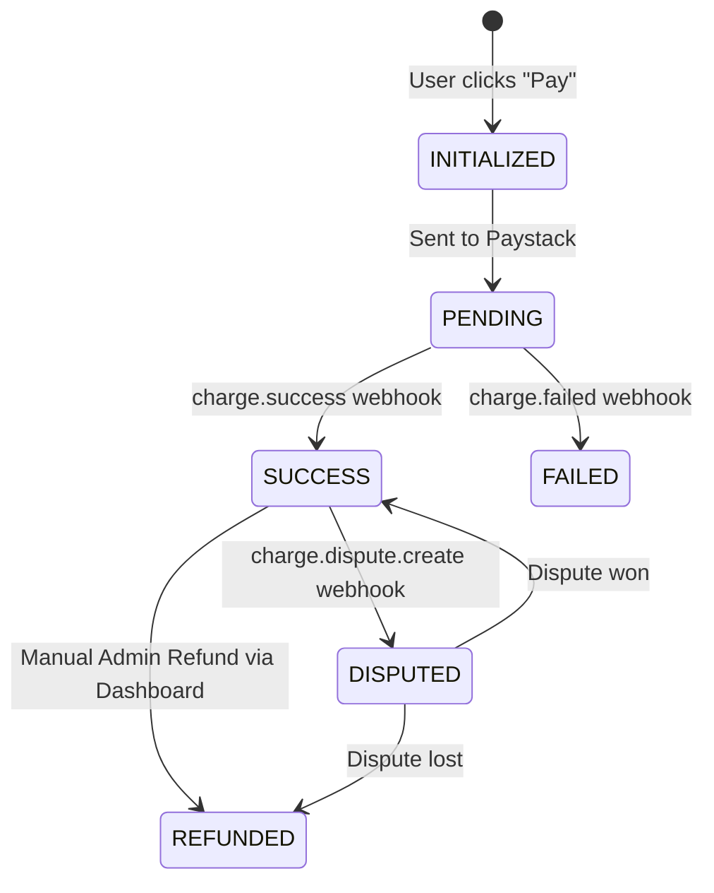
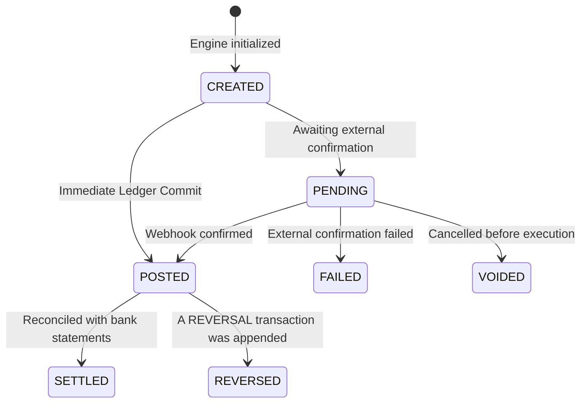
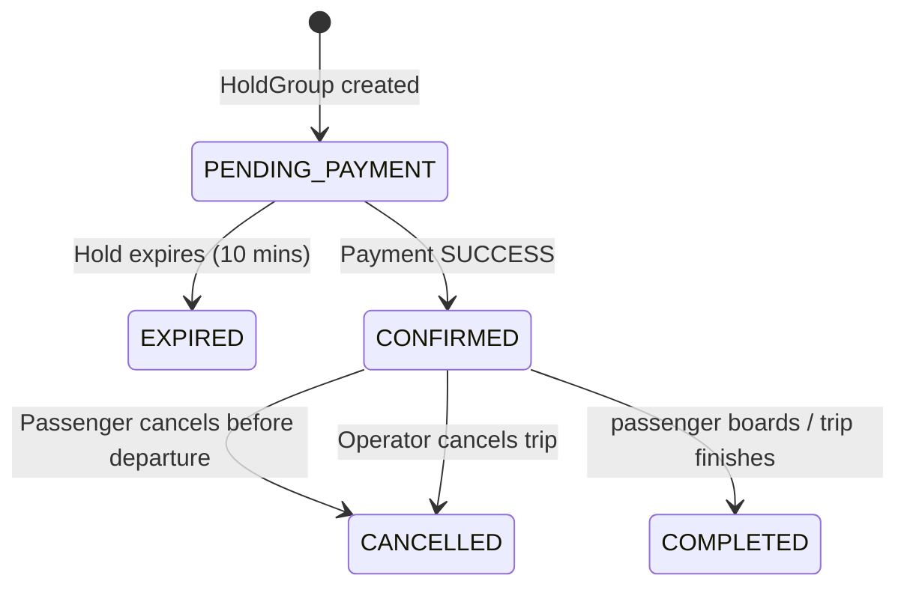
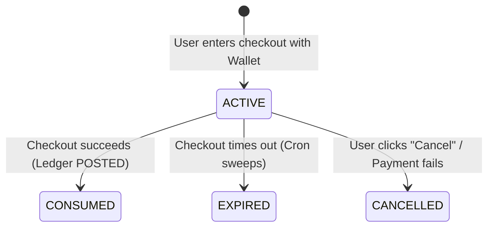
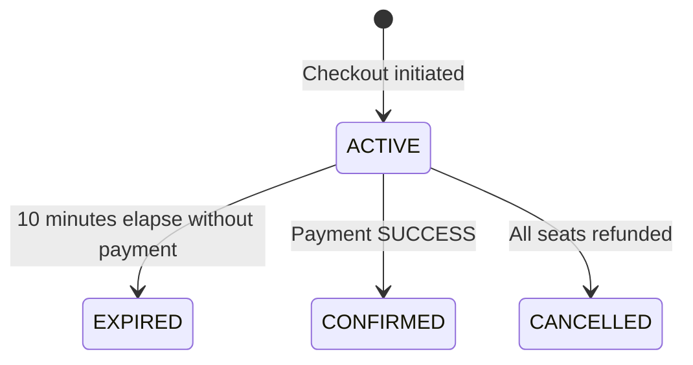

# 05. State Machines

Everything financial in Moja Ride is a state transition. This document outlines the lifecycle of the core operational models using state machine diagrams.

---

## 1. ExternalPayment

The `ExternalPayment` model tracks communication intent with a third-party gateway (like Paystack). It maps directly to the `PaymentRecordStatus` enum.

## 2. FinancialTransaction

The `FinancialTransaction` model represents a completed or pending atomic movement of money on the Moja Ride ledger. It maps to the `TransactionStatus` enum.

*Note: In the current implementation, most transactions skip `PENDING` and go directly to `POSTED` inside an atomic Prisma transaction block.*

## 3. Booking

The `Booking` model tracks the operational state of a ticket. It maps to the `BookingStatus` enum.

*Note on Payments: A Booking also maintains a `paymentStatus` field (`UNPAID` -> `PAID` -> `REFUNDED`).*

## 4. WalletReservation

The `WalletReservation` model locks funds in a user's wallet while they are at checkout, preventing double-spending.

## 5. HoldGroup

The `HoldGroup` manages the temporary locking of physical bus seats across multiple bookings during checkout.

