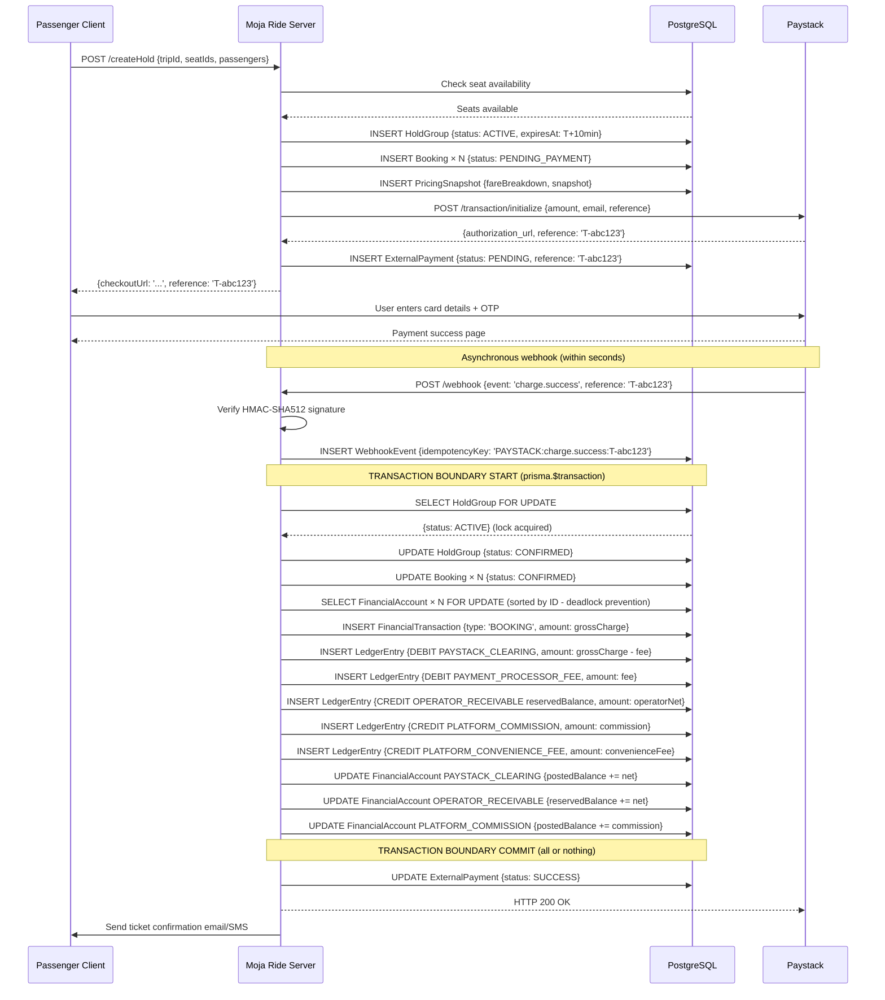
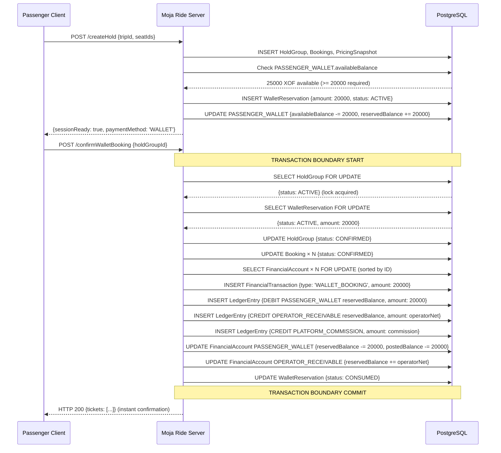
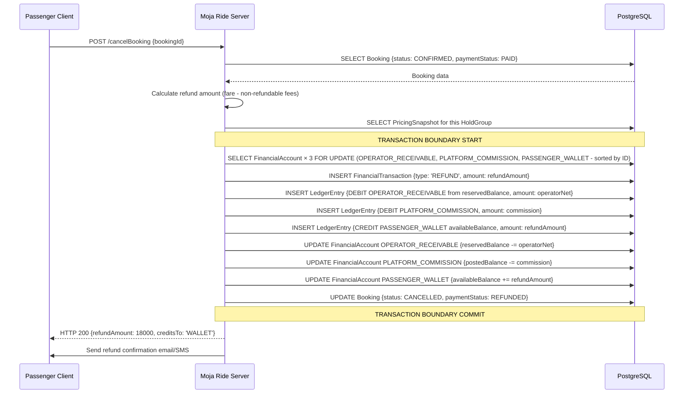
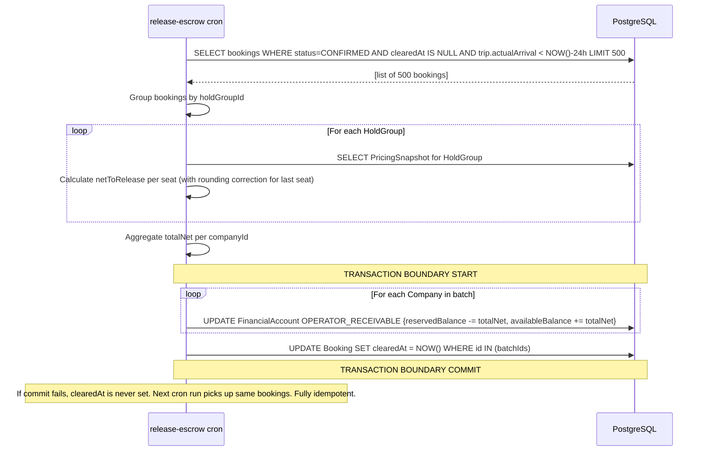
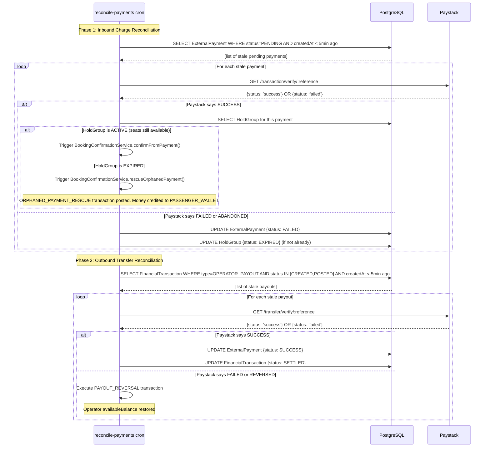
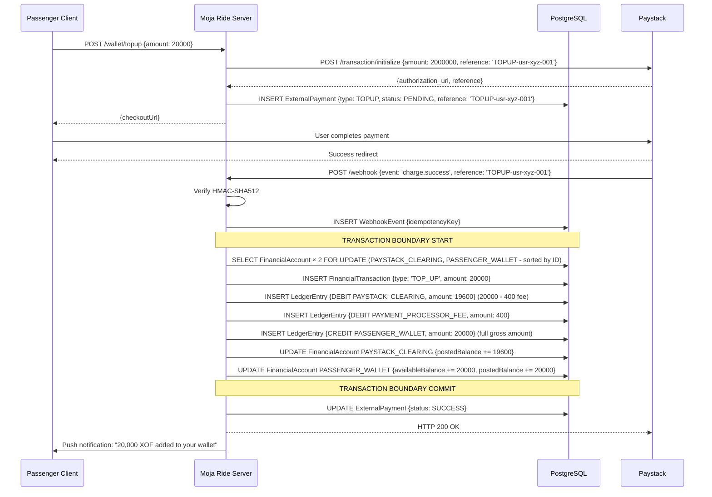

# Sequence Diagrams: End-to-End System Flows

[⬅️ Back to README](./README.md)

---

These diagrams trace the complete chronological flow of interactions across all system boundaries: Client, Moja Ride Server, PostgreSQL Database, and the Paystack API.

Each diagram uses the following notation conventions:
- **`-->>` (dashed arrow)**: Asynchronous or return response
- **`->>`** (solid arrow): Synchronous call or event
- **`Note over`**: System-level operations (transactions, locks)
- **`alt`**: Branching paths

---

## 1. Successful Booking (Card Payment via Paystack)

The primary happy path: passenger pays by card, seats confirmed, accounting posted.



---

## 2. Wallet Booking (Internal Payment, No Gateway)

When the passenger pays entirely from their `PASSENGER_WALLET` balance. This flow bypasses Paystack entirely, resulting in sub-second confirmation.



---

## 3. Operator Withdrawal (Pessimistic Locking)

The withdrawal flow, including the critical lock-before-debit ordering that prevents double-spends.

```mermaid
sequenceDiagram
    participant Operator
    participant Server as Moja Ride Server
    participant DB as PostgreSQL
    participant Paystack

    Operator->>Server: POST /requestWithdrawal {amount: 50000}
    Server->>DB: Check operator company status (not SUSPENDED)

    Note over Server,DB: TRANSACTION BOUNDARY START
    Server->>DB: SELECT availableBalance FROM financial_account WHERE id=X FOR UPDATE
    DB-->>Server: {availableBalance: 50000} (exclusive lock acquired; concurrent requests wait here)
    Server->>Server: Validate: 50000 >= 50000 AND 50000 >= MINIMUM_WITHDRAWAL
    Server->>DB: INSERT FinancialTransaction {type: 'OPERATOR_PAYOUT', status: 'CREATED'}
    Server->>DB: INSERT LedgerEntry {DEBIT OPERATOR_RECEIVABLE, amount: 50000}
    Server->>DB: INSERT LedgerEntry {CREDIT PAYSTACK_CLEARING, amount: 50000}
    Server->>DB: UPDATE FinancialAccount {availableBalance -= 50000}
    Server->>DB: INSERT ExternalPayment {type: PAYOUT, status: PENDING, reference: 'TX-MOJ-123'}
    Note over Server,DB: TRANSACTION BOUNDARY COMMIT (lock released)

    Server->>Paystack: POST /transfer {amount: 5000000, recipient: 'RCP_abc', reference: 'TX-MOJ-123'}

    alt Transfer Accepted by Paystack
        Paystack-->>Server: {status: true, data: {transfer_code: 'TRF_xyz'}}
        Server-->>Operator: HTTP 200 {message: 'Transfer initiated'}

        Note over Paystack,Server: Asynchronous webhook (minutes to hours)
        Paystack->>Server: POST /webhook {event: 'transfer.success', reference: 'TX-MOJ-123'}
        Server->>DB: UPDATE ExternalPayment {status: SUCCESS}
        Server->>DB: UPDATE FinancialTransaction {status: SETTLED}
        Server-->>Paystack: HTTP 200 OK

    else Transfer Rejected by Paystack (HTTP 4xx/5xx)
        Paystack-->>Server: Error response
        Note over Server,DB: COMPENSATING TRANSACTION
        Server->>DB: INSERT FinancialTransaction {type: 'PAYOUT_REVERSAL'}
        Server->>DB: INSERT LedgerEntry {DEBIT PAYSTACK_CLEARING, amount: 50000}
        Server->>DB: INSERT LedgerEntry {CREDIT OPERATOR_RECEIVABLE availableBalance, amount: 50000}
        Server->>DB: UPDATE FinancialAccount {availableBalance += 50000}
        Server->>DB: UPDATE ExternalPayment {status: FAILED}
        Server-->>Operator: HTTP 422 {error: 'Transfer failed. Funds restored.'}
    end
```

---

## 4. Booking Cancellation & Refund

A passenger cancels their booking before the trip. Funds return to their wallet.



---

## 5. Escrow Release (Automated Cron)

24 hours after trip arrival, escrowed funds become available for operator withdrawal.



---

## 6. Reconcile-Payments Cron (Orphan Recovery)

The cron that catches all missed webhooks and recovers stuck transactions.



---

## 7. Wallet Top-Up

A passenger adds money to their wallet via a Paystack card charge.



---

*See also: [10 - Concurrency](./10-concurrency.md) | [11 - Idempotency](./11-idempotency.md) | [05 - State Machines](./05-state-machines.md)*
