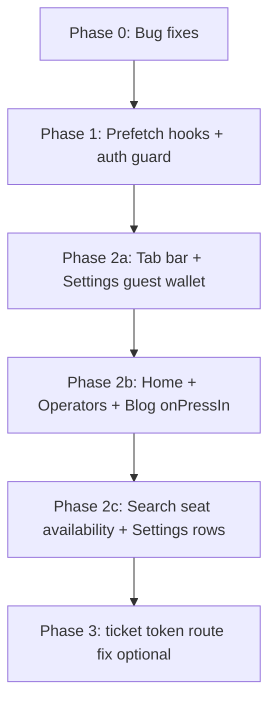

# Implementation Plan: Traveler App tRPC Prefetch & Query Fixes

Improve perceived performance across `apps/traveler-app` by extending client-side TanStack Query prefetching, fixing broken/mismatched query keys, and correcting guest-session wallet UX on the Settings tab.

**Scope:** `apps/traveler-app` only. tRPC procedures live in `apps/web/trpc/routers/`.

**Out of scope:** Server-side (RSC) prefetch — not applicable to Expo/React Native.

**Status:** Implemented (2026-08-14). See [Implementation log](#implementation-log) at the bottom.

---

## Finalized decisions

| # | Decision |
|---|----------|
| 1 | Home upcoming trip uses `booking.listMyBookings({ filter: "upcoming", limit: 1, offset: 0 })` with `mapBookingToActiveTripCard()` |
| 2 | `/ticket/[token]` renders `PublicTicketView` + `booking.getTicketByToken` (shared link, no auth) — **not** the tickets tab list |
| 3 | Pending/past booking lists: prefetch on **filter chip `onPressIn`**, not all filters on tab press. Tab press warms `upcoming` + stats + tickets list only |

---

## Current state (baseline)

| Area | Today |
|------|--------|
| Prefetch hook | Single hook: `features/booking/hooks/use-booking-prefetch.ts` |
| Prefetched procedures | `booking.listMyBookings`, `passenger.getDashboardStats`, `booking.getBooking`, `booking.getTicket` |
| Prefetch triggers | Tab bar `onPressIn` (bookings/tickets), bookings/tickets `useFocusEffect`, booking/ticket card `onPressIn` |
| Global query defaults | `staleTime: 30_000` in `lib/trpc.tsx` |
| Guest wallet on Settings | `SettingsDetails` calls `useWalletBalance()` with no `enabled` guard → fires protected tRPC, shows spinner, eventually `0 XOF` |
| Home upcoming trip | Calls non-existent `passenger.getBookings` |
| Tickets list cache | Screen fetches `limit: 50`; prefetch uses `limit: 20` → different query keys |

---

## UX assessment: Settings wallet row for guests

**You are correct.**

`features/settings/screens/wallet.tsx` already gates the query:

```tsx
const isAuth = !!session?.user;
const balanceQuery = useWalletBalance(isAuth);
```

`features/settings/components/settings-details.tsx` does **not**:

```tsx
const { data: balance, isLoading } = useWalletBalance(); // always enabled
```

For unauthenticated users, React Query still runs a protected procedure, hits 401/retry paths, and `isLoading` stays true long enough to show a spinner before falling back to `"0 XOF"`.

**Correct behavior for the Settings summary row (not the full `/wallet` screen):**

- Guest → show **`0 XOF` immediately**, no spinner, no network call.
- Authenticated → spinner only while the first fetch is in flight; then show balance or `0 XOF` if empty.

**Related issue (same class of bug):** `use-home-data.ts` and `home-header.tsx` call `useWalletBalance()` / `usePersonalInfo()` without an auth gate. Home wallet chip and greeting name can spin or error for guests. Fix in the same pass for consistency.

**What you are not wrong about, but is a separate product choice:** tapping the wallet row while logged out still navigates to `/wallet`, which correctly shows sign-in. That is fine; only the inline balance display needs the guest shortcut.

---

## Architectural goals

1. **Centralize prefetch helpers** — avoid scattering raw `prefetchQuery` calls; extend booking prefetch + add small domain hooks.
2. **Match query keys exactly** — shared constants for `filter`, `limit`, `offset` used by both `useQuery` and `prefetchQuery`.
3. **Prefetch on intent** — tab `onPressIn`, list item `onPressIn`, settings row `onPressIn`; avoid prefetching heavy/search-param-dependent queries without inputs.
4. **Auth-aware prefetch** — skip protected prefetches when `!session?.user` (no wasted 401s).
5. **Auth-aware fetch** — pass `enabled: isAuth` to protected hooks on summary surfaces (Settings, Home).

---

## Phase 0 — Bug fixes & query-key alignment (do first)

These are correctness fixes; prefetch work builds on top of them.

### 0.1 Shared booking list constants

**New file:** `features/booking/constants/query-keys.ts`

```ts
export const BOOKINGS_LIST_LIMIT = 20;
export const TICKETS_LIST_LIMIT = 50; // tickets tab shows more seats flattened from list

export function bookingsListOptions(filter: BookingFilterType, limit = BOOKINGS_LIST_LIMIT, offset = 0) {
  return { filter, limit, offset } as const;
}
```

**Update:**

| File | Change |
|------|--------|
| `use-bookings.ts` | Default `limit` → import constant |
| `use-booking-prefetch.ts` | Use same constants; add `prefetchTicketsList()` with `TICKETS_LIST_LIMIT` |
| `bookings.tsx` | Explicit `BOOKINGS_LIST_LIMIT` |
| `tickets.tsx` | Explicit `TICKETS_LIST_LIMIT` |
| `(tabs)/_layout.tsx` | Tickets tab `onPressIn` → `prefetchTicketsList()` not generic `prefetchBookings("upcoming")` |

### 0.2 Fix Home upcoming trip API

**Problem:** `passenger.getBookings` does not exist on `AppRouter`.

**Options (pick one in implementation):**

| Option | Procedure | Pros | Cons |
|--------|-----------|------|------|
| A (recommended) | `booking.listMyBookings({ filter: "upcoming", limit: 1, offset: 0 })` | Same DTO as bookings/tickets tabs; reuse prefetch | `ActiveTripCard` expects old shape — needs mapping |
| B | `passenger.getNextDeparture` | Semantically “next trip” | Different Prisma shape; still needs `ActiveTripCard` mapper |
| C | `passenger.getRecentBookings({ limit: 1 })` | Simple | Not filtered to upcoming confirmed |

**Implementation steps:**

1. Replace `getBookings` in `use-home-data.ts` with option A (aligns with rest of app).
2. Add `mapBookingSummaryToActiveTripCard(booking: PassengerBookingSummary)` in `features/home/lib/` (origin/destination labels, departure time, reference from `seats[0].bookingReference` or `groupId`).
3. Gate query with `enabled: isAuth` — guests skip fetch; no active trip card (same as today visually).
4. Add `prefetchUpcomingTrip()` to home prefetch hook (Phase 2).

### 0.3 Guest wallet & protected queries on summary surfaces

| Component / hook | Fix |
|------------------|-----|
| `settings-details.tsx` | Accept `isAuthenticated` prop from `SettingsView`, or read `authClient.useSession()` locally. `useWalletBalance(isAuthenticated)`. Display: `showSpinner = isAuthenticated && isLoading`; amount = `isAuthenticated ? (balance?.availableBalance ?? 0) : 0`. |
| `use-home-data.ts` | Pass `enabled: isAuth` to wallet + upcoming booking queries. |
| `home-header.tsx` | Pass `enabled: isAuth` to `usePersonalInfo(isAuth)` OR stop fetching in header and use session name from Better Auth. |

**Acceptance:** Logged-out user opens Settings tab → wallet row shows `0 XOF` with zero spinner and zero `/api/trpc` wallet calls (verify in network tab).

---

## Phase 1 — Prefetch infrastructure

### 1.1 Auth-aware prefetch utility

**New file:** `lib/prefetch-guard.ts`

```ts
export function usePrefetchGuard() {
  const { data: session } = authClient.useSession();
  return {
    isAuthenticated: !!session?.user,
    prefetchIfAuthed: (fn: () => void) => { if (session?.user) fn(); },
  };
}
```

Use in all protected prefetches.

### 1.2 Extend hooks (keep files small)

| Hook file | Responsibilities |
|-----------|------------------|
| `features/booking/hooks/use-booking-prefetch.ts` | Existing + `prefetchTicketsList`, export list key helper |
| `features/home/hooks/use-home-prefetch.ts` | `prefetchHomeFeed()` — wallet, banners, blog, operators, upcoming booking |
| `features/settings/hooks/use-settings-prefetch.ts` | `prefetchWallet`, `prefetchPassengers`, `prefetchPreferences`, `prefetchReviews` |
| `features/operators/hooks/use-operators-prefetch.ts` | `prefetchOperatorsList`, `prefetchOperator(slug)` |
| `features/search/hooks/use-search-prefetch.ts` | `prefetchOperatorProfile`-style only where params known |

### 1.3 Optional: shared stale times

**New file:** `lib/query-stale-times.ts` — mirror values already used (`60_000` banners, `5 * 60_000` blog, etc.) so prefetch + fetch share the same `staleTime` in `queryOptions` second arg.

---

## Phase 2 — Page-by-page prefetch map

Priority: **P0** = high traffic / obvious latency win · **P1** = nice-to-have · **P2** = skip or defer

### Tab bar `(tabs)/_layout.tsx`

| Tab | Trigger | Prefetch (P0) | Notes |
|-----|---------|---------------|-------|
| Home | `onPressIn` | `prefetchHomeFeed()` (if authed: wallet + upcoming booking; always: banners, blog, operators) | Warms tab user is about to open |
| Search | — | **None** | No default search params; prefetch would be wasted |
| Bookings | `onPressIn` | `listMyBookings(upcoming)`, `getDashboardStats` | Already exists; add `prefetchIfAuthed` |
| Tickets | `onPressIn` | `listMyBookings(upcoming, TICKETS_LIST_LIMIT)` | Fix limit mismatch |
| Settings | `onPressIn` | `getWalletBalance` (if authed) | Cheap; matches visible wallet row |

### Home `(tabs)/index` → `HomeView`

| Interaction | Prefetch | Priority |
|-------------|----------|----------|
| Screen focus | Same as `prefetchHomeFeed()` | P1 (tab press may already cover) |
| Operator card `onPressIn` | `public.getOperator({ slug })` | P0 |
| Blog card `onPressIn` | `blog.getPostBySlug({ slug })` | P0 |
| Active trip card `onPressIn` | `booking.getTicket` for first seat ref | P1 |
| Wallet chip `onPressIn` | `getWalletBalance`, first ledger page | P1 |

**Do not prefetch:** `search.search` / `cheapestByDate` from home (no route params until user searches).

### Search `(tabs)/search`

| Interaction | Prefetch | Priority |
|-------------|----------|----------|
| Trip result row `onPressIn` | `booking.getSeatAvailability({ offerId })` | P0 |
| Date strip day `onPressIn` | **Defer** — date change refetches via `useQuery` key | P2 |
| Passenger form open | `payments.getCheckoutPricing` when offer + seat count known | P1 |
| City picked | `locations.getCityDetails`, `getGeoPlaceLabel` for resolved ids | P2 (fast queries) |

**Do not prefetch:** `locations.searchCities` on every keystroke — use existing debounce in `useSearchCities` only.

### Bookings / Tickets (existing + improvements)

| Item | Action |
|------|--------|
| Focus prefetch all booking filters | When filter is `pending` or `past`, tab `onPressIn` should prefetch **active filter** if stored in a tiny zustand/context, or accept that focus effect handles it (current) |
| Tickets focus | Use `prefetchTicketsList()` with correct limit |
| Booking detail | Keep card `onPressIn` + `setQueryData` seeding |

### Settings `(tabs)/settings`

| Interaction | Prefetch | Priority |
|-------------|----------|----------|
| Wallet row `onPressIn` | `getWalletBalance`, `getWalletLedger({ limit: 10, offset: 0 })` | P0 |
| Passengers row `onPressIn` | `passenger.listSaved` | P0 |
| Personal info row `onPressIn` | `passenger.getPreferences` | P0 |
| Reviews row `onPressIn` | `passenger.getUserReviews` | P1 |

All protected — wrap with `prefetchIfAuthed`.

### Stack routes

| Route | Prefetch trigger | Procedures | Priority |
|-------|------------------|------------|----------|
| `/wallet` | Route focus or Settings row press | Already partially covered | P0 |
| `/passengers` | Settings row press | `listSaved` | P0 |
| `/personal-info` | Settings row press | `getPreferences` | P0 |
| `/reviews` | Settings row press | `getUserReviews` | P1 |
| `/operators` | Home “see all” / nav `onPressIn` | `listOperators` | P1 (often cached from home) |
| `/operators/[slug]` | Operator card `onPressIn` | `getOperator` | P0 |
| `/article/[slug]` | Blog card `onPressIn` | `getPostBySlug` | P0 |
| `/booking/[reference]` | Bookings card `onPressIn` | Already prefetched | Done |
| `/ticket/[token]` | **Fix route** — should use `getTicketByToken`, not reuse `TicketsView` | P0 bug (separate from prefetch) |

### Global / layout

| Location | Prefetch | Notes |
|----------|----------|-------|
| `app/_layout.tsx` | **Do not prefetch** `getNotificationToken` earlier | Already fetched on mount; duplicate prefetch adds noise |
| Notification bell | No change | |

### Explicitly **not** worth prefetching

- Auth screens (`/(auth)/login`) — no tRPC reads
- Static settings pages (help, terms, privacy, language, notifications UI)
- Mutations (hold, payment, top-up, review submit)
- Admin-only or unused routers
- Search results before user submits origin/destination/date

---

## Phase 3 — Implementation order



| Step | Task | Files touched |
|------|------|---------------|
| 1 | Query key constants + tickets limit fix | `constants/query-keys.ts`, booking hooks/screens, tab layout |
| 2 | Guest wallet Settings + Home auth gates | `settings-details.tsx`, `settings.tsx`, `use-home-data.ts`, `home-header.tsx` |
| 3 | Fix `getBookings` → `listMyBookings` + mapper | `use-home-data.ts`, `active-trip-card` or mapper |
| 4 | `usePrefetchGuard` + extend booking prefetch | `lib/prefetch-guard.ts`, `use-booking-prefetch.ts` |
| 5 | Home / settings / operators prefetch hooks | new hook files |
| 6 | Wire tab bar + onPressIn handlers | `_layout.tsx`, home sections, `account-settings-list.tsx`, operator/blog cards |
| 7 | Search seat prefetch on trip select | search result component |
| 8 | Manual QA pass | see below |

---

## Phase 4 — Verification checklist

### Functional

- [ ] Guest Settings: wallet shows `0 XOF`, no spinner, no wallet tRPC in network log
- [ ] Authed Settings: wallet spinner only on first load; value matches `/wallet`
- [ ] Tickets tab: tab `onPressIn` populates same cache key as screen (`limit: 50`)
- [ ] Bookings tab: pending/past filters fetch correct data after tab switch
- [ ] Home: no tRPC error for `getBookings`; upcoming card renders when user has booking
- [ ] Operator profile opens without full-screen loader when prefetched from home
- [ ] Article opens faster from blog carousel when prefetched

### Performance (manual)

- [ ] React Query Devtools (if enabled) or logging: prefetch hits cache on navigation (`status: success` before screen mount)
- [ ] No prefetch storm on app launch — only tab intent + focus, not all routes at once

### Regression

- [ ] Pull-to-refresh still invalidates correctly on Home, Bookings, Tickets
- [ ] Logout clears sensitive cached queries (`queryClient.clear()` or existing `DangerZoneRow` behavior)

---

## Open questions (resolved)

1. **Home upcoming trip API:** ✅ `booking.listMyBookings` limit 1
2. **`/ticket/[token]` route:** ✅ Dedicated `PublicTicketView` in same implementation
3. **Prefetch pending/past on bookings tab press:** ✅ Filter chip `onPressIn` instead of tab press

---

## Implementation log

### Phase 0 — Bug fixes

- [x] `features/booking/constants/query-keys.ts` — shared limits (`20` bookings, `50` tickets, `1` home)
- [x] `use-home-data.ts` — `listMyBookings` replaces broken `passenger.getBookings`; auth-gated wallet/booking
- [x] `features/home/lib/map-active-trip.ts` + `ActiveTripCard` typed props
- [x] `settings-details.tsx` — guest shows `0 XOF` immediately (`useWalletBalance(isAuthenticated)`)
- [x] `home-header.tsx` — guest wallet `0 F`, session name, no `usePersonalInfo` fetch

### Phase 1 — Prefetch infrastructure

- [x] `lib/prefetch-guard.ts` — `usePrefetchGuard()` / `prefetchIfAuthed`
- [x] Extended `use-booking-prefetch.ts` — `prefetchTicketsList`, `prefetchTicketByToken`, auth guard
- [x] `use-home-prefetch.ts`, `use-settings-prefetch.ts`, `use-operators-prefetch.ts`, `use-search-prefetch.ts`

### Phase 2 — Wiring

- [x] Tab bar: home feed, bookings, tickets (`prefetchTicketsList`), settings wallet
- [x] Bookings filter chips: `onTabPressIn` → prefetch that filter
- [x] Settings: wallet row + account list rows (`prefetchForRoute`)
- [x] Home: operator/blog `onPressIn`, active trip ticket prefetch
- [x] Search: offer card `onPressIn` → `getSeatAvailability`
- [x] `/ticket/[token]` → `PublicTicketView`

### Remaining / follow-up

- [ ] Manual QA on device (guest Settings wallet, tab prefetch cache hits)
- [ ] Optional: `useCallback` on prefetch helpers to stabilize `useFocusEffect` deps

---

## File change summary (expected)

| Action | Path |
|--------|------|
| Create | `docs/plans/2026-08-14-traveler-app-trpc-prefetch-plan.md` (this file) |
| Create | `features/booking/constants/query-keys.ts` |
| Create | `lib/prefetch-guard.ts` |
| Create | `features/home/hooks/use-home-prefetch.ts` |
| Create | `features/home/lib/map-active-trip.ts` |
| Create | `features/settings/hooks/use-settings-prefetch.ts` |
| Create | `features/operators/hooks/use-operators-prefetch.ts` |
| Create | `features/search/hooks/use-search-prefetch.ts` (minimal) |
| Modify | `use-booking-prefetch.ts`, `use-bookings.ts`, `use-home-data.ts` |
| Modify | `settings-details.tsx`, `settings.tsx`, `(tabs)/_layout.tsx` |
| Modify | `featured-operators-section.tsx`, `blog-news-section.tsx`, `account-settings-list.tsx` |
| Modify | Search trip result component (seat prefetch) |
| Modify | `ticket/[token]/index.tsx` (optional P0 bugfix) |

---

## Success metrics

- Settings guest wallet: **0 ms** perceived load (instant `0 XOF`)
- Tab → Bookings/Tickets: list visible from cache on repeat visits within `staleTime`
- Home → Operator/Article: skeleton time reduced when user pauses on press (`onPressIn` window)
- Zero calls to non-existent `passenger.getBookings`
- Tickets prefetch cache hit rate: 100% when keys match (`limit: 50`)
