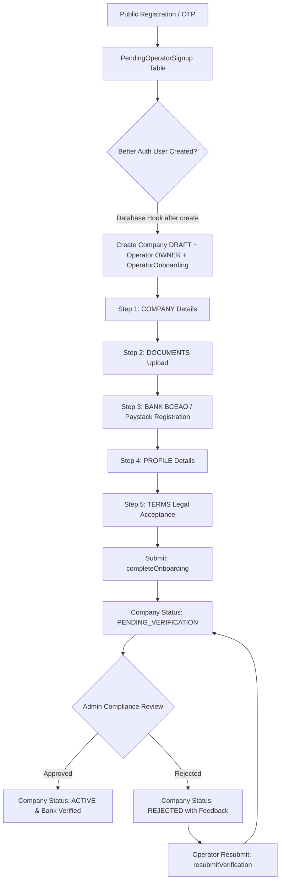

# Comprehensive Audit Report: IAM Rules, Permissions, Onboarding Architecture, & Operator Governance

**System Audit Target:** Moja Transport Platform  
**Audited Subsystems:** `@packages/db/prisma/schema.prisma`, `@packages/schemas/src/permissions.ts`, `@packages/schemas/src/admin-permissions.ts`, `@apps/web/lib/permissions/`, `@apps/web/trpc/init.ts`, `@apps/web/trpc/routers/`, `@apps/web/app/[locale]/dashboard/operator/onboarding/`, `@apps/web/app/[locale]/dashboard/operator/(dashboard)/`, `@apps/web/features/operator/`  
**Evaluation Standard:** Zero-Trust Enterprise Security, Data Integrity, Multi-Tenancy Isolation, Regulatory & Process Compliance, Operational Efficiency  

---

## 1. Executive Summary

An exhaustive audit of the IAM rules, onboarding workflows, operator and staff permissions, database schemas, tRPC routers, and UI components was conducted. 

### Audit Scorecard
| Audit Dimension | Rating | Key Summary |
| :--- | :--- | :--- |
| **IAM & Authorization Architecture** | **8.5 / 10** | Strong dual-layer IAM (Company Operator IAM vs. Platform Admin IAM). Role hierarchy and privilege escalations are guarded via `assertCanGrant` and `canModifyMember`. |
| **Data Accuracy & Schema Integrity** | **7.0 / 10** | **Critical schema mismatch identified** in [`apps/web/trpc/routers/operator/settings.ts`](file:///c:/dev/moja-buss/apps/web/trpc/routers/operator/settings.ts#L142) where `fullName` is updated against the `Operator` table instead of the `User` table (which causes a runtime crash). Missing phone prefill in the onboarding UI. |
| **Security & Vulnerability Posture** | **8.0 / 10** | Robust double-entry accounting locks, encrypted bank accounts at rest (`enc:v1:`), and SHA-256 token hashing on invites. Minor gaps in un-throttled public token endpoints and permission misalignments for private document downloads. |
| **Onboarding Process Optimization** | **8.5 / 10** | Structured 5-step onboarding lifecycle with real-time Paystack recipient registration for French West Africa (UEMOA/BCEAO/XOF). Clear status progression from `DRAFT` to `PENDING_VERIFICATION` to `ACTIVE`. |

---

## 2. Onboarding Lifecycle & Workflow Architecture



### 2.1 The 5 Onboarding Steps & State Transitions

1. **Step 1: Company Profile (`COMPANY`)**
   - **Schema & Model:** [`Company`](file:///c:/dev/moja-buss/packages/db/prisma/schema.prisma#L529-L601) table.
   - **Fields Collected:** `name`, `slug` (debounced uniqueness validation), `email`, `phone`, `businessType` (LLC, Sole Proprietorship, Corporation, etc.), `registrationNumber`, `taxId`, `yearEstablished`, `estimatedStaffSize`, `logoUrl`.
   - **State Mutation:** Updates `Company`, records `workEmail` on the `User` model, updates `OperatorOnboarding.completedSteps` and sets `Operator.onboardingStatus = IN_PROGRESS`.

2. **Step 2: Compliance Documents (`DOCUMENTS`)**
   - **Schema & Model:** [`CompanyDocument`](file:///c:/dev/moja-buss/packages/db/prisma/schema.prisma#L605-L644) table.
   - **Mandatory Documents:**
     1. `BUSINESS_REGISTRATION_CERTIFICATE` (Registre de Commerce)
     2. `TAX_CLEARANCE_CERTIFICATE` (Attestation Fiscale)
     3. `TRANSPORT_OPERATING_PERMIT` (Autorisation de Transport)
     4. Optional: `OTHER` / `INSURANCE_CERTIFICATE`
   - **Storage & Security:** Uploaded via presigned S3/R2 direct PUT. Old documents are superseded with version retention (`supersededAt`, `isCurrent = false`, `replacedById`).

3. **Step 3: Banking & Payout Destination (`BANK`)**
   - **Schema & Model:** [`BankAccount`](file:///c:/dev/moja-buss/packages/db/prisma/schema.prisma#L646-L687) table.
   - **BCEAO / XOF Integration:** Real-time Paystack recipient registration (`paystackRegisterRecipient`) during form save. Because West African franc (XOF) bank verification does not support standard name-enquiry resolving, Paystack validates bank routing codes and account numbers at recipient generation.
   - **Data Protection:** Account numbers are AES-256-GCM encrypted at rest (`enc:v1:` prefix) via [`apps/web/lib/bank-crypto.ts`](file:///c:/dev/moja-buss/apps/web/lib/bank-account.ts). All reads and reveals trigger an immutable entry in [`BankAccessLog`](file:///c:/dev/moja-buss/packages/db/prisma/schema.prisma#L689-L702).

4. **Step 4: Owner / Operator Profile (`PROFILE`)**
   - **Schema & Model:** [`Operator`](file:///c:/dev/moja-buss/packages/db/prisma/schema.prisma#L721-L772) and [`User`](file:///c:/dev/moja-buss/packages/db/prisma/schema.prisma#L358-L432).
   - **Fields Collected:** `fullName` (persisted to `User`), `dateOfBirth` (mandatory ISO YYYY-MM-DD), `nationalIdNumber`, `nationalIdType` (`passport`, `national_id`, `driver_license`), `personalPhone`, `emergencyContactName`, `emergencyContactPhone`, `jobTitle`, `profilePhotoUrl`.

5. **Step 5: Legal & Commission Agreement (`TERMS`)**
   - **Schema & Model:** [`Company`](file:///c:/dev/moja-buss/packages/db/prisma/schema.prisma#L552-L559).
   - **Legal Compliance Recorded:** `termsAcceptedAt`, `commissionAcceptedAt`, `privacyAcceptedAt`, `termsVersion` (`TERMS_VERSION`), `commissionVersion` (`COMMISSION_VERSION`), `privacyVersion` (`PRIVACY_VERSION`).

### 2.2 Completion & Verification Lifecycle
- Calling `completeOnboarding` in [`apps/web/trpc/routers/operator.ts`](file:///c:/dev/moja-buss/apps/web/trpc/routers/operator.ts#L261-L376) validates the presence of all 3 mandatory compliance documents, bank account, and tax IDs in an atomic transaction.
- Transitions `Operator.onboardingStatus` from `IN_PROGRESS` to `COMPLETED` and `Company.status` from `DRAFT` to `PENDING_VERIFICATION`.
- Alerts platform compliance administrators via Novu workflow `admin-operator-signup-pending`.

---

## 3. IAM Rules, Roles, & Permissions Matrix

The platform implements a strict multi-tier, hierarchical Role-Based & Action-Based Access Control (RBAC/ABAC) architecture.

### 3.1 Operator Staff Hierarchy & Role Levels
Defined in [`packages/schemas/src/permissions.ts`](file:///c:/dev/moja-buss/packages/schemas/src/permissions.ts#L9-L20) and [`apps/web/lib/permissions/staff-hierarchy.ts`](file:///c:/dev/moja-buss/apps/web/lib/permissions/staff-hierarchy.ts):

| Staff Role | Rank Level | Default Permissions Count | Assignable Subordinate Roles | Intended Responsibilities |
| :--- | :---: | :---: | :--- | :--- |
| **OWNER** | **600** | **48 (Implicit ALL)** | `ADMIN`, `MANAGER`, `OPERATIONS`, `FINANCE`, `SUPPORT`, `TREASURY`, `DISPATCHER`, `CONDUCTOR`, `DRIVER` | Legal company owner. Full bypass on company resources. Payouts, ownership transfers, bank modifications. |
| **ADMIN** | **500** | **43** | `MANAGER`, `FINANCE`, `SUPPORT`, `TREASURY`, `DISPATCHER`, `CONDUCTOR`, `DRIVER` | Fleet management, route creation, scheduling, staff invite/update, financial views. Cannot transfer company ownership. |
| **MANAGER** | **400** | **25** | `SUPPORT`, `TREASURY`, `DISPATCHER`, `CONDUCTOR`, `DRIVER` | Day-to-day operations, promotions, dispatching, route updates. No direct bank account deletion. |
| **DISPATCHER**| **350** | **11** | None | Real-time vehicle dispatch, driver assignment, trip tracking, booking lookup. |
| **OPERATIONS** | **300** | **14** | `DRIVER` | Fleet view, trip updates, driver assignment, review response. |
| **CONDUCTOR** | **275** | **6** | None | Manifest passenger lists, ticket validation, passenger boarding check-ins. |
| **TREASURY** | **260** | **9** | None | Withdrawal requests, financial reporting, ledger entry views. |
| **FINANCE** | **250** | **9** | None | Read-only ledger views, revenue analytics, promotional reporting. |
| **SUPPORT** | **200** | **5** | None | Customer inquiries, review viewing, booking and schedule status lookups. |
| **DRIVER** | **150** | **5** | None | Trip view, passenger check-in, live GPS telemetry streaming (`telemetry:stream`). |

### 3.2 Platform Admin Staff Hierarchy
Defined in [`packages/schemas/src/admin-permissions.ts`](file:///c:/dev/moja-buss/packages/schemas/src/admin-permissions.ts#L9-L16) and [`apps/web/lib/permissions/admin-staff-hierarchy.ts`](file:///c:/dev/moja-buss/apps/web/lib/permissions/admin-staff-hierarchy.ts):

| Admin Staff Role | Rank Level | Default Permissions Count | Assignable Subordinate Roles | Domain / Scope |
| :--- | :---: | :---: | :--- | :--- |
| **SUPER_ADMIN** | **600** | **44 (Implicit ALL)** | `ADMIN`, `OPERATIONS`, `SUPPORT`, `COMPLIANCE`, `FINANCE` | Complete platform governance, system settings, treasury transfers, admin ownership transfer. |
| **ADMIN** | **500** | **41** | `OPERATIONS`, `SUPPORT`, `COMPLIANCE`, `FINANCE` | Company verification, operator staff auditing, global marketing campaigns, dispute resolution. |
| **OPERATIONS** | **400** | **16** | None | Platform-wide trip tracking, route inspection, support inquiries. |
| **COMPLIANCE** | **350** | **10** | None | Document verification, bank account compliance inspection, verification checklist sign-offs. |
| **FINANCE** | **300** | **10** | None | Platform ledger reconciliation, withdrawal approvals, commission tier updates. |
| **SUPPORT** | **200** | **8** | None | Cross-company inquiry responses, passenger/operator issue resolution. |

### 3.3 Privilege Escalation Guardrails
1. **Grant Assertion Rule (`assertCanGrant` / `assertAdminCanGrant`):** A staff member cannot grant any IAM permission key they do not personally hold in their own effective permission set.
2. **Hierarchy Rule (`canModifyMember` / `canModifyAdminMember`):** A staff member can only edit, suspend, or remove personnel strictly below their numeric rank (`getRoleLevel(modifier) > getRoleLevel(target)`).
3. **Template Reset on Role Change:** When `updateRole` is invoked, the user's custom permissions are reset to the target role template to prevent latent privilege retention.
4. **Ownership Transfer OTP:** Transferring `OWNER` or `SUPER_ADMIN` requires an email-delivered, 6-digit cryptographic OTP, exact string confirmation (`"TRANSFER OWNERSHIP"`), and atomic transactional role swap.

---

## 4. Comprehensive Findings by Category

### Category A: Accuracy and Integrity (Data Errors, Logic Flaws, Schema Mismatches)

#### [HIGH] Critical Runtime Crash: Profile Update Schema Mismatch in Operator Settings
- **Location:** [`apps/web/trpc/routers/operator/settings.ts:L140-L154`](file:///c:/dev/moja-buss/apps/web/trpc/routers/operator/settings.ts#L140-L154)
- **Defect:** In `updateProfile`, the procedure attempts to update `fullName` directly on the `Operator` table:
  ```typescript
  // BUGGY CODE in operator/settings.ts
  const updatedOperator = await ctx.prisma.operator.update({
    where: { id: operator.id },
    data: {
      ...(profileFields.fullName !== undefined && { fullName: profileFields.fullName }), // Crash: fullName is not a column on Operator!
      ...
    }
  });
  ```
- **Impact:** In [`packages/db/prisma/schema.prisma`](file:///c:/dev/moja-buss/packages/db/prisma/schema.prisma#L721-L772), `fullName` is a property of `User`, not `Operator`. Calling `updateProfile` from the dashboard settings tab crashes with a `PrismaClientValidationError: Unknown argument fullName`.
- **Root Cause:** Inconsistency with [`apps/web/trpc/routers/operator.ts:L833-L836`](file:///c:/dev/moja-buss/apps/web/trpc/routers/operator.ts#L833-L836) where `User.fullName` is correctly updated.

---

#### [MEDIUM] Missing Phone Number Prefill in Onboarding Company Step
- **Location:** [`apps/web/features/operator/components/onboarding/company-step.tsx:L77-L108`](file:///c:/dev/moja-buss/apps/web/features/operator/components/onboarding/company-step.tsx#L77-L108)
- **Defect:** In the `useEffect` prefill block, `setPhone(company.phone || "")` was accidentally omitted while every other company property is populated.
- **Impact:** When an operator resumes onboarding or navigates back from a later step to `COMPANY`, the phone input appears blank. Because `phone` is a required submission field, the operator is blocked from proceeding until they re-type their phone number.

---

#### [MEDIUM] Incorrect Permission Key Checked for Private Document Download
- **Location:** [`apps/web/trpc/routers/storage.ts:L185-L200`](file:///c:/dev/moja-buss/apps/web/trpc/routers/storage.ts#L185-L200)
- **Defect:** In `presignDownload`, when an operator requests a signed download link for private compliance documents (`operator-document`), the procedure enforces:
  ```typescript
  requirePermission(operatorPermissionContext(ctx, caller!), "financials:view");
  ```
- **Impact:** An Operations or Compliance Manager who holds `"company:compliance:update"` or `"company:view"` cannot download or view their uploaded documents unless they have also been granted financial access. It should check `"company:compliance:update"` or `"company:view"`.

---

#### [LOW] Disparate Hardcoded Onboarding Step Count
- **Location:** [`packages/db/prisma/schema.prisma:L787`](file:///c:/dev/moja-buss/packages/db/prisma/schema.prisma#L787), [`apps/web/lib/auth-server.ts:L228`](file:///c:/dev/moja-buss/apps/web/lib/auth-server.ts#L228), [`apps/web/trpc/routers/operator.ts:L148`](file:///c:/dev/moja-buss/apps/web/trpc/routers/operator.ts#L148)
- **Defect:** The step count `5` is duplicated across database schema defaults, Better Auth hooks, and router constants.
- **Impact:** Modifying or adding steps in the future risks calculating incorrect progress percentages if one location is missed.

---

### Category B: Risk and Vulnerabilities (Security, IAM, Isolation, Multi-Tenancy)

#### [HIGH] Unthrottled Public Endpoints for Token Validation
- **Location:** [`apps/web/trpc/routers/invitation.ts:L41-L82`](file:///c:/dev/moja-buss/apps/web/trpc/routers/invitation.ts#L41-L82), [`apps/web/trpc/routers/admin-staff.ts:L139-L191`](file:///c:/dev/moja-buss/apps/web/trpc/routers/admin-staff.ts#L139-L191)
- **Vulnerability:** `invitationRouter.validateToken` and `adminStaffRouter.validateToken` are `publicProcedure`s without rate limiting.
- **Impact:** While tokens are 256-bit SHA-256 hashes, un-throttled public token endpoints expose the database to resource exhaustion / denial-of-service (DoS) attacks.
- **Recommendation:** Attach Redis/database rate limiting middleware to all public token validation queries (e.g., maximum 30 requests per minute per IP).

---

#### [MEDIUM] Disconnected Platform Admin Procedure Context in Operator Company Endpoints
- **Location:** [`apps/web/trpc/init.ts:L110-L165`](file:///c:/dev/moja-buss/apps/web/trpc/init.ts#L110-L165)
- **Defect:** `operatorProcedure` allows `role === "ADMIN"`. However, `operatorCompanyProcedure` immediately attempts to resolve `ctx.prisma.operator.findFirst({ where: { userId: ctx.user.id } })`.
- **Impact:** If a Platform Admin without an `Operator` record attempts to invoke an operator company procedure, the query fails with `FORBIDDEN: Operator profile or company not found`. While platform admins have their own `adminRouter`, this creates an inconsistent contract in procedures that allow admin overrides.

---

#### [MEDIUM] Single-Signer Withdrawal Vulnerability on High-Value Payouts
- **Location:** [`apps/web/trpc/routers/operator.ts:L1980-L2080`](file:///c:/dev/moja-buss/apps/web/trpc/routers/operator.ts#L1980-L2080)
- **Vulnerability:** If platform-level 2FA is toggled off (`require2FAForWithdrawals = false`), any operator staff member granted `"withdrawals:create"` (such as a Treasury staff member) can initiate an irreversible automated Paystack transfer up to the full available company balance without dual approval.
- **Recommendation:** Enforce a mandatory Owner confirmation or 2-man rule for withdrawals exceeding a threshold (e.g., > 500,000 XOF).

---

### Category C: Efficiency and Quality (Performance, Code Smells, Standards)

#### [MEDIUM] Redundant Database Count Aggregations in Onboarding Status
- **Location:** [`apps/web/trpc/routers/operator.ts:L197-L244`](file:///c:/dev/moja-buss/apps/web/trpc/routers/operator.ts#L197-L244)
- **Performance Issue:** `getOnboardingStatus` runs 5 live DB count queries (`companyLocation`, `bus`, `route`, `schedule`, `trip`) to calculate `businessReadiness` on every page load, even for operators who are still on Step 1 (`COMPANY`).
- **Optimization:** Only query business readiness counts when `operator.onboardingStatus === 'COMPLETED'` or `operator.company.status === 'ACTIVE'`.

---

#### [LOW] Redundant Code Duplication in Permission Helper Modules
- **Location:** [`packages/schemas/src/permissions.ts`](file:///c:/dev/moja-buss/packages/schemas/src/permissions.ts) vs [`packages/schemas/src/admin-permissions.ts`](file:///c:/dev/moja-buss/packages/schemas/src/admin-permissions.ts)
- **Code Quality:** Permission assertion logic, effective permission mapping, and hierarchy checks are copy-pasted with separate type signatures.
- **Optimization:** Create a generic IAM engine factory that parameterizes role catalogues, permission metadata, and rank hierarchies.

---

## 5. Prioritized Remediation Plan

### Phase 1: High Priority (Immediate Fixes)

#### 1. Fix Operator Settings `fullName` Update Bug
Update [`apps/web/trpc/routers/operator/settings.ts`](file:///c:/dev/moja-buss/apps/web/trpc/routers/operator/settings.ts#L122-L154):
```diff
--- a/apps/web/trpc/routers/operator/settings.ts
+++ b/apps/web/trpc/routers/operator/settings.ts
@@ -138,10 +138,15 @@ export const operatorSettingsProcedures = {
       const { data: profileFields } = parsed;
 
+      if (profileFields.fullName !== undefined) {
+        await ctx.prisma.user.update({
+          where: { id: ctx.user.id },
+          data: { fullName: profileFields.fullName },
+        });
+      }
+
       const updatedOperator = await ctx.prisma.operator.update({
         where: { id: operator.id },
         data: {
-          ...(profileFields.fullName !== undefined && { fullName: profileFields.fullName }),
           ...(profileFields.personalPhone !== undefined && { personalPhone: profileFields.personalPhone }),
           ...(profileFields.jobTitle !== undefined && { jobTitle: profileFields.jobTitle }),
```

#### 2. Fix Onboarding Company Step Phone Number Prefill
Update [`apps/web/features/operator/components/onboarding/company-step.tsx`](file:///c:/dev/moja-buss/apps/web/features/operator/components/onboarding/company-step.tsx#L85-L87):
```diff
--- a/apps/web/features/operator/components/onboarding/company-step.tsx
+++ b/apps/web/features/operator/components/onboarding/company-step.tsx
@@ -85,6 +85,7 @@ export function CompanyStep({
         setName(company.name || "");
         setSlug(
           company.slug && !company.slug.startsWith("draft-")
             ? company.slug
             : generateSlug(company.name || ""),
         );
         setEmail(company.email || "");
+        setPhone(company.phone || "");
         setWebsite(company.website || "");
```

#### 3. Correct Storage Presign Download IAM Permission
Update [`apps/web/trpc/routers/storage.ts`](file:///c:/dev/moja-buss/apps/web/trpc/routers/storage.ts#L185-L200):
```diff
--- a/apps/web/trpc/routers/storage.ts
+++ b/apps/web/trpc/routers/storage.ts
@@ -196,7 +196,7 @@ export const storageRouter = createTRPCRouter({
                  companyId: doc.companyId,
                }
              : operatorPermissionContext(ctx, caller!),
-           "financials:view",
+           "company:compliance:update",
          );
```

---

### Phase 2: Medium Priority (Hardening & Quality)

#### 4. Add Rate Limiting on Public Token Endpoints
Attach a custom rate limiter or in-memory sliding window on `invitationRouter.validateToken` and `adminStaffRouter.validateToken` in [`apps/web/trpc/routers/invitation.ts`](file:///c:/dev/moja-buss/apps/web/trpc/routers/invitation.ts) and [`apps/web/trpc/routers/admin-staff.ts`](file:///c:/dev/moja-buss/apps/web/trpc/routers/admin-staff.ts).

#### 5. Condition Business Readiness Queries
In [`apps/web/trpc/routers/operator.ts:L196`](file:///c:/dev/moja-buss/apps/web/trpc/routers/operator.ts#L196), execute the 5 readiness count queries only if `operator.onboardingStatus === "COMPLETED"`.

---

### Phase 3: Low Priority (Refactoring & Modernization)

#### 6. Consolidate Shared IAM Logic
Refactor [`packages/schemas/src/permissions.ts`](file:///c:/dev/moja-buss/packages/schemas/src/permissions.ts) and [`packages/schemas/src/admin-permissions.ts`](file:///c:/dev/moja-buss/packages/schemas/src/admin-permissions.ts) into a single reusable generic factory `createIamCatalog<TRole, TPermission>()`.

---

## 6. Audit Conclusion

The Moja platform exhibits a well-architected dual IAM engine, robust cryptographic practices for banking and token storage, and a reliable multi-step onboarding lifecycle. Implementing the targeted fixes in Phase 1 (resolving the `fullName` update crash, adding the phone prefill, and aligning the storage download permission) will bring the system to full operational integrity and enterprise security readiness.
