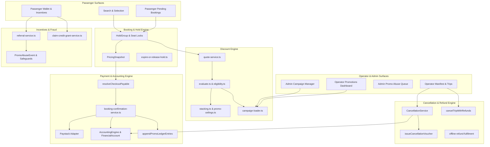

# Commercial System Comprehensive Audit — 01: Executive Summary & System Map

**Audit Date:** 2026-08-17  
**Scope:** Complete end-to-end commercial architecture across discounts, pricing, checkout, payments, trips, schedules, promo credits, vouchers, coupon campaigns, referral/welcome incentives, cancellation/refunds, operator settlement, and fraud prevention.  
**Location:** `C:\dev\moja-buss`

---

## 1. Audit Overview & Objectives

This audit provides an exhaustive architectural, flow, and operational analysis of the entire commercial engine powering Moja Ride (`moja-buss`). The system spans multi-currency calculations (XOF), multi-instrument discounting (coupons, monetary vouchers, credit lots), seat reservation locks, payment processing (Paystack, Wallet, ZERO_CASH), double-entry ledger accounting, operator escrow clearing, multi-channel cancellations (`CASH`, `WALLET`, `VOUCHER`), and fraud/abuse protection.

The goal of this audit is to:
1. Map all commercial domain models, lifecycle states, and interactions end-to-end.
2. Verify pricing invariants, instrument stacking orders, fee waiver policies, and budget guards.
3. Validate double-spend prevention, hold expiry workflows, and ledger accounting consistency.
4. Detail cancellation policies, refund channel routing, checked-in seat protections, and operator clawbacks.
5. Provide actionable findings, edge case analysis, and hardening recommendations across every surface.

---

## 2. Commercial System Architecture Map

---

## 3. Core Domain Models & Invariants

| Domain Model | Key Fields & Controls | Core Invariant |
|--------------|----------------------|----------------|
| `DiscountCampaign` | `fundingType` (`OPERATOR` \| `PLATFORM` \| `SHARED`), `benefitType` (`PERCENT` \| `FIXED_AMOUNT` \| `FREE_SEAT`), `applyTarget`, `budgetXOF`, `budgetReservedXOF`, `budgetConsumedXOF` | `budgetConsumedXOF + budgetReservedXOF <= budgetXOF` (when budget set) |
| `CouponCode` | `code`, `isActive`, `maxRedemptions`, `assignedUserId`, `expiresAt` | Unique `code`, single-use per user/phone when configured |
| `MonetaryVoucher` | `source` (`CANCELLATION` \| `PROMOTIONAL` \| `ADMIN`), `scheduleId`, `companyId`, `originalAmountXOF`, `remainingAmountXOF`, `reservedAmountXOF` | `source == CANCELLATION` requires `scheduleId` & `companyId` |
| `CreditLot` | `source` (`WELCOME_BONUS` \| `REFERRAL` \| `ADMIN`), `amountXOF`, `remainingXOF`, `reservedXOF`, `expiresAt`, `availableAt` | Redemptions draw from oldest active non-expired lot |
| `HoldGroup` | `status` (`ACTIVE` \| `CONFIRMED` \| `CANCELLED` \| `EXPIRED`), `expiresAt`, `totalAmountXOF` | Atomic seat lock across all seats in checkout |
| `Booking` | `status` (`PENDING_PAYMENT` \| `CONFIRMED` \| `CANCELLED` \| `EXPIRED`), `farePaid`, `checkedInAt`, `clearedAt` | Cannot cancel single booking if `checkedInAt != null` |
| `FinancialAccount` | `postedBalance`, `reservedBalance`, `availableBalance`, `accountClass` | `availableBalance = postedBalance - reservedBalance` |
| `DiscountRedemption` | `status` (`RESERVED` \| `CONFIRMED` \| `RELEASED`), `ticketDiscountXOF`, `feeDiscountXOF`, `creditAppliedXOF` | 1-to-1 link with active `HoldGroup` snapshot |

---

## 4. Key Cross-Cutting Invariants

1. **Zero-Cash Confirmation (`payableXOF === 0`):**
   When promo instruments, vouchers, or credits cover 100% of the payable fare, `paymentMode` resolves to `ZERO_CASH`. The system confirms the hold without debiting cash wallet balances while posting exact liability drawdowns to the double-entry accounting ledger.

2. **Schedule-Scoped Cancellation Vouchers:**
   Monetary vouchers issued from booking cancellations (`source = CANCELLATION`) are strictly bound to the `scheduleId` and `companyId` of the cancelled trip. They are redeemable only on future departures under the same schedule.

3. **Checked-In Gating on Cancellation:**
   Any booking with `checkedInAt != null` is locked against single-booking cancellation (`BAD_REQUEST`). Whole-trip cancellation is blocked (`checkedInCount > 0`) to prevent checked-in passengers from remaining on cancelled trips.

4. **Multi-Seat Hold Atomicity:**
   Hold groups lock multiple seats simultaneously. Expiry releases all seat holds and un-reserves used budget, credit lots, and monetary vouchers in a single transaction.

5. **Double-Spend Prevention:**
   Discounts and credit lots use dual-state reservation (`reservedAmountXOF` / `remainingAmountXOF`) during hold creation, followed by atomic consumption on booking confirmation or release on hold expiration.

---

## 5. Audit Document Directory

- **`01-executive-summary-and-system-map.md`**: Overview, architecture diagram, domain models, and global invariants.
- **`02-discount-engine-and-promotions-audit.md`**: Pricing pipeline, eligibility criteria, campaigns, vouchers, credit lots, and budget guards.
- **`03-checkout-payments-and-ledger-audit.md`**: Hold snapshotting, `resolveCheckoutPayable`, Paystack/Wallet/ZERO_CASH integration, double-entry ledger.
- **`04-trips-schedules-and-hold-expiry-audit.md`**: Trip scheduling, seat occupancy windows, hold expiry cron, reservation release.
- **`05-cancellations-refunds-and-clawbacks-audit.md`**: Single/bulk/trip cancellations, refund channels (`CASH`, `WALLET`, `VOUCHER`), checked-in locks, operator balance clawback.
- **`06-referral-welcome-bonus-and-abuse-prevention-audit.md`**: Referral engine, credit qualification rules, device/IP fraud checks, promo abuse queue.
- **`07-admin-and-operator-management-surfaces-audit.md`**: Operator promotions view, admin campaigns, abuse queue, passenger bookings view, operator manifest.
- **`08-comprehensive-findings-catalog-and-recommendations.md`**: Detailed findings, edge cases, risks, hardening recommendations, and testing checklists.
