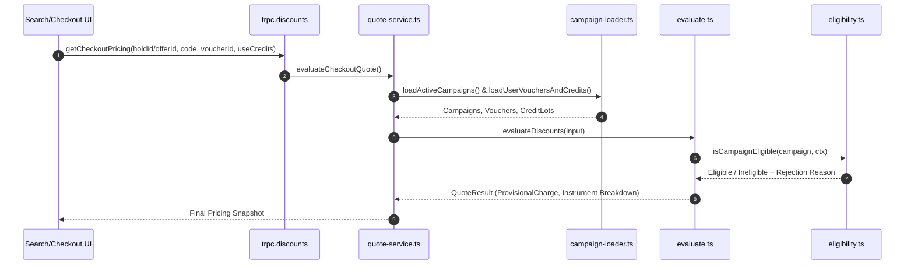

# Commercial System Comprehensive Audit — 02: Discount Engine & Promotions

**Audit Date:** 2026-08-17  
**Subsystems Covered:** Discount Engine (`evaluate.ts`, `eligibility.ts`, `benefits.ts`, `stacking.ts`), Quote Service (`quote-service.ts`), Campaign Loader (`campaign-loader.ts`), Coupon Management, Monetary Vouchers, Credit Lots, Budget Guards, and Promo Ceilings.

---

## 1. Discount Engine Evaluation Pipeline

The evaluation pipeline evaluates all available commercial instruments against a target booking request and produces a deterministic quote breakdown.



### 1.1 Calculation Step Invariants

1. **Subtotal Base Calculation:**
   $$\text{subtotalBaseXOF} = \sum_{\text{seat} \in \text{seats}} \text{seatPriceXOF}$$

2. **Ticket Discount Calculation:**
   Applied via `BenefitType`:
   - `PERCENT`: $\text{discount} = \lfloor \text{subtotalBaseXOF} \times (\text{percentBps} / 10000) \rfloor$
   - `FIXED_AMOUNT`: $\text{discount} = \min(\text{subtotalBaseXOF}, \text{amountXOF})$
   - `FREE_SEAT`: $\text{discount} = \sum_{i=1}^{\min(N, \text{freeSeatCount})} \text{seatPrice}_i$ (sorted ascending/descending per policy)

   Cap by `maxDiscountPerBookingXOF` if present:
   $$\text{ticketDiscountXOF} = \min(\text{discount}, \text{maxDiscountPerBookingXOF})$$

3. **Post-Discount Subtotal:**
   $$\text{postDiscountSubtotalXOF} = \max(0, \text{subtotalBaseXOF} - \text{ticketDiscountXOF})$$

4. **Monetary Voucher Deduction:**
   Monetary vouchers apply against `postDiscountSubtotalXOF` (or `ENTIRE_CHARGE` if configured):
   $$\text{voucherAppliedXOF} = \min(\text{voucherAvailableXOF}, \text{postDiscountSubtotalXOF})$$

5. **Credit Lot Deduction:**
   Credit lots apply against remaining subtotal after ticket discount and monetary voucher:
   $$\text{creditAppliedXOF} = \min(\text{creditsAvailableXOF}, \text{postDiscountSubtotalXOF} - \text{voucherAppliedXOF})$$

6. **Final Cash Charge:**
   $$\text{chargeAmountXOF} = \max(0, \text{postDiscountSubtotalXOF} - \text{voucherAppliedXOF} - \text{creditAppliedXOF}) + \text{convenienceFeeXOF}$$

---

## 2. Instrument Inventory & Rules

### 2.1 Discount Campaign & Coupon Codes (`DiscountCampaign`, `CouponCode`)
- **Funding Models:** `OPERATOR` (100% operator funded), `PLATFORM` (100% platform funded), or `SHARED` (`platformShareBps` + `operatorShareBps` = 10000).
- **Scope Restrictions:** `CampaignRouteScope`, `CampaignTripScope`, `CampaignScheduleScope`, `CampaignCompanyOptIn`.
- **User / First Booking Guards:** `newUserOnly` (requires user to have zero confirmed bookings), `firstBookingOnly`.
- **Redemption Limits:** `maxRedemptionsGlobal`, `maxRedemptionsPerUser`, `maxRedemptionsPerPhone`.

### 2.2 Monetary Vouchers (`MonetaryVoucher`)
- **Sources:** `CANCELLATION`, `PROMOTIONAL`, `ADMIN_MANUAL`, `GOODWILL`, `MARKETING_GRANT`.
- **Cancellation Voucher Binding:**
  - `source === CANCELLATION` requires non-null `scheduleId` and `companyId`.
  - Soft-fails with `VOUCHER_SCHEDULE_MISMATCH` if `context.scheduleId !== voucher.scheduleId`.
  - Soft-fails with `VOUCHER_COMPANY_MISMATCH` if `context.companyId !== voucher.companyId`.
- **Partial Remaining Balance:** Redeeming a 10,000 XOF voucher on a 6,000 XOF trip leaves 4,000 XOF in `remainingAmountXOF` bound to the schedule until expiry (12 months default).

### 2.3 Promo Credit Lots (`CreditLot`)
- **Sources:** `WELCOME_BONUS`, `REFERRAL`, `ADMIN_MANUAL`.
- **Status & Availability:** Active lots require `status === "ACTIVE"`, `expiresAt > now`, and `availableAt <= now` (or null).
- **FIFO Consumption:** Automatically consumed in order of nearest expiration date.

---

## 3. Budget Guards & Double-Spend Control

### 3.1 Budget Reserve Guard (`budget-reserve-guard.ts`)
```ts
export function assertBudgetAvailable(
  campaign: { budgetXOF: number | null; budgetConsumedXOF: number; budgetReservedXOF: number },
  requestedAmountXOF: number
): void {
  if (campaign.budgetXOF !== null) {
    const totalCommitted = campaign.budgetConsumedXOF + campaign.budgetReservedXOF;
    if (totalCommitted + requestedAmountXOF > campaign.budgetXOF) {
      throw new TRPCError({
        code: "BAD_REQUEST",
        message: "Campaign budget exceeded",
      });
    }
  }
}
```

### 3.2 Dual-State Reservation Pattern
All instruments follow a 2-step reservation lifecycle during checkout:
1. **Hold Creation (`PENDING_PAYMENT`):**
   - Campaign: `budgetReservedXOF += amount`
   - MonetaryVoucher: `reservedAmountXOF += amount`
   - CreditLot: `reservedXOF += amount`
   - Creates a `DiscountRedemption` record with `status: "RESERVED"`.
2. **Confirmation (`CONFIRMED`):**
   - Campaign: `budgetReservedXOF -= amount`, `budgetConsumedXOF += amount`
   - MonetaryVoucher: `reservedAmountXOF -= amount`, `remainingAmountXOF -= amount`
   - CreditLot: `reservedXOF -= amount`, `remainingXOF -= amount`
   - Updates `DiscountRedemption` status to `"CONFIRMED"`.
3. **Expiration / Release (`EXPIRED` / `CANCELLED`):**
   - Campaign: `budgetReservedXOF -= amount`
   - MonetaryVoucher: `reservedAmountXOF -= amount`
   - CreditLot: `reservedXOF -= amount`
   - Updates `DiscountRedemption` status to `"RELEASED"`.

---

## 4. Edge Cases & Safeguards Analysis

| Scenario | Handled By | Expected Result | Verification Status |
|----------|------------|-----------------|---------------------|
| Concurrent checkout with same voucher | Prisma transaction + `reservedAmountXOF` update | Second hold fails with `VOUCHER_EMPTY` or insufficient available balance | Verified in unit tests |
| Expired voucher selected by passenger | `evaluate.ts` line 165 | Soft-fails with `VOUCHER_EXPIRED` (does not block cash checkout) | Verified |
| Voucher schedule mismatch | `evaluate.ts` line 170 | Soft-fails with `VOUCHER_SCHEDULE_MISMATCH` | Verified |
| Partial credit lot redemption | `quote-service.ts` & `promo-ledger.ts` | Partial amount deducted; remainder left in lot | Verified |
| Stacking multiple promotional vouchers | `promo-ceilings.ts` | Gated by `maxPromotionalVouchersPerUser` (default 1) | Verified |
