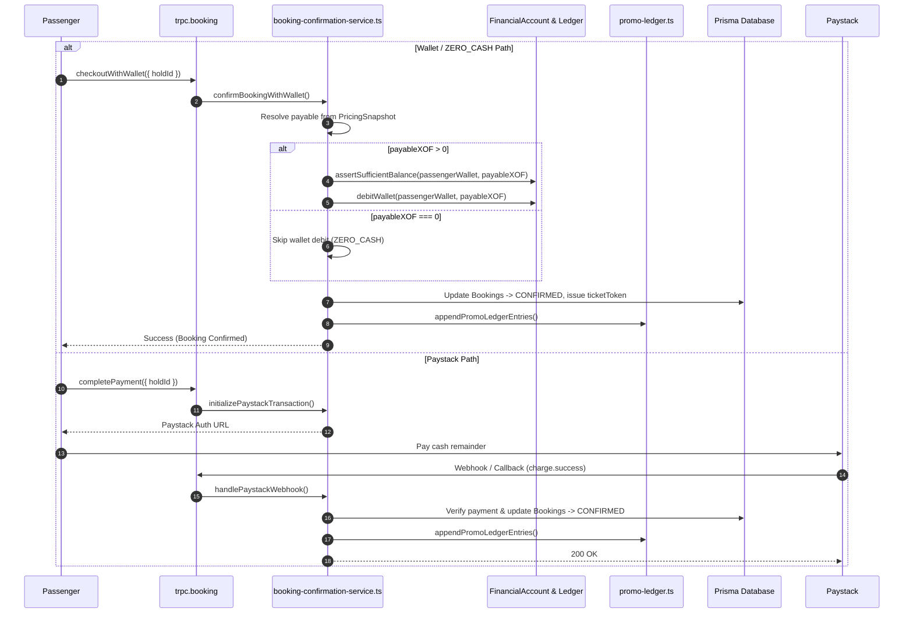

# Commercial System Comprehensive Audit — 03: Checkout, Payments & Ledger

**Audit Date:** 2026-08-17  
**Subsystems Covered:** Checkout Payable Resolver (`checkout-payable.ts`), Hold Snapshotting (`PricingSnapshot`), Booking Confirmation Service (`booking-confirmation-service.ts`), Paystack Adapter, Wallet Engine, and Accounting Ledger Integration (`FinancialAccount`, `LedgerEntry`).

---

## 1. Checkout Payable Resolution (`resolveCheckoutPayable`)

The checkout payable resolver determines the exact cash amount to collect from the passenger based on instruments applied and payment method fee policies.

```ts
export function resolveCheckoutPayable(input: CheckoutPayableInput): CheckoutPayable {
  const credit = Math.max(0, input.creditAppliedXOF);
  const postSub = Math.max(0, input.postDiscountSubtotalXOF);
  const waiveFee = input.paymentMethod === "WALLET" || input.paymentMethod === "ZERO_CASH";

  const displayFeeXOF = waiveFee ? 0 : Math.max(0, input.convenienceFeeXOF);
  const payableWithFee = Math.max(0, input.chargeAmountXOF);
  const payableWalletStyle = Math.max(0, postSub - credit);

  let payableXOF = waiveFee ? payableWalletStyle : payableWithFee;

  if (payableXOF === 0) {
    return {
      payableXOF: 0,
      paymentMode: "ZERO_CASH",
      displayFeeXOF: 0,
    };
  }

  return {
    payableXOF,
    paymentMode: input.paymentMethod === "PAYSTACK" ? "PAYSTACK" : "WALLET",
    displayFeeXOF,
  };
}
```

### 1.1 Payment Modes Matrix

| Input Condition | Payment Method Selected | Fee Policy | `payableXOF` | `paymentMode` | Server Path |
|-----------------|-------------------------|------------|--------------|---------------|-------------|
| Instruments cover full fare | Any (`PAYSTACK` / `WALLET` / `ZERO_CASH`) | Waived (0 XOF) | `0` | `ZERO_CASH` | `confirmBookingWithWallet` (Zero debit, posts liability legs) |
| Partial coverage | `WALLET` | Waived (0 XOF) | `postSub - credit` | `WALLET` | `confirmBookingWithWallet` (Debits cash wallet) |
| Partial coverage | `PAYSTACK` | Charged (Fee applies to remainder) | `chargeAmountXOF` | `PAYSTACK` | Paystack Checkout -> Webhook / Callback confirmation |

---

## 2. Server Booking Confirmation Flow



---

## 3. Double-Entry Accounting Ledger Integration

### 3.1 Account Classes

- `PASSENGER_WALLET`: Passenger cash balance.
- `OPERATOR_RECEIVABLE`: Operator earnings held prior to payout/clearing.
- `PLATFORM_ESCROW`: Platform escrow pool holding passenger payments for uncompleted trips.
- `PROMO_EXPENSE`: Platform marketing expense account for platform-funded discounts.
- `VOUCHER_LIABILITY`: Liability account tracking outstanding/redeemed monetary vouchers.
- `CONVENIENCE_FEE_REVENUE`: Platform fee revenue account.

### 3.2 Booking Ledger Entry Structure (`appendPromoLedgerEntries`)

When a booking is confirmed, the ledger records exact debit/credit entries to maintain balanced books:

```
Transaction: BOOKING_CONFIRMATION (ID: {holdGroupId})
---------------------------------------------------------------------
1. DEBIT  PASSENGER_WALLET / PAYSTACK       : payableXOF
2. DEBIT  VOUCHER_LIABILITY                 : voucherAppliedXOF
3. DEBIT  PROMO_EXPENSE / OPERATOR_PROMO    : ticketDiscountXOF + creditAppliedXOF
4. CREDIT OPERATOR_RECEIVABLE               : operatorNetXOF
5. CREDIT CONVENIENCE_FEE_REVENUE           : convenienceFeeXOF
---------------------------------------------------------------------
TOTAL DEBITS = TOTAL CREDITS (Strict Double-Entry Balance)
```

---

## 4. Double-Spend & Idempotency Controls

1. **Idempotency Keys on Financial Transactions:**
   `businessIdempotencyKey` set to `BOOKING_CONFIRM_{holdGroupId}` prevents duplicate confirmation processing even under network retries or concurrent webhook calls.

2. **Ledger Entry Idempotency:**
   `idempotencyKey` on `LedgerEntry` prevents duplicate debit/credit posts to financial accounts.

3. **Status Locks:**
   Booking status transition `PENDING_PAYMENT -> CONFIRMED` is guarded in an atomic database transaction. If status is no longer `PENDING_PAYMENT`, confirmation aborts cleanly.
