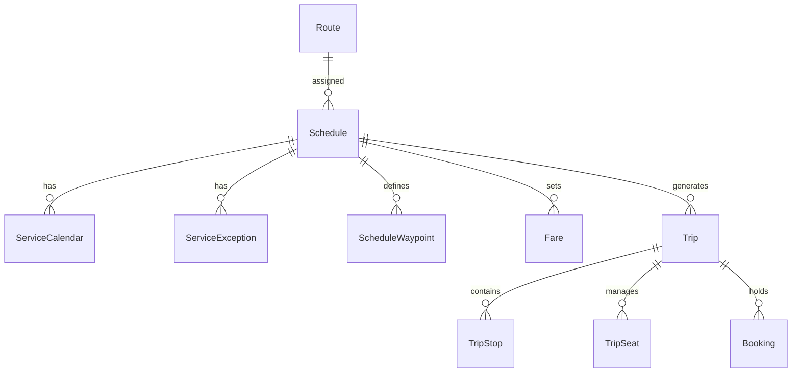
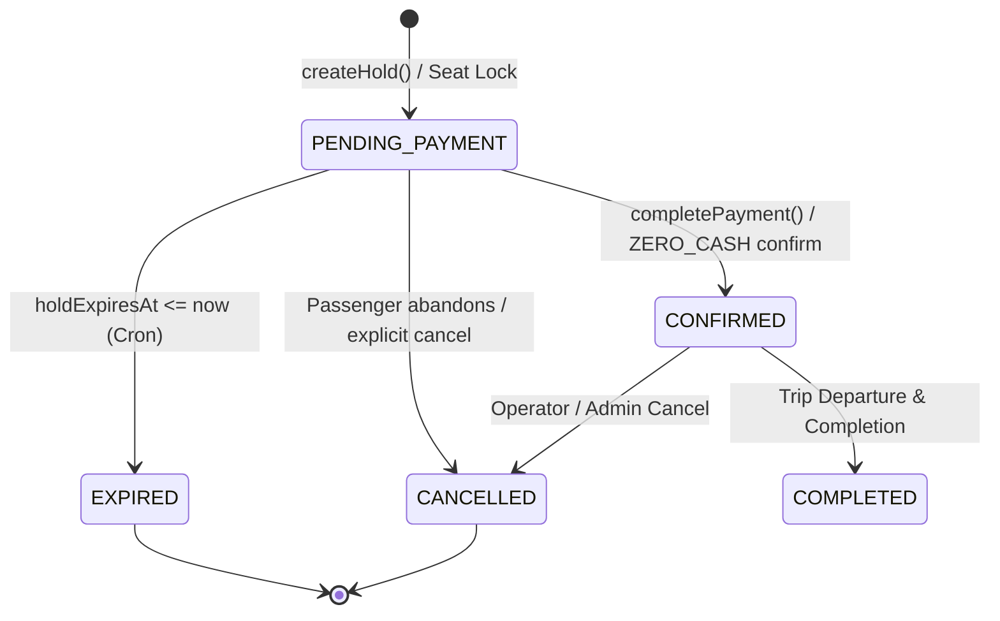

# Commercial System Comprehensive Audit — 04: Trips, Schedules & Hold Expiry

**Audit Date:** 2026-08-17  
**Subsystems Covered:** Schedules (`Schedule`), Trip Instances (`Trip`), Segment Occupancy, Multi-Seat Holds (`HoldGroup`), Hold Expiry Cron (`expire-or-release-hold.ts`), and Un-reservation Workflows.

---

## 1. Schedule & Trip Instance Model



### 1.1 Segment Occupancy & Overlap Rules

Moja Ride supports intermediate stop boarding and dropoff. Occupancy is tracked per seat across stop order ranges $[O_{\text{board}}, O_{\text{drop}}]$.

Two bookings $B_1$ and $B_2$ for the same seat on a trip overlap if and only if:
$$\text{segmentsOverlap}(B_1, B_2) = (B_1.O_{\text{board}} < B_2.O_{\text{drop}}) \land (B_1.O_{\text{drop}} > B_2.O_{\text{board}})$$

If $\text{segmentsOverlap}(B_1, B_2)$ is false (e.g. Passenger 1 rides Stop 1 to Stop 3, Passenger 2 rides Stop 3 to Stop 5), both bookings may share the same seat on the same trip.

---

## 2. Multi-Seat Hold Lifecycle



1. **Hold Duration:** Default hold TTL is 15 minutes (`holdExpiresAt = now + 15m`).
2. **Snapshot Persistence:** Discount quote details, selected coupon codes, voucher IDs, and credit applications are frozen into `PricingSnapshot` and `DiscountRedemption` records linked to `holdGroupId`.

---

## 3. Hold Expiry Cron & Reservation Release (`expire-or-release-hold.ts`)

The hold expiry daemon runs via cron (`/api/cron/expire-holds`) to clean up abandoned seat holds and release reserved commercial instruments.

```ts
export async function expireHoldsAndReleaseReservations(prisma: PrismaClient) {
  const expiredBookings = await prisma.booking.findMany({
    where: {
      status: "PENDING_PAYMENT",
      holdExpiresAt: { lte: new Date() },
    },
    select: { id: true, holdGroupId: true },
  });

  // 1. Atomically transition expired bookings
  await prisma.booking.updateMany({
    where: { id: { in: expiredBookings.map(b => b.id) } },
    data: { status: "EXPIRED" },
  });

  // 2. Process hold groups and release reserved budget, credits, and vouchers
  for (const holdGroupId of uniqueHoldGroupIds) {
    await releaseHoldReservations(prisma, holdGroupId);
  }
}
```

### 3.1 Un-reservation Actions (`releaseHoldReservations`)

When a hold expires, the system executes atomic un-reservations:

| Instrument | Table | Action Executed |
|------------|-------|-----------------|
| Discount Campaign | `DiscountCampaign` | `budgetReservedXOF = max(0, budgetReservedXOF - amount)` |
| Monetary Voucher | `MonetaryVoucher` | `reservedAmountXOF = max(0, reservedAmountXOF - amount)` |
| Credit Lot | `CreditLot` | `reservedXOF = max(0, reservedXOF - amount)` |
| Cash Wallet | `WalletReservation` | Set `status: "RELEASED"`, `releasedAt: now` |
| Discount Redemption | `DiscountRedemption` | Set `status: "RELEASED"` |

---

## 4. Invariants & Reliability Guards

1. **Exactly-Once Un-reservation:** `WalletReservation.releasedAt` and `DiscountRedemption.status === "RELEASED"` prevent double-releasing funds if cron retries after a partial crash.
2. **Re-freeze Protection:** If a passenger attempts to pay a pending booking whose hold is still active, `refreezeHoldDiscounts` re-verifies campaign availability and updates the snapshot before executing payment.
