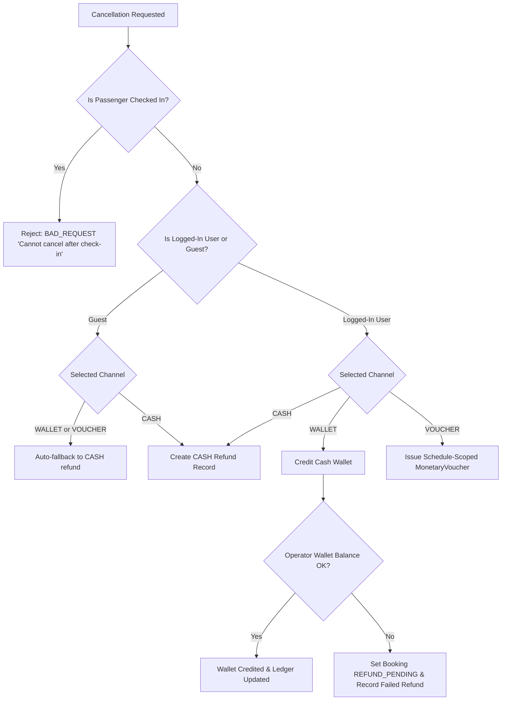

# Commercial System Comprehensive Audit — 05: Cancellations, Refunds & Clawbacks

**Audit Date:** 2026-08-17  
**Subsystems Covered:** Single Booking Cancellation (`cancellation-service.ts`), Bulk Cancellation (`operator.ts`), Whole-Trip Cancellation (`cancelTripWithRefunds.ts`), Refund Channel Routing (`CASH`, `WALLET`, `VOUCHER`), Checked-in Gating, Operator Balance Clawback, and Offline Refund Fulfillment (`offline-refund-fulfilment.ts`).

---

## 1. Refund Channels & Routing Architecture

Moja Ride supports 3 distinct refund channels when cancelling confirmed bookings:



---

## 2. Cancellation Surface Matrix

| Surface | Function / Endpoint | Allowed Channels | Checked-in Behavior | Guest Handling |
|---------|---------------------|------------------|---------------------|----------------|
| Passenger Detail | `cancellationService.cancelBooking` | `WALLET` | Hidden in UI; blocked at API (`BAD_REQUEST`) | N/A (Passenger authenticated) |
| Operator Booking Detail | `operator.cancelBooking` | `CASH`, `WALLET`, `VOUCHER` | Disabled in UI; blocked at API | Disallows `WALLET`/`VOUCHER`; forces `CASH` |
| Operator Bulk Cancel | `operator.bulkCancelBookings` | `CASH`, `WALLET`, `VOUCHER` | Skips checked-in seats (`skippedCheckedIn`) | Converts `WALLET`/`VOUCHER` to `CASH` |
| Operator Whole-Trip Cancel | `cancelTripWithRefunds` | `CASH`, `WALLET`, `VOUCHER` | Blocks entire trip cancel if `checkedInCount > 0` | Converts `WALLET`/`VOUCHER` to `CASH` |
| Admin Refund Management | `admin-offline-refunds-view` | `CASH` | Admin override flow | Processes offline cash payout |

---

## 3. Detailed Channel Specifications

### 3.1 Schedule-Scoped Cancellation Voucher (`VOUCHER`)
- **Required Parameters:** `scheduleId` and `companyId` from booking trip.
- **Invariants:**
  - `MonetaryVoucher.source = "CANCELLATION"`
  - `expiresAt = now + 12 months`
  - Bound to `scheduleId` and `companyId`.
  - Redeemable on any future trip operating under the same `scheduleId`.

### 3.2 Passenger Cash Wallet Refund (`WALLET`)
- Executed via `AccountingEngine.creditWallet(userId, farePaid)`.
- **Clawback Economics:**
  - The system debits the issuing operator's `OPERATOR_RECEIVABLE` account.
  - If operator balance is insufficient, status is set to `REFUND_PENDING` and flagged for admin offline resolution.

### 3.3 Cash / Counter Refund (`CASH`)
- Creates a `Refund` record with `channel: "CASH"`, `status: "PENDING"`.
- Operator/admin pays passenger in cash at terminal counter and marks refund `FULFILLED` via `offline-refund-fulfilment.ts`.

---

## 4. Whole-Trip Cancellation Security (Decision 6 & Policy A)

Whole-trip cancellation (`cancelTripWithRefunds`) handles bulk refunds when an entire departure is cancelled by the operator:

```ts
const checkedInCount = await prisma.booking.count({
  where: { tripId, status: "CONFIRMED", checkedInAt: { not: null } },
});

if (checkedInCount > 0) {
  throw new Error(
    `Cannot cancel trip while ${checkedInCount} passenger(s) are checked in. Handle checked-in bookings first, or cancel non-checked-in seats individually.`
  );
}
```

**Rationale:** Blocking trip cancellation when checked-in passengers exist prevents architectural inconsistencies where checked-in passengers remain marked `CONFIRMED` on a `CANCELLED` trip.
