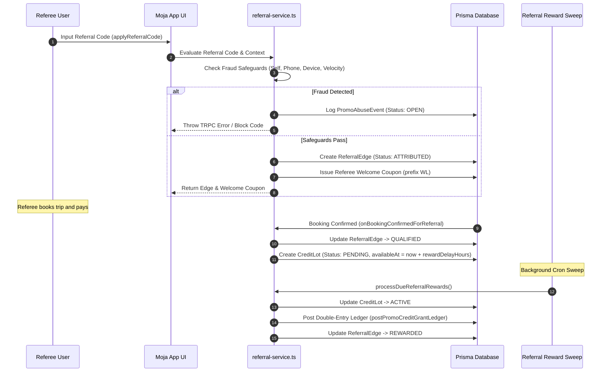

# Commercial System Comprehensive Audit — 06: Referral, Welcome Bonus & Abuse Prevention

**Audit Date:** 2026-08-17  
**Subsystems Covered:** Referral Engine (`referral-service.ts`), Credit Grant Claims (`claim-credit-grant-service.ts`), Anti-Abuse Fraud Controls, Device Fingerprinting (`device-hash.ts`), and Admin Abuse Review Queue (`PromoAbuseEvent`).

---

## 1. Referral Program Architecture & Qualification Lifecycle

---

## 2. Fraud & Anti-Abuse Safeguards

| Safeguard | Trigger Condition | System Action | Abuse Queue Event Type |
|-----------|-------------------|---------------|------------------------|
| **Self-Referral Block** | `refereeUserId === referrerUserId` | Blocks attribution, throws `BAD_REQUEST` | `SELF_REFERRAL` |
| **Same-Phone Block** | `referee.phone === referrer.phone` | Blocks attribution, throws `BAD_REQUEST` | `SAME_PHONE_REFERRAL` |
| **Same-Device Block** | `referee.deviceHash === referrer.deviceHash` or previously recorded `ReferralEdge` | Blocks attribution, throws `BAD_REQUEST` | `SAME_DEVICE_REFERRAL` |
| **Velocity Cap** | Referrer qualifications today $> \text{maxQualificationsPerDay}$ (Default: 10) | Blocks attribution | `VELOCITY_CAP` |
| **Device Reuse Grant Claim** | Same `deviceHash` attempting to claim multiple welcome credit coupons | Blocks grant claim | `DEVICE_REUSE_GRANT` |

### 2.1 Browser Device Fingerprinting (`device-hash.ts`)
- Device fingerprinting generates a SHA-256 hash using browser canvas, screen resolution, time zone, user agent, navigator hardware concurrency, and local storage seed (`moja:device-id:v1`).
- Included in headers/payloads during referral code application, hold creation, credit grant claims, and booking confirmation.

---

## 3. Reward Delays & Maturation Policy

1. **Qualification Criteria:**
   - Requires referee booking `status === "CONFIRMED"` and `paymentStatus === "PAID"`.
   - Option `requirePaidConfirmedBooking = true` prevents exploitation via unpaid/cancelled holds.

2. **Trip-Departure Anchored Maturation (`rewardDelayHours`):**
   - Referrer reward credit lot is created in `PENDING` status with `availableAt` anchored to the **referee's trip departure date** (`trip.departureDate + rewardDelayHours`).
   - If the referee cancels their booking or if no `CONFIRMED` booking exists at maturation time, `processDueReferralRewards` invalidates the pending credit lot (`EXPIRED`) rather than granting credits.
   - Cron task `processDueReferralRewards` sweeps mature lots (`availableAt <= now`), verifies active booking status, activates them (`status: "ACTIVE"`), and posts the double-entry accounting ledger transaction (`postPromoCreditGrantLedger`).

---

## 4. Admin Promo Abuse Queue (`admin-promo-abuse-view.tsx`)

The admin promo abuse queue allows compliance staff to review and resolve flagged abuse events:

- **Review States (`PromoAbuseReviewStatus`):** `OPEN` -> `INVESTIGATING` -> `RESOLVED` / `DISMISSED`.
- **Metadata Inspection:** Shows anonymized IP hashes, device hashes, involved user IDs, referrer IDs, and campaign references.
- **Resolution Workflow:** Admin attaches investigation notes (`resolutionNote`) and records `resolvedAt` and `resolvedByUserId`.
