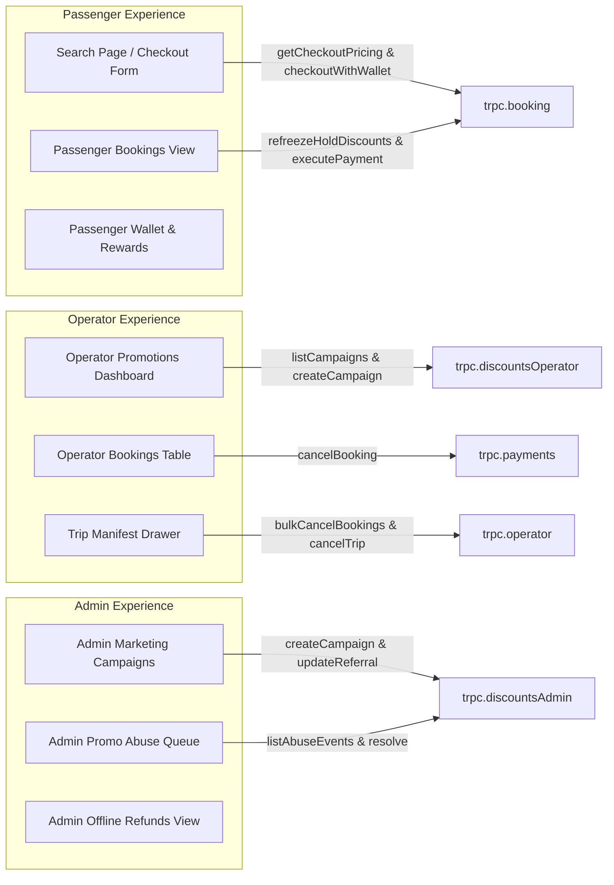

# Commercial System Comprehensive Audit — 07: Admin & Operator Management Surfaces

**Audit Date:** 2026-08-17  
**Subsystems Covered:** Passenger Search & Checkout UI, Operator Promotions View, Admin Campaign Manager, Admin Abuse Queue, Passenger Bookings View, Operator Bookings View, and Manifest Drawer.

---

## 1. UI Surface Inventory & Integration Map

---

## 2. Surface Specifications

### 2.1 Passenger Search & Checkout (`SearchPageClient` & `booking-checkout-form.tsx`)
- **Location:** `apps/web/app/[locale]/search/page.tsx` & `features/booking/components/booking-checkout-form.tsx`
- **Capabilities:**
  - Displays journey options, seat map, and passenger details.
  - Promo code input with instant validation via `trpc.booking.getCheckoutPricing`.
  - Schedule-filtered monetary voucher selector (`listUserVouchers`).
  - Auto-applied credit toggle (`useCredits`).
  - Calculates cash payable via `resolveCheckoutPayable`.
  - Dispatches `ZERO_CASH` confirm, Wallet confirm, or Paystack checkout modal.

### 2.2 Passenger Bookings View (`passenger-bookings-view.tsx` & `booking-details.tsx`)
- **Location:** `apps/web/app/[locale]/dashboard/(passenger)/bookings/page.tsx`
- **Capabilities:**
  - Lists upcoming, pending payment, and completed passenger bookings.
  - Pending payment drawer displays hold countdown timer (`useHoldCountdown`).
  - Allows pending booking re-pricing and discount re-freezing via `trpc.booking.refreezeHoldDiscounts`.
  - Complete pending payment via Wallet / ZERO_CASH or Paystack.
  - Single-booking self-cancellation gated to non-checked-in seats.

### 2.3 Operator Promotions Dashboard (`operator-promotions-view.tsx`)
- **Location:** `apps/web/app/[locale]/dashboard/operator/(dashboard)/promotions/page.tsx`
- **Capabilities:**
  - Create operator-funded promotional campaigns (`fundingType: "OPERATOR"`).
  - Define coupon codes, start/end dates, max redemptions, and minimum subtotal.
  - Scope campaign to specific operator schedules or routes.
  - View campaign performance analytics, redemptions count, and budget consumption.

### 2.4 Operator Bookings View & Manifest Drawer (`booking-detail-drawer.tsx` & `manifest-drawer.tsx`)
- **Location:** `apps/web/app/[locale]/dashboard/operator/(dashboard)/bookings/page.tsx`
- **Capabilities:**
  - Booking detail drawer supports single booking cancel with 3 refund channels (`CASH`, `WALLET`, `VOUCHER`).
  - Disables cancel action if `booking.checkedInAt != null` ("Checked in — cancel disabled").
  - Trip manifest drawer supports bulk selected seat cancellation (`bulkCancelBookings`) with refund channel selection, reporting skipped checked-in count.
  - Whole-trip cancellation (`cancelTripWithRefunds`) with refund channel selection, blocked if checked-in passengers exist.

### 2.5 Admin Marketing Campaigns & Abuse Queue (`admin-campaigns-view.tsx` & `admin-promo-abuse-view.tsx`)
- **Location:** `apps/web/app/[locale]/dashboard/admin/marketing/campaigns` & `abuse`
- **Capabilities:**
  - Platform-wide campaign creation (Platform, Operator, or Shared funding).
  - Referral program parameters editor (`referrerCreditAmountXOF`, `rewardDelayHours`, `sameDeviceBlock`, etc.).
  - Admin manual monetary voucher issuance and credit lot grants.
  - Review promo abuse queue events (`SELF_REFERRAL`, `SAME_DEVICE_REFERRAL`, `SAME_PHONE_REFERRAL`), assign notes, and mark resolved.
