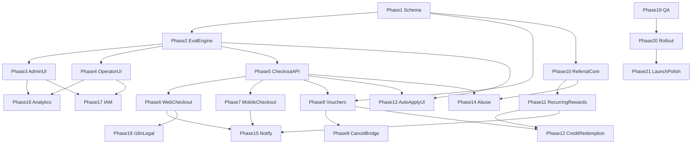

# Discount, Coupon, Voucher & Referral System — Master Plan

**Created:** 2026-08-15  
**Status:** Ready for phased implementation  
**Product:** Moja Ride (Côte d'Ivoire intercity bus marketplace + operator ERP)  
**Approach:** Full target architecture designed now; ship phase-by-phase

---

## Why this exists

The core marketplace, payments, operator ERP, admin dashboard, and traveler app are complete. Before launch we need an **enterprise-grade commercial incentives layer**:

- Platform and operator **campaigns / coupons / discounts**
- **Monetary vouchers** (cancellation + marketing) aligned with FAQ/Terms
- **Passenger referrals** with recurring wallet credits
- Correct **pricing, ledger, and hybrid cost-share** so money always balances

Today: **no coupon/referral domain**. Closest stubs are `FareType.PROMO` (unused in matching), `PromoBanner` (marketing only), `RefundChannel.VOUCHER` (cancel clawback label), and FAQ/Terms copy that already promises vouchers/codes.

---

## Locked product decisions (2026-08-15)

| # | Decision | Choice |
|---|----------|--------|
| 1 | Who creates & funds | **Platform + Operators + Hybrid cost-share** |
| 2 | Referral model | **Recurring wallet credits** across bookings (not one-shot only) |
| 3 | Reward currency | **Both:** coupons for acquisition + wallet credits for loyalty/referrals |
| 4 | Discount mechanics (v1 target) | **All:** % off, fixed XOF, first-booking, trip/route/operator/platform scope, min spend/seats, usage caps, date windows, auto-apply best, stacking rules, invite codes/links |
| 5 | Cancellation vouchers | **In scope** — full voucher + coupon + referral program |
| 6 | Operator autonomy | Operators create codes **without admin approval** |
| 7 | Abuse | Hard floor: self-referral block, paid-confirm before payout, device/phone limits, creator-defined per-user redemption caps |
| 8 | Surfaces | **Admin + Operator + Passenger (web + traveler-app)** all required |
| 9 | Delivery | **Phased** (architecture first, implement one phase at a time) |

### Engineering defaults locked in this plan (not re-asked)

| Topic | Default |
|-------|---------|
| Commission on operator-funded discount | On **post-discount** ticket subtotal |
| Commission on platform-funded discount | On **pre-discount** fare; platform eats discount via promo liability |
| Hybrid | `platformShareBps` + `operatorShareBps` on campaign (must sum 10_000) |
| Convenience fee | Always on **post-discount** ticket subtotal (never discount fees/add-ons) — matches FAQ |
| Stacking default | At most **one discount code OR one monetary voucher** on ticket price; optional **auto promo** may combine only if campaign `stackGroup` allows; wallet credit can partially pay remainder |
| Code apply timing | Validated at preview + **frozen on `createHold`** into `PricingSnapshot` |
| Operator approval | None required to publish; admin can **pause / revoke** any campaign platform-wide for fraud |
| Currency | XOF only |
| i18n | EN + FR for all passenger + dashboard copy |

---

## Document map

| File | Purpose |
|------|---------|
| [00-README.md](./00-README.md) | This index |
| [01-locked-decisions-and-product-vision.md](./01-locked-decisions-and-product-vision.md) | Vision, goals, non-goals, success metrics |
| [02-glossary-and-personas.md](./02-glossary-and-personas.md) | Terms + passenger/operator/admin journeys |
| [03-domain-model-schema.md](./03-domain-model-schema.md) | Prisma models, enums, relations |
| [04-pricing-stacking-auto-apply.md](./04-pricing-stacking-auto-apply.md) | Math, stacking, auto-apply algorithm |
| [05-ledger-cost-share-settlements.md](./05-ledger-cost-share-settlements.md) | Double-entry, hybrid funding, settlements |
| [06-phase-01-foundation-schema-services.md](./06-phase-01-foundation-schema-services.md) | Phase 1 — schema + shared packages |
| [07-phase-02-discount-evaluation-engine.md](./07-phase-02-discount-evaluation-engine.md) | Phase 2 — eligibility engine |
| [08-phase-03-admin-campaigns-coupons.md](./08-phase-03-admin-campaigns-coupons.md) | Phase 3 — admin marketing/finance UI |
| [09-phase-04-operator-promotions.md](./09-phase-04-operator-promotions.md) | Phase 4 — operator promo ERP |
| [10-phase-05-checkout-backend-integration.md](./10-phase-05-checkout-backend-integration.md) | Phase 5 — hold/pricing/pay APIs |
| [11-phase-06-passenger-web-checkout-ui.md](./11-phase-06-passenger-web-checkout-ui.md) | Phase 6 — web checkout UX |
| [12-phase-07-traveler-app-checkout-ui.md](./12-phase-07-traveler-app-checkout-ui.md) | Phase 7 — mobile checkout UX |
| [13-phase-08-monetary-vouchers.md](./13-phase-08-monetary-vouchers.md) | Phase 8 — voucher wallet instruments |
| [14-phase-09-cancellation-voucher-bridge.md](./14-phase-09-cancellation-voucher-bridge.md) | Phase 9 — cancel → 12-month voucher |
| [15-phase-10-referral-core.md](./15-phase-10-referral-core.md) | Phase 10 — codes, links, attribution |
| [16-phase-11-referral-rewards-recurring.md](./16-phase-11-referral-rewards-recurring.md) | Phase 11 — recurring credits |
| [17-phase-12-wallet-credits-and-redemption.md](./17-phase-12-wallet-credits-and-redemption.md) | Phase 12 — credit apply at checkout |
| [18-phase-13-auto-apply-and-stacking-ui.md](./18-phase-13-auto-apply-and-stacking-ui.md) | Phase 13 — best-deal UX |
| [19-phase-14-abuse-fraud-controls.md](./19-phase-14-abuse-fraud-controls.md) | Phase 14 — fraud floor |
| [20-phase-15-notifications.md](./20-phase-15-notifications.md) | Phase 15 — Novu workflows |
| [21-phase-16-analytics-reporting.md](./21-phase-16-analytics-reporting.md) | Phase 16 — admin/operator reports |
| [22-phase-17-permissions-iam-audit.md](./22-phase-17-permissions-iam-audit.md) | Phase 17 — permissions + audit |
| [23-phase-18-i18n-legal-faq.md](./23-phase-18-i18n-legal-faq.md) | Phase 18 — copy + legal alignment |
| [24-phase-19-testing-qa-matrix.md](./24-phase-19-testing-qa-matrix.md) | Phase 19 — test strategy |
| [25-phase-20-rollout-feature-flags.md](./25-phase-20-rollout-feature-flags.md) | Phase 20 — flags + launch |
| [29-phase-21-launch-polish.md](./29-phase-21-launch-polish.md) | Phase 21 — charts, marketing opt-in, app referrals, Terms |
| [26-edge-cases-and-risks.md](./26-edge-cases-and-risks.md) | Exhaustive edge cases |
| [27-future-enhancements.md](./27-future-enhancements.md) | Post-v1 catalog (kept out of launch) |
| [28-implementation-order-and-deps.md](./28-implementation-order-and-deps.md) | Dependency graph + suggested sprints |

---

## Current codebase anchors

| Area | Path |
|------|------|
| Schema | `packages/db/prisma/schema.prisma` — `HoldGroup`, `PricingSnapshot`, `Booking`, ledger, `PromoBanner` |
| Pricing | `apps/web/features/payments/lib/pricing-resolver.ts` |
| Pricing docs | `docs/payment_system_parts/12-pricing.md` |
| Hold/pay | `apps/web/trpc/routers/booking.ts`, `payments.ts` |
| Web checkout | `apps/web/features/booking/components/booking-checkout-form.tsx` |
| Mobile checkout | `apps/traveler-app/features/search/components/passenger-form-sheet.tsx` |
| Operator permissions | `packages/schemas/src/permissions.ts` |
| Admin permissions | `packages/schemas/src/admin-permissions.ts` |
| Legal promises | `apps/web/features/home/data/faq.ts`, `terms.ts` |

---

## Phase dependency (high level)

**Critical path to first passenger value:** Phases 1 → 2 → 5 → 6/7 (platform coupon at checkout).  
**Full launch bar:** through Phase 20; **Phase 21** is polish before GA marketing honesty.

---

## How to use this folder

1. Implement **one phase file at a time**.
2. Do not start a phase until its **Dependencies** are Done.
3. Mark acceptance criteria in the phase file as you land work.
4. Update `context/progress-tracker.md` when a phase ships.
5. Keep schema changes additive; never rewrite ledger history.

---

## Out of this program (see 27)

Agent-office voucher redemption UI, multi-currency, loyalty points catalog, influencer marketplace, gift-card public purchase, BNPL, dynamic yield ML pricing (separate from `FareType` windows).
