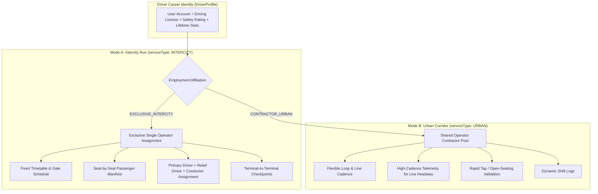

# 01 — Executive Summary & System Architecture

## 1. System Vision & Purpose

The **Moja Bus Driver System & Real-Time Telemetry Backbone** bridges the operational divide between bus operators, commercial drivers, and travelers across West Africa (with Côte d'Ivoire / Abidjan as the pilot launch market).

Prior to this system:
1. **No Live Visibility**: Operators and awaiting passengers had no visibility into bus locations, average corridor velocities, or arrival delays.
2. **Coarse Feedback**: Passenger reviews were aggregated at the carrier company level, missing granular accountability for driver conduct or bus cleanliness.
3. **Fragmented Work Models**: Intercity transport operates under strict timetable dispatches with exclusive company drivers, whereas dense urban transport (Gbaka / SOTRA feeder lines) operates as high-frequency contractor loops with shared driver pools.
4. **Manual Gate Dispatch**: Passenger boarding relied on paper manifests without real-time QR token validation.

The engineered solution introduces a **lifetime portable driver identity**, an **enterprise dual-mode operational engine**, a **Safarpay-grade physical telemetry ingestion pipeline**, and a **dedicated driver mobile application (`apps/driver-app`)**.

---

## 2. End-to-End System Architecture

```mermaid
flowchart TD
    subgraph MobileFrontends ["Client Mobile & Web Frontends"]
        DApp["Driver Mobile App<br/>(apps/driver-app)<br/>Expo 57 / NativeWind"]
        TApp["Traveler App<br/>(apps/traveler-app)<br/>Expo 57 / NativeWind"]
        OpWeb["Operator Web ERP<br/>(apps/web)<br/>Next.js 15 App Router"]
    end

    subgraph IngestionAndAPI ["API & Telemetry Ingestion Layer"]
        WSGate["WebSocket Telemetry Gateway<br/>(apps/web/server/telemetry-ws.ts)<br/>Heartbeat & Room Multiplexing"]
        RESTPing["REST Ingestion Fallback<br/>(/api/v1/telemetry/ping)<br/>Single & Batch Ingest"]
        TRPCApi["tRPC v11 API Routers<br/>(apps/web/trpc/routers)<br/>drivers.ts, trips.ts, reviews.ts"]
        AuthSvc["Better Auth Server<br/>(packages/auth)<br/>Phone / OTP & Session Tokens"]
    end

    subgraph TelemetryGates ["Physical Anomaly Filter Gates (Safarpay-Engineered)"]
        BoundsGate["1. Coord Bounds Gate<br/>[-90..90, -180..180]"]
        AccGate["2. Accuracy Gate<br/>&lt; 50.0 meters"]
        SpeedGate["3. Speed Limit Gate<br/>&lt; 200.0 km/h"]
        JumpGate["4. Haversine Velocity Jump Gate<br/>v = &Delta;d / &Delta;t &lt; 220.0 km/h"]
    end

    subgraph StateAndPubSub ["Hot In-Memory State & PubSub"]
        RedisGeo["Redis Geo Spatial Store<br/>GEOADD moja:fleet:geo"]
        RedisLive["Redis Hash Cache<br/>HSET driver:{id}:live"]
        RedisPubSub["Redis PubSub Channels<br/>trip:{id}:telemetry<br/>operator:{id}:fleet"]
        MemBuffer["In-Memory Buffer<br/>Queue: 50 pings / 5s flush"]
    end

    subgraph Persistence ["Persistence & Notifications"]
        PostgresDB[("PostgreSQL Database<br/>Prisma 6 Models")]
        NovuEngine["Novu Notification Engine<br/>Passenger Delay & Review Push"]
        S3Docs["Cloudflare R2 / S3<br/>License & Medical Docs"]
    end

    %% Flow connections
    DApp -->|Background GPS Pings (WS)| WSGate
    DApp -->|HTTP Sync Fallback| RESTPing
    DApp -->|Auth / Session| AuthSvc
    DApp -->|Trip Mutations & Check-in| TRPCApi

    WSGate --> BoundsGate --> AccGate --> SpeedGate --> JumpGate
    RESTPing --> BoundsGate

    JumpGate -->|GEOADD / HSET| RedisGeo
    JumpGate -->|HSET| RedisLive
    JumpGate -->|PUBLISH| RedisPubSub
    JumpGate -->|RPUSH / Buffer| MemBuffer

    RedisPubSub -->|Stream Events| TApp
    RedisPubSub -->|Live Fleet Stream| OpWeb
    TRPCApi -->|Operator Roster & Dispatch| OpWeb

    MemBuffer -->|Batch Bulk Insert| PostgresDB
    TRPCApi -->|ORM Read/Write| PostgresDB
    TRPCApi -->|Trigger Alerts| NovuEngine
    TRPCApi -->|Signed Document URLs| S3Docs
```

---

## 3. Dual-Mode Operational Engine: Intercity vs. Urban

A core architectural achievement of the system is decoupling transport operations into two modes within unified data structures:



### Comparative Breakdown

| Attribute | Intercity Operations Mode | Urban Operations Mode |
| :--- | :--- | :--- |
| **Prisma Employment Type** | `EXCLUSIVE_INTERCITY` | `CONTRACTOR_URBAN` |
| **Prisma Service Type** | `ServiceType.INTERCITY` | `ServiceType.URBAN` |
| **Contract Exclusivity** | Strict 1-to-1 company exclusivity per active schedule. | Multi-operator pool; driver can take shifts across affiliated urban carriers. |
| **Rostering & Crew** | Primary Driver, optional Relief Driver ($>400\text{ km}$), optional Conductor. | Solo operator per loop. |
| **Ticketing & Boarding** | Seat-allocated boarding manifest with QR token verification. | Rapid tap/scan or unreserved pass validation. |
| **Telemetry Cadence** | 5s moving, 30s idling; waypoints and terminal geofences. | 3s high-cadence for dense corridor live arrival times. |

---

## 4. Lifetime Portable Driver Identity Philosophy

Unlike legacy bus dispatch systems where driver records are siloed within each bus company's local database, Moja Bus implements a **platform-sovereign, lifetime driver identity**:

1. **Global Root Identity**: The `DriverProfile` is anchored directly to the universal `User` record (`userId`).
2. **Portable Career Reputation**:
   - `averageRating` (1.00 to 5.00) aggregated from verified passenger trips.
   - `safetyScore` (0 to 100) calculated from collision history, speed anomalies, and driving records.
   - `totalTripsCompleted` and `totalDistanceKm` tracked continuously.
3. **Decoupled Company Affiliation**:
   - Operator companies do not own the driver profile; they create a `DriverCompanyAffiliation`.
   - Operators can verify credentials, assign trips, and terminate affiliations, but cannot erase the driver's lifetime safety score or career passport.

---

## 5. Safarpay Telemetry Benchmark Analysis

The real-time telemetry architecture draws direct inspiration from high-throughput transport references (such as the Safarpay architecture):

| Engineering Pillar | Moja Bus Implementation | Benefit & Impact |
| :--- | :--- | :--- |
| **Geodesic Haversine Gate** | `calculateHaversineDistanceMeters()` calculates great-circle distance $\Delta d$. If $\Delta d / \Delta t > 220\text{ km/h}$, ping is tagged anomalous and rejected. | Eliminates GPS multipath reflections, tunnel exits, and simulated spoofing. |
| **Horizontal GPS Accuracy Gate** | Rejects readings where `accuracyMeters > 50.0m`. | Prevents cell-tower fallback jumps from showing buses miles away from roads. |
| **Dual Ingestion Paths** | Primary low-latency WebSocket connection + HTTP `/api/v1/telemetry/ping` fallback. | Guarantees telemetry delivery even on firewalled or intermittent 2G/3G mobile data. |
| **In-Memory Batch Flushing** | In-memory buffer flushes 50 pings or every 5,000ms to PostgreSQL `DriverLocationPing`. | Prevents write-amplification on database during peak hours with hundreds of buses streaming. |
| **Redis Hot State** | `GEOADD moja:fleet:geo` and `HSET driver:{id}:live`. | Provides sub-millisecond radius search and fleet-wide live queries without touching disk. |
