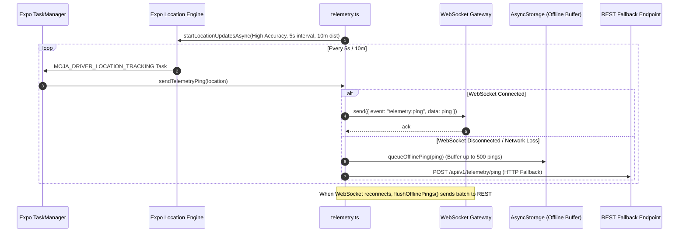

# 02 — Driver Mobile App (`apps/driver-app`) Audit

## 1. Overview & Technology Stack

The **Driver Mobile App** (`apps/driver-app`) is a dedicated React Native mobile application built on Expo SDK 57, Expo Router, NativeWind (Tailwind CSS for React Native), and Better Auth Expo Client. It serves as the driver's in-vehicle electronic logging device, GPS telemetry beacon, boarding scanner, and career passport.

```
apps/driver-app/
├── app/
│   ├── (auth)/
│   │   └── login.tsx               # Phone/password authentication
│   ├── (tabs)/
│   │   ├── _layout.tsx             # 4-tab bar navigation
│   │   ├── trips.tsx               # Assigned dispatches (Today/Upcoming/Completed)
│   │   ├── live.tsx                # Active trip HUD speedometer & delay logger
│   │   ├── scanner.tsx             # High-speed ticket QR scanner
│   │   └── profile.tsx             # Career passport, stats, and shift switch
│   ├── trip/
│   │   └── [id]/
│   │       └── manifest.tsx        # Passenger manifest & seat check-in
│   ├── _layout.tsx                 # Root layout & providers
│   └── index.tsx                   # Auth gate redirector
├── lib/
│   ├── auth-client.ts              # Better Auth Expo client & cookie manager
│   ├── haptics.ts                  # Device vibration & audio feedback
│   ├── telemetry.ts                # Background location engine & WebSocket stream
│   └── trpc.tsx                    # tRPC client provider with session keepalive
├── app.json                        # Expo app manifest & permissions
├── global.css                      # Tailwind styling imports
├── metro.config.js                 # Monorepo Metro bundler configuration
└── package.json                    # Workspace dependencies
```

---

## 2. Screen-by-Screen Deep Audit

### A. Root Layout & Auth Gate (`app/_layout.tsx` & `app/index.tsx`)
- **Implementation**:
  - `_layout.tsx` wraps the app with `SafeAreaProvider`, `TRPCReactProvider`, and `Toast`.
  - `index.tsx` checks `authClient.getSession()`. If a valid user session exists, redirects to `/(tabs)/trips`; otherwise redirects to `/(auth)/login`.
- **Audit Assessment**: 🟢 **Clean & Robust**. Proper fallback and error handling in session resolution.

### B. Authentication Screen (`app/(auth)/login.tsx`)
- **Implementation**:
  - Branded dark UI with phone number and password inputs.
  - Submits via `authClient.signIn.phoneNumber({ phoneNumber, password })`.
  - Triggers haptic feedback on success (`DriverFeedback.successScan()`) or error (`DriverFeedback.invalidScan()`).
- **Gaps & Findings**:
  - 🟡 **OTP Verification Missing**: `login.tsx` currently only executes phone + password sign-in. For drivers who forgotten their password or use SMS OTP sign-in, the OTP verification flow is not yet exposed in the UI.

### C. Tab Navigation (`app/(tabs)/_layout.tsx`)
- **Implementation**:
  - Configures 4 tabs: `My Trips` (`Route`), `Live Trip` (`Radio`), `QR Scanner` (`QrCode`), and `Passport` (`UserCheck`).
  - Strict dark theme styling matching Moja Bus palette (`#09090b` background, `#e11d48` active tint, `#71717a` inactive tint).
- **Audit Assessment**: 🟢 **Excellent UI Consistency**.

### D. Trips Screen (`app/(tabs)/trips.tsx`)
- **Implementation**:
  - Top header with **Dual-Mode Toggle** (`Intercity` vs `Urban`).
  - Filter pills for `Today`, `Upcoming`, and `Completed`.
  - Trip dispatch cards showing origin, destination, departure time, bus registration plate, booked seats, Manifest CTA, and `Start Run` button.
  - On `Start Run`, invokes `startBackgroundLocationTracking(...)` and navigates to `/(tabs)/live`.
- **Gaps & Findings**:
  - 🔴 **Hardcoded Driver ID**: Line 62 passes `"drv_default_01"` to `startBackgroundLocationTracking`. Must be dynamically populated from the active authenticated driver profile.
  - 🟡 **Mock Trip Data**: Array is hardcoded locally rather than querying `trpc.trips.getMyAssignedTrips` or `trpc.drivers.getMyTrips`.

### E. Live Trip & HUD Speedometer (`app/(tabs)/live.tsx`)
- **Implementation**:
  - High-contrast vehicle HUD with digital speedometer (km/h), compass heading (° NE), and GPS accuracy indicator.
  - Next waypoint card displaying upcoming terminal and estimated time of arrival.
  - Traffic Delay modal with input for estimated delay minutes and reason text.
  - `Complete Run` button that invokes `stopBackgroundLocationTracking()`.
- **Gaps & Findings**:
  - 🟡 **Simulated Speedometer**: Currently updates using an artificial `setInterval` jitter instead of receiving real GPS velocity updates from the active `expo-location` stream.
  - 🟡 **Delay Reporting API**: `handleReportDelay` closes the modal without dispatching a tRPC mutation to alert dispatchers and broadcast passenger notifications via Novu.

### F. High-Speed QR Ticket Scanner (`app/(tabs)/scanner.tsx`)
- **Implementation**:
  - Utilizes `expo-camera` (`CameraView`) with `barcodeScannerSettings={{ barcodeTypes: ["qr"] }}`.
  - Torchlight / flashlight toggle for low-light terminal gates.
  - High-contrast animated target viewfinder.
  - Boarding clearance modal displaying passenger name, seat number, and ticket token reference.
- **Critical Blocker Bug**:
  - 🔴 **CRITICAL FATAL BUG (Line 118)**:
    ```tsx
    // Line 118 of apps/driver-app/app/(tabs)/scanner.tsx:
    <div>
      <Text className="text-lg font-black text-white">Boarding Cleared</Text>
      <Text className="text-xs text-emerald-400 font-semibold">Verified & Validated</Text>
    </div>
    ```
    `<div>` is an HTML DOM element that **does not exist in React Native**. This causes an immediate unhandled fatal redscreen crash whenever a QR barcode is scanned on iOS or Android. Must be replaced with `<View>`.
  - 🟡 **Token Decoding**: Decodes string directly into mock passenger name rather than parsing signed booking JWT or validating against trip manifest cache.

### G. Passenger Manifest Screen (`app/trip/[id]/manifest.tsx`)
- **Implementation**:
  - Top search bar filtering passengers by name or seat number.
  - Visual boarding counter (e.g. `2 / 5 Boarded`).
  - Interactive tap-to-board checkmark toggle per passenger.
- **Gaps & Findings**:
  - 🟡 **Local State Only**: Boarding toggle updates local `boardedMap` state without writing back to database via `trpc.booking.checkIn`.

### H. Driver Career Passport (`app/(tabs)/profile.tsx`)
- **Implementation**:
  - Digital commercial ID card with full name, verified class D badge, and avatar initials.
  - **On-Duty Shift Switch**: Reactive toggle between Available and Off-duty.
  - Lifetime Career Achievement Grid: Average Rating (4.92 / 5), Safety Index (98/100), Completed Journeys (512), Total Distance (68,400 km).
  - Affiliated Carriers list showing company contract status and driver badge number.
  - Sign Out button clearing session cookies.
- **Audit Assessment**: 🟢 **High visual fidelity**. Needs wiring to dynamic `trpc.drivers.getMyProfile`.

---

## 3. Background Telemetry Engine (`apps/driver-app/lib/telemetry.ts`)



### Telemetry Pipeline Strengths:
1. **Background Persistence**: Enforces foreground notification on Android (`FOREGROUND_SERVICE_LOCATION`) with persistent notification bar so OS does not terminate the app in background.
2. **Offline Resilience**: Buffers up to 500 pings in `AsyncStorage` when vehicle traverses rural areas without mobile signal, flushing automatically upon network reconnection.
3. **Dual Transport**: Tries WebSocket first; falls back immediately to HTTP batch POST.

---

## 4. Hardware & Platform Manifest Audit (`app.json`)

| Manifest Setting | Configured Value | Compliance Status |
| :--- | :--- | :--- |
| **App Name & Slug** | `"Moja Driver"` / `"driver-app"` | 🟢 Configured |
| **Custom URL Scheme** | `"driver-app"` | 🟢 Configured |
| **iOS Background Modes** | `["location", "fetch", "remote-notification"]` | 🟢 Verified |
| **iOS Location Descriptions** | `NSLocationAlwaysAndWhenInUseUsageDescription`, `NSLocationWhenInUseUsageDescription` | 🟢 Clear user disclosures |
| **iOS Camera Description** | `NSCameraUsageDescription` | 🟢 Required for QR scanner |
| **Android Permissions** | `ACCESS_FINE_LOCATION`, `ACCESS_COARSE_LOCATION`, `ACCESS_BACKGROUND_LOCATION`, `FOREGROUND_SERVICE`, `FOREGROUND_SERVICE_LOCATION`, `CAMERA`, `WAKE_LOCK` | 🟢 Full coverage |
| **Expo Plugins Config** | `expo-location` (Always & When In Use), `expo-camera`, `expo-notifications`, `expo-router` | 🟢 Correctly parameterized |

---

## 5. Summary of Findings & Remediation

| Issue ID | Severity | File & Location | Description & Fix |
| :--- | :--- | :--- | :--- |
| **DRV-APP-001** | 🔴 **BLOCKER** | `apps/driver-app/app/(tabs)/scanner.tsx:118` | Replace invalid `<div>` with `<View>` to eliminate runtime redscreen crash. |
| **DRV-APP-002** | 🟠 **HIGH** | `apps/driver-app/app/(tabs)/trips.tsx:62` | Replace hardcoded `"drv_default_01"` with authenticated driver profile ID from session. |
| **DRV-APP-003** | 🟠 **HIGH** | `apps/driver-app/app/(tabs)/trips.tsx` & `manifest.tsx` | Wire screens to real tRPC backend queries instead of static mock arrays. |
| **DRV-APP-004** | 🟡 **MEDIUM** | `apps/driver-app/app/(tabs)/live.tsx` | Wire `handleReportDelay` to dispatch delay notification mutation. |
| **DRV-APP-005** | 🟡 **MEDIUM** | `apps/driver-app/app` (All Screens) | Add French (`fr`) and English (`en`) i18n support via `react-i18next`. |
