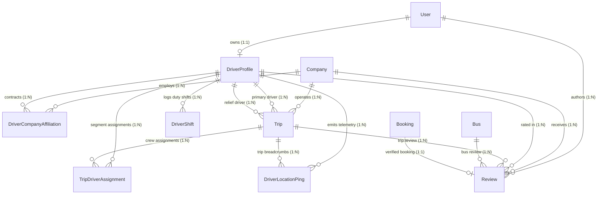

# 03 — Database Schema & Data Models Audit

## 1. Schema Overview

The database models supporting the Driver System are defined in `packages/db/prisma/schema.prisma` and generated using Prisma ORM with PostgreSQL. The schema architecture introduces 5 new primary models, 4 specialized enums, and extends the existing `Trip`, `User`, `Company`, `Operator`, and `Review` models.



---

## 2. Model-by-Model Deep Audit

### A. `DriverProfile` Model
The core, lifetime portable identity representing a commercial driver on the Moja platform.

```prisma
model DriverProfile {
  id                   String                   @id @default(cuid())
  userId               String                   @unique
  user                 User                     @relation(fields: [userId], references: [id], onDelete: Cascade)

  // Professional Credentials
  licenseNumber        String                   @unique
  licenseCategory      LicenseCategory          @default(D)
  licenseExpiryDate    DateTime
  licenseFrontUrl      String?
  licenseBackUrl       String?
  yearsOfExperience    Int                      @default(1)
  medicalClearanceDate DateTime?
  medicalDocUrl        String?
  
  // Platform Verification
  verificationStatus   DriverVerificationStatus @default(PENDING)
  verifiedAt           DateTime?
  verifiedById         String?
  verifiedBy           User?                    @relation("DriverVerifiedBy", fields: [verifiedById], references: [id], onDelete: SetNull)
  rejectionReason      String?

  // Current Live Operational State
  status               DriverStatus             @default(OFFLINE)
  currentTripId        String?
  currentTrip          Trip?                    @relation("DriverCurrentTrip", fields: [currentTripId], references: [id], onDelete: SetNull)
  lastPingAt           DateTime?
  lastLatitude         Float?
  lastLongitude        Float?
  lastHeading          Float?
  lastSpeedKmh         Float?

  // Career Reputation & Analytics (Aggregated across all employers)
  averageRating        Float                    @default(5.0)
  totalReviews         Int                      @default(0)
  totalTripsCompleted  Int                      @default(0)
  totalDistanceKm      Float                    @default(0.0)
  safetyScore          Int                      @default(100)

  // Relations
  companyAffiliations  DriverCompanyAffiliation[]
  assignedTrips        Trip[]                   @relation("TripAssignedDriver")
  reliefTrips          Trip[]                   @relation("TripReliefDriver")
  tripAssignments      TripDriverAssignment[]
  telemetryPings       DriverLocationPing[]
  reviews              Review[]                 @relation("DriverReviews")
  shifts               DriverShift[]

  createdAt            DateTime                 @default(now())
  updatedAt            DateTime                 @updatedAt

  @@index([status])
  @@index([verificationStatus])
  @@index([licenseNumber])
  @@map("driver_profile")
}
```

#### Evaluation:
- 🟢 **Strengths**:
  - `userId` is strictly unique with `onDelete: Cascade` to ensure identity lifetime coupling with User account.
  - `licenseNumber` is unique across the entire platform, preventing duplicate fraudulent driver registrations.
  - Direct columns for `lastLatitude`, `lastLongitude`, `lastSpeedKmh`, `lastHeading`, and `lastPingAt` enable lightning-fast operator fleet queries without aggregating time-series ping tables.
  - Explicit indexes on `status`, `verificationStatus`, and `licenseNumber` for optimal filtering in ERP tables.

---

### B. `DriverCompanyAffiliation` Model
Manages the employment relationship between a driver and an operator company.

```prisma
model DriverCompanyAffiliation {
  id              String               @id @default(cuid())
  driverProfileId String
  driverProfile   DriverProfile        @relation(fields: [driverProfileId], references: [id], onDelete: Cascade)
  companyId       String
  company         Company              @relation(fields: [companyId], references: [id], onDelete: Cascade)

  employmentType  DriverEmploymentType @default(EXCLUSIVE_INTERCITY)
  isActive        Boolean              @default(true)
  isVerified      Boolean              @default(false)
  badgeNumber     String?
  hiredAt         DateTime             @default(now())
  terminatedAt    DateTime?
  notes           String?

  createdAt       DateTime             @default(now())
  updatedAt       DateTime             @updatedAt

  @@unique([driverProfileId, companyId])
  @@index([companyId, isActive])
  @@map("driver_company_affiliation")
}
```

#### Evaluation:
- 🟢 **Strengths**:
  - Composite unique constraint `@@unique([driverProfileId, companyId])` prevents duplicate contractual affiliations.
  - Soft termination via `isActive: false` and `terminatedAt` preserves historical trip audits.
  - `@@index([companyId, isActive])` allows instant filtering of active company rosters.

---

### C. `TripDriverAssignment` Model
Supports multi-driver crew manifests on long-distance or multi-segment intercity routes.

```prisma
model TripDriverAssignment {
  id              String        @id @default(cuid())
  tripId          String
  trip            Trip          @relation(fields: [tripId], references: [id], onDelete: Cascade)
  driverProfileId String
  driverProfile   DriverProfile @relation(fields: [driverProfileId], references: [id], onDelete: Cascade)

  role            String        @default("PRIMARY") // PRIMARY | RELIEF | CONDUCTOR
  assignedAt      DateTime      @default(now())
  assignedByStaffId String?
  
  startStopOrder  Int           @default(0)
  endStopOrder    Int?
  distanceKm      Float?

  createdAt       DateTime      @default(now())
  updatedAt       DateTime      @updatedAt

  @@unique([tripId, driverProfileId, role])
  @@index([tripId])
  @@index([driverProfileId])
  @@map("trip_driver_assignment")
}
```

#### Evaluation:
- 🟢 **Strengths**:
  - Enables granular crew configurations: Primary Driver, Relief Driver, and Conductor.
  - `startStopOrder` and `endStopOrder` support segment-based driver swaps (e.g. Driver A drives Abidjan $\rightarrow$ Yamoussoukro, Driver B takes Yamoussoukro $\rightarrow$ Bouaké).

---

### D. `DriverLocationPing` Model
Time-series breadcrumb store for vehicle telemetry, historical playback, and audit logging.

```prisma
model DriverLocationPing {
  id              String        @id @default(cuid())
  driverProfileId String
  driverProfile   DriverProfile @relation(fields: [driverProfileId], references: [id], onDelete: Cascade)
  tripId          String?
  trip            Trip?         @relation(fields: [tripId], references: [id], onDelete: SetNull)

  latitude        Float
  longitude       Float
  heading         Float?
  speedKmh        Float?
  accuracyMeters  Float?
  altitudeMeters  Float?
  
  isAnomaly       Boolean       @default(false)
  anomalyReason   String?
  recordedAt      DateTime

  createdAt       DateTime      @default(now())

  @@index([tripId, recordedAt])
  @@index([driverProfileId, recordedAt])
  @@map("driver_location_ping")
}
```

#### Evaluation:
- 🟢 **Strengths**:
  - Composite indexes on `[tripId, recordedAt]` and `[driverProfileId, recordedAt]` make trajectory extraction and playback queries highly performant.
  - `isAnomaly` and `anomalyReason` support telemetry data quality auditing and speed violation reporting.

---

### E. `DriverShift` Model
Tracks driver work shifts, on-duty hours, and labor compliance.

```prisma
model DriverShift {
  id              String        @id @default(cuid())
  driverProfileId String
  driverProfile   DriverProfile @relation(fields: [driverProfileId], references: [id], onDelete: Cascade)
  companyId       String
  company         Company       @relation(fields: [companyId], references: [id], onDelete: Cascade)

  startedAt       DateTime      @default(now())
  endedAt         DateTime?
  totalMinutes    Int?
  serviceType     ServiceType   @default(INTERCITY)
  tripsCompleted  Int           @default(0)

  createdAt       DateTime      @default(now())

  @@index([driverProfileId, startedAt])
  @@index([companyId, startedAt])
  @@map("driver_shift")
}
```

---

### F. Extended `Review` Model (3-Way Passenger Ratings)

```prisma
model Review {
  id               String         @id @default(cuid())
  companyId        String
  company          Company        @relation(fields: [companyId], references: [id], onDelete: Cascade)

  // Overall Score (1 to 5)
  rating           Int
  content          String?        @db.Text
  authorId         String
  author           User           @relation(fields: [authorId], references: [id])

  // Multi-dimensional breakdown
  driverRating     Int?           // 1 to 5: Driver safety & behavior
  busRating        Int?           // 1 to 5: Cleanliness & vehicle AC
  punctualityRating Int?          // 1 to 5: On-time schedule performance

  // Entity Links
  driverId         String?
  driver           DriverProfile? @relation("DriverReviews", fields: [driverId], references: [id], onDelete: SetNull)
  tripId           String?
  trip             Trip?          @relation(fields: [tripId], references: [id], onDelete: SetNull)
  busId            String?
  bus              Bus?           @relation(fields: [busId], references: [id], onDelete: SetNull)

  // Operator Public Response
  response         String?        @db.Text
  respondedAt      DateTime?

  bookingId        String?        @unique
  booking          Booking?       @relation(fields: [bookingId], references: [id], onDelete: SetNull)

  createdAt        DateTime       @default(now())
  updatedAt        DateTime       @updatedAt

  @@index([companyId])
  @@index([driverId])
  @@index([tripId])
  @@map("review")
}
```

---

## 3. Enums Audit

| Enum Name | Values | Usage |
| :--- | :--- | :--- |
| `StaffRole` | `... DRIVER` | Integrates drivers into operator staff RBAC. |
| `DriverStatus` | `OFFLINE`, `AVAILABLE`, `ON_DUTY`, `ON_TRIP`, `RESTING`, `SUSPENDED` | Live operational state in dispatch. |
| `DriverVerificationStatus` | `PENDING`, `VERIFIED`, `REJECTED`, `EXPIRED`, `SUSPENDED` | Compliance clearing before trip assignment. |
| `DriverEmploymentType` | `EXCLUSIVE_INTERCITY`, `CONTRACTOR_URBAN`, `HYBRID` | Dual-mode operational classification. |
| `LicenseCategory` | `B` (Van), `C` (Heavy), `D` (Bus), `E` (Articulated) | Commercial vehicle category endorsement. |

---

## 4. Performance & Data Retention Recommendations

1. **Location Ping Partitioning**:
   - As telemetry scales to millions of pings, implement monthly PostgreSQL range partitioning on `driver_location_ping(recordedAt)` or configure a 90-day retention cleanup worker.
2. **Atomic Driver Rating Rollup**:
   - Use database triggers or async background jobs to periodically recalculate `DriverProfile.averageRating` and `totalReviews` to avoid drift over time.
