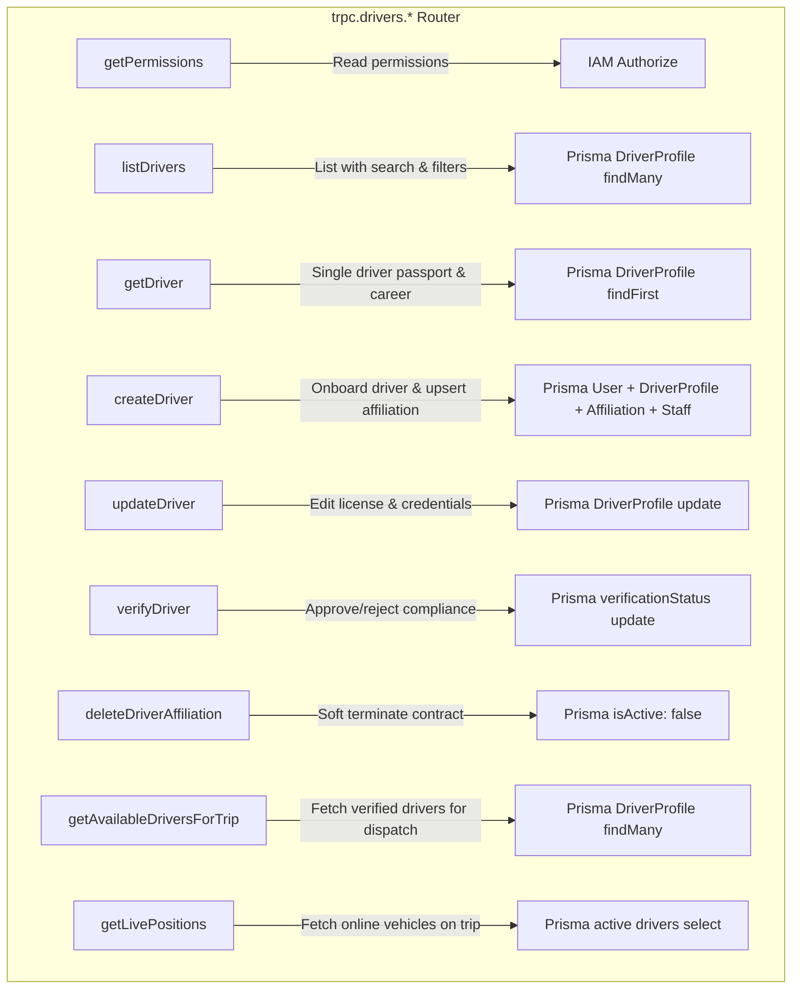
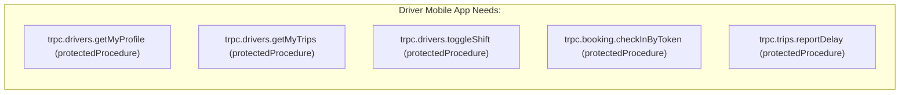

# 04 — Backend APIs & tRPC Routers Audit

## 1. Overview & Router Topology

The backend API surface powering the Driver System is exposed via **tRPC v11** with Zod v4 validation inside `apps/web/trpc/routers` alongside a dedicated REST endpoint for high-frequency telemetry ingestion:

```
apps/web/
├── trpc/
│   ├── routers/
│   │   ├── _app.ts               # Root router composition
│   │   ├── drivers.ts            # Operator driver fleet management procedures
│   │   ├── trips.ts              # Trip dispatch & driver allocation
│   │   ├── reviews.ts            # Passenger 3-way review ingestion & operator responses
│   │   └── staff.ts              # Staff directory with DRIVER role filter
├── app/
│   └── api/
│       └── v1/
│           └── telemetry/
│               └── ping/
│                   └── route.ts  # High-throughput REST telemetry ingest
└── lib/
    └── permissions/
        └── authorize.ts          # Granular IAM permission enforcement
```

---

## 2. Deep Audit of `drivers.ts` Router

The `driversRouter` in `apps/web/trpc/routers/drivers.ts` implements the following procedures:



### Line-by-Line Procedure Analysis

| Procedure | Procedure Type | Guard | Input Schema | Evaluation & Findings |
| :--- | :--- | :--- | :--- | :--- |
| `getPermissions` | `operatorCompanyProcedure.query` | None (Returns map) | None | 🟢 Returns boolean flags for `drivers:read`, `drivers:create`, `drivers:update`, `drivers:delete`, `drivers:verify`, `drivers:assign`. |
| `listDrivers` | `operatorCompanyProcedure.query` | `drivers:read` | `listDriversSchema` | 🟢 Supports search across `fullName`, `email`, `phoneNumber`, `licenseNumber`, and filters for `status`, `verificationStatus`, `licenseCategory`, `employmentType`. |
| `getDriver` | `operatorCompanyProcedure.query` | `drivers:read` | `getDriverSchema` (`id: cuid`) | 🟢 Fetches career passport, company affiliations, active trip, last 10 reviews, last 10 shifts, and aggregate counts. Enforces company boundary. |
| `createDriver` | `operatorCompanyProcedure.mutation` | `drivers:create` | `createDriverSchema` | 🟢 Creates user if not existing, creates global `DriverProfile`, upserts `DriverCompanyAffiliation`, and provisions `Operator` staff entry with `DRIVER` role. |
| `updateDriver` | `operatorCompanyProcedure.mutation` | `drivers:update` | `updateDriverSchema` | 🟢 Updates driver license credentials and company affiliation badge/notes. |
| `verifyDriver` | `operatorCompanyProcedure.mutation` | `drivers:verify` | `verifyDriverSchema` | 🟢 Sets `verificationStatus` to `VERIFIED` or `REJECTED`, records `verifiedById` and `verifiedAt`, and synchronizes `DriverCompanyAffiliation.isVerified`. |
| `deleteDriverAffiliation` | `operatorCompanyProcedure.mutation` | `drivers:delete` | `driverProfileId` | 🟢 Soft-terminates affiliation by setting `isActive: false` and `terminatedAt: new Date()`. |
| `getAvailableDriversForTrip` | `operatorCompanyProcedure.query` | `drivers:read` | `tripDate` (optional) | 🟢 Returns verified, available drivers sorted by rating for the dispatch modal. |
| `getLivePositions` | `operatorCompanyProcedure.query` | `drivers:read` | None | 🟢 Returns live GPS coordinates, heading, speed, and bus registration plate for all drivers on `ON_TRIP` or `ON_DUTY`. |

---

## 3. Trip Dispatch Integration (`trips.ts`)

In `apps/web/trpc/routers/trips.ts`:

### Driver Assignment Procedure (`assignDriver`):
1. **Verification Gate**: Checks that `driver.verificationStatus === "VERIFIED"`. If not, rejects with `TRPCError({ code: "PRECONDITION_FAILED", message: "Cannot assign driver: Driving license compliance is not verified." })`.
2. **Dual Slot Assignment**:
   - Assigns `driverId` (Primary Driver) or `reliefDriverId` (Relief Driver).
   - Simultaneously creates a `TripDriverAssignment` junction entry recording `startStopOrder`, `endStopOrder`, and assignment timestamps.

### Driver Unassignment Procedure (`unassignDriver`):
1. Removes driver reference from `Trip.driverId` or `Trip.reliefDriverId`.
2. Removes matching `TripDriverAssignment` row.

---

## 4. REST Telemetry Ingestion Endpoint (`/api/v1/telemetry/ping`)

In `apps/web/app/api/v1/telemetry/ping/route.ts`:
- Accepts single ping payload or batch array (`pings: [...]`).
- Validates via Zod `driverLocationPingSchema`.
- Applies physical anomaly gates via `validateTelemetryPing`.
- Enqueues valid pings into `queueTelemetryPing` (in-memory buffer).
- Publishes real-time event to Redis channel `trip:${tripId}:telemetry`.
- Returns `{ success: true, processed, accepted, rejected, timestamp }`.

---

## 5. Identified Gaps & Missing Mobile-Facing Endpoints

The current backend implementation is complete from an **Operator ERP perspective**, but needs dedicated endpoints for the **Driver Mobile App**:



### Required New Procedures:
1. **`trpc.drivers.getMyProfile`**: Allows authenticated driver to retrieve their personal passport, lifetime ratings, and active company affiliations without an operator company context.
2. **`trpc.drivers.getMyTrips`**: Retrieves scheduled, active, and completed trips assigned to the currently logged-in driver.
3. **`trpc.drivers.toggleShift`**: Allows the driver to toggle On-Duty / Off-Duty status and start/close a `DriverShift` record.
4. **`trpc.booking.checkInByToken`**: Validates a scanned QR ticket token at the gate and updates booking boarding status.
5. **`trpc.trips.reportDelay`**: Dispatches a delay notification to dispatchers and triggers a Novu passenger push notification.
