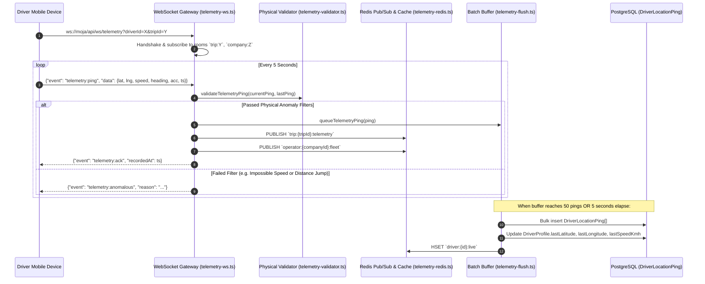

# 05 — Real-Time Telemetry & WebSocket Gateway Audit

## 1. Overview of Telemetry Subsystem

The real-time telemetry subsystem provides sub-second GPS streaming from active vehicle devices (`apps/driver-app`) to carrier dispatch maps (`apps/web`) and passenger live tracking screens (`apps/traveler-app`).

```
apps/web/server/
├── telemetry-ws.ts         # Standalone WebSocket Server & Gateway
├── telemetry-validator.ts  # Physical constraint & Haversine jump filter
├── telemetry-redis.ts      # Redis Pub/Sub & Geohash store with memory fallback
└── telemetry-flush.ts      # Telemetry buffer batcher & PostgreSQL bulk persister
```

---

## 2. Ingestion Flow & Component Interaction



---

## 3. Physical Anomaly Filters (`telemetry-validator.ts`)

The validator enforces four strict physical gates inspired by high-throughput fleet telemetry systems:

```typescript
// 1. Geographical Bounds Gate
if (currentPing.latitude < -90 || currentPing.latitude > 90 ||
    currentPing.longitude < -180 || currentPing.longitude > 180) {
  return { isValid: false, reason: "GPS coordinates out of global geographical bounds" };
}

// 2. Horizontal Accuracy Gate (Threshold: 50.0 meters)
if (currentPing.accuracyMeters > MAX_ACCURACY_METERS) {
  return { isValid: false, reason: `Accuracy ${currentPing.accuracyMeters}m exceeds threshold (50m)` };
}

// 3. Instantaneous Speed Gate (Threshold: 200.0 km/h)
if (currentPing.speedKmh > MAX_SPEED_KMH) {
  return { isValid: false, reason: `Speed ${currentPing.speedKmh} km/h exceeds maximum physical bus threshold (200 km/h)` };
}

// 4. Geodesic Haversine Velocity Jump Gate (Threshold: 220.0 km/h)
const distanceMeters = calculateHaversineDistanceMeters(
  previousPing.latitude, previousPing.longitude,
  currentPing.latitude, currentPing.longitude
);
const calculatedSpeedKmh = (distanceMeters / elapsedSeconds) * 3.6;
if (calculatedSpeedKmh > MAX_JUMP_SPEED_KMH) {
  return { isValid: false, reason: `Implausible GPS jump: traveled ${distanceMeters}m in ${elapsedSeconds}s` };
}
```

### Evaluation:
- 🟢 **Strengths**:
  - Implements the Great-Circle Haversine formula to compute true surface distance between two latitude/longitude coordinates on Earth ($R = 6371\text{ km}$).
  - Prevents erratic GPS drift from distorting passenger ETA predictions or triggering false speed alerts.

---

## 4. Redis State & In-Memory Fallback (`telemetry-redis.ts`)

The Redis helper detects whether `REDIS_URL` or `KV_URL` is set in the environment:
1. **Production Mode (`ioredis`)**: Connects to Redis instance with automatic reconnects and connection pooling.
2. **Local Development / Offline Mode (`MockRedisStore`)**: Automatically falls back to an in-memory `Map` with local pub/sub listener dispatching. This allows full local development and end-to-end testing without running an external Redis daemon.

---

## 5. Batch Persistence Worker (`telemetry-flush.ts`)

To avoid overloading PostgreSQL with individual row writes every 5 seconds per bus:
1. Pings are appended to an in-memory queue (`PING_BUFFER`).
2. The buffer flushes when it reaches **50 pings** OR when **5,000ms** elapse since the last ping.
3. The flush operation executes a single batch transaction:
   - `prisma.driverLocationPing.createMany({ data: batch })`
   - `prisma.driverProfile.update(...)` updating latest coordinates and timestamps.
   - Updates Redis hash `driver:{id}:live`.
4. **Error Recovery**: If PostgreSQL write fails, the uncommitted batch is restored to the head of `PING_BUFFER` via `PING_BUFFER.unshift(...batch)`.

---

## 6. Production Deployment Recommendations

1. **Standalone Node Process / Custom Server**:
   - In Next.js standalone mode or serverless environments (e.g. Vercel), long-lived WebSocket connections require a dedicated Node.js service (e.g. `node apps/web/server/telemetry-ws.ts`) or an edge WebSocket broker.
2. **Horizontal Scaling**:
   - Because Redis Pub/Sub is already integrated in `telemetry-ws.ts`, multiple WebSocket worker instances can run behind an AWS ALB or Cloudflare stream router without state divergence.
