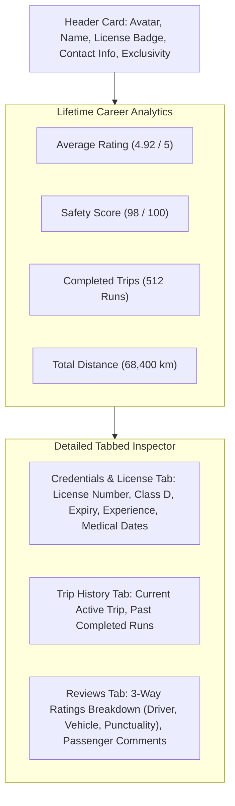

# 06 — Operator Web ERP Surfaces Audit

## 1. Overview of Operator Fleet Management Surfaces

The Operator Web ERP (`apps/web`) provides fleet managers, dispatchers, and operations staff with full control over driver onboarding, license compliance, trip allocation, live telemetry tracking, and review response.

```
apps/web/
├── app/[locale]/dashboard/operator/(dashboard)/
│   ├── drivers/
│   │   ├── page.tsx                    # Drivers directory route
│   │   ├── [id]/
│   │   │   └── page.tsx                # Driver passport & details route
│   │   └── map/
│   │       └── page.tsx                # Live fleet map route
│   ├── trips/
│   │   └── page.tsx                    # Dispatch board with driver selector
│   └── reviews/
│       └── page.tsx                    # 3-way passenger reviews route
└── features/operator/
    ├── components/
    │   ├── operator-sidebar.tsx        # Navigation menu with Drivers entry
    │   └── drivers/
    │       ├── add-driver-modal.tsx    # Driver onboarding modal
    │       ├── verify-driver-dialog.tsx# Compliance approval dialog
    │       ├── driver-status-badge.tsx # Status pill (Available, On Duty, etc.)
    │       └── driver-career-stats-card.tsx # Lifetime stats grid
    └── views/
        ├── operator-drivers-view.tsx   # Directory view & KPI metrics
        ├── driver-detail-view.tsx      # Comprehensive career passport view
        ├── operator-fleet-map-view.tsx # Real-time interactive fleet radar map
        └── operator-reviews-view.tsx   # 3-way review list & response flow
```

---

## 2. Deep Dive: Driver Directory View (`OperatorDriversView`)

Located in `apps/web/features/operator/views/operator-drivers-view.tsx`:

### Key Features:
1. **Real-time KPI Metrics**:
   - Total Fleet Drivers
   - On Duty / Active (`ON_DUTY`, `ON_TRIP`)
   - Verified Licenses
   - Pending Verification
2. **Search & Reactive Filters**:
   - Search by name, license number, phone, or email (debounced 300ms).
   - Status filter: `ALL`, `AVAILABLE`, `ON_DUTY`, `ON_TRIP`, `RESTING`, `OFFLINE`.
   - License Class filter: `ALL`, `Class D (Bus)`, `Class C (Heavy)`, `Class E (Coach)`, `Class B (Van)`.
3. **Data Table Rows**:
   - Avatar with initials fallback.
   - Name with direct link to career passport (`/dashboard/operator/drivers/[id]`).
   - Driver status badge (`Available`, `On Duty`, `On Trip`, `Offline`).
   - Phone/email, license number, license class, and average rating stars.
   - Active bus registration plate indicator.
   - Compliance verification badge (`Verified` / `Pending`).
   - Contextual actions: `View Full Passport`, `Verify License`.

---

## 3. Deep Dive: Driver Career Passport (`DriverDetailView`)

Located in `apps/web/features/operator/views/driver-detail-view.tsx`:



### Evaluation:
- 🟢 **Strengths**:
  - Implements the "Career Passport" paradigm seamlessly, combining global platform credentials with operator-specific notes.
  - Tabbed interface cleanly separates legal compliance, operational trips, and passenger feedback.

---

## 4. Deep Dive: Live Fleet Telemetry Map (`OperatorFleetMapView`)

Located in `apps/web/features/operator/views/operator-fleet-map-view.tsx`:

### Layout & Capabilities:
- **Left Panel (Active Vehicles List)**:
  - Lists all drivers currently on `ON_TRIP` or `ON_DUTY` with valid GPS coordinates.
  - Shows driver name, assigned bus plate, and current speed in km/h.
  - Clicking any vehicle focuses the map canvas on that driver.
- **Right Panel (Map Canvas & Telemetry HUD)**:
  - Dark geo grid canvas.
  - Selected vehicle card with bus registration plate.
  - Digital speed readout (km/h) and compass heading (°).
  - Center radar pulse icon with rotating orientation pointer matching `lastHeading`.
  - Latitude and longitude coordinates to 5 decimal places.
  - Bottom bar with `Last Ping` time and `Driver Passport` quick link.
- **Auto-Refresh**: Polls `trpc.drivers.getLivePositions` every 10 seconds as a fallback to WebSocket streaming.

---

## 5. Deep Dive: Driver Registration & Compliance Modals

### A. Driver Registration Modal (`AddDriverModal`):
- React Hook Form with Zod validation (`createDriverSchema`).
- Fields: Full Name, Phone, Email, Company Badge ID, License Number, License Class (B/C/D/E), Years of Experience, Expiry Date, Operational Model (Intercity Exclusive / Urban Contractor / Hybrid), and Internal Notes.
- On success: Displays toast notification, invalidates tRPC cache, and closes modal.

### B. License Verification Dialog (`VerifyDriverDialog`):
- Displays driver details and license number with a clear compliance checklist.
- Allows operations managers to click **Approve & Verify** (setting `verificationStatus: "VERIFIED"`) or **Reject License** with a mandatory rejection reason text.

---

## 6. Deep Dive: 3-Way Review Center (`OperatorReviewsView`)

Located in `apps/web/features/operator/views/operator-reviews-view.tsx`:
- Summary banner with average rating, total reviews count, and 1–5 star distribution bar graph.
- List of verified reviews displaying:
  - Passenger name and trip route (Origin $\rightarrow$ Destination + Date).
  - 3-Way breakdown badges:
    - `Driver: [Name] ([X]★)`
    - `Bus: [Plate] ([Y]★)`
    - `Punctuality: [Z]★`
  - Written review content.
  - Operator public response editor (`respondToReview` mutation).
