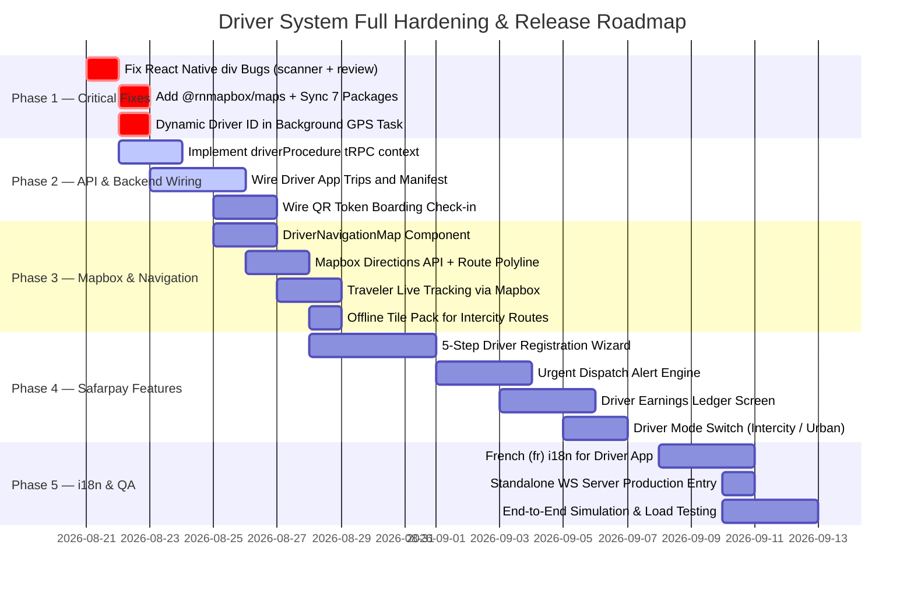

# 09 — Comprehensive Findings Catalog & Action Plan

## 1. Categorized Findings & Vulnerability Catalog

### Priority 0: Critical Blockers (Fatal Runtime Crashes)

#### 🔴 BUG-01: HTML `<div>` in React Native Scanner Screen
- **Location**: `apps/driver-app/app/(tabs)/scanner.tsx` (Line 118)
- **Problem**: HTML `<div>` used inside React Native component tree causes immediate fatal redscreen crash on mobile devices when scanning a QR code.
- **Fix**: Replace `<div>` and `</div>` with `<View>` and `</View>`.

#### 🔴 BUG-02: HTML `<div>` in React Native Review Modal
- **Location**: `apps/traveler-app/features/booking/components/review-sheet.tsx` (Line 76)
- **Problem**: HTML `<div>` used inside React Native component tree crashes traveler app when opening the 3-way review sheet.
- **Fix**: Replace `<div>` and `</div>` with `<View>` and `</View>`.

---

### Priority 1: High Priority (API & Operational Gaps)

#### 🟠 GAP-01: Driver Mobile App Mock Data Decoupling
- **Location**: `apps/driver-app/app/(tabs)/trips.tsx`, `live.tsx`, `profile.tsx`, `manifest.tsx`
- **Problem**: Screens use local mock arrays and hardcoded driver ID (`drv_default_01`) instead of real tRPC backend procedures.
- **Fix**: Introduce mobile-facing driver procedures in `apps/web/trpc/routers/drivers.ts` (`getMyProfile`, `getMyTrips`, `toggleShift`) and wire them via `useTRPC()`.

#### 🟠 GAP-02: Mobile Ticket Boarding Verification & Sync
- **Location**: `apps/driver-app/app/(tabs)/scanner.tsx` & `apps/driver-app/app/trip/[id]/manifest.tsx`
- **Problem**: Scanned QR codes do not validate signed booking tokens against the database or trip manifest.
- **Fix**: Implement `trpc.booking.checkInByToken` and connect QR scan result directly to the mutation.

---

### Priority 2: Medium Priority (UX, Telemetry & i18n)

#### 🟡 GAP-03: Real-Time Telemetry Subscription in Traveler App
- **Location**: `apps/traveler-app/app/tracking/[tripId].tsx`
- **Problem**: Speed and vehicle location currently jitter via simulated interval rather than subscribing to WebSocket channel `trip:${tripId}:telemetry`.
- **Fix**: Connect tracking screen to live WebSocket telemetry room or implement react-query polling against `trpc.drivers.getLivePositions`.

#### 🟡 GAP-04: Driver Mobile App Localization (French & English)
- **Location**: `apps/driver-app/app`
- **Problem**: UI text is currently hardcoded in English. For deployment in West Africa (Côte d'Ivoire), French (`fr`) is required.
- **Fix**: Integrate `react-i18next` with bilingual translation files (`fr/driver.json`, `en/driver.json`).

---

## 2. Concrete Code Diffs for Critical Fixes

### Patch 1: Fix `<div>` Crash in `apps/driver-app/app/(tabs)/scanner.tsx`

```diff
--- a/apps/driver-app/app/(tabs)/scanner.tsx
+++ b/apps/driver-app/app/(tabs)/scanner.tsx
@@ -115,12 +115,12 @@ export default function DriverScannerScreen() {
 						<View className="flex-row items-center gap-3">
 							<View className="size-12 rounded-2xl bg-emerald-500/10 border border-emerald-500/20 items-center justify-center">
 								<CheckCircle size={28} color="#10b981" />
 							</View>
-							<div>
+							<View>
 								<Text className="text-lg font-black text-white">
 									Boarding Cleared
 								</Text>
 								<Text className="text-xs text-emerald-400 font-semibold">
 									Verified & Validated
 								</Text>
-							</div>
+							</View>
 						</View>
```

### Patch 2: Fix `<div>` Crash in `apps/traveler-app/features/booking/components/review-sheet.tsx`

```diff
--- a/apps/traveler-app/features/booking/components/review-sheet.tsx
+++ b/apps/traveler-app/features/booking/components/review-sheet.tsx
@@ -73,12 +73,12 @@ export function ReviewSheet({
 			<Pressable className="flex-1 bg-black/50" onPress={onClose} />
 			<View className="bg-white dark:bg-zinc-900 rounded-t-3xl px-5 py-6 gap-4 shadow-2xl max-h-[85%]">
 				<View className="flex-row items-center justify-between">
-					<div>
+					<View>
 						<Text className="text-xl font-extrabold text-foreground">
 							Rate Your Journey
 						</Text>
 						<Text className="text-xs text-muted-foreground mt-0.5">
 							Provide feedback for your driver, bus, and on-time experience.
 						</Text>
-					</div>
+					</View>
 					<Pressable onPress={onClose} hitSlop={12}>
 						<Text className="text-lg text-muted-foreground">✕</Text>
 					</Pressable>
 				</View>
```

---

## 3. Mapbox Geospatial Engine Gaps (`@rnmapbox/maps`)

#### 🔴 GAP-05: No Vector Map Engine in Either Mobile App
- **Location**: `apps/driver-app/app/(tabs)/live.tsx`, `apps/traveler-app/app/tracking/[tripId].tsx`
- **Problem**: Driver live navigation screen uses a hardcoded CSS grid placeholder. Traveler tracking screen simulates location movement with a timer interval. Neither app uses a real Mapbox vector map.
- **Impact**: No real-time route visualization, no smooth camera follow, no turn-by-turn navigation cues, no offline tile caching for intercity routes with poor cellular coverage.
- **Fix**: Install `@rnmapbox/maps@^11.18.0` to both apps. Add plugin config to `app.json`. Implement `DriverNavigationMap` component per spec in [Document 11](./11-mapbox-geospatial-and-navigation-architecture-audit.md).

#### 🟠 GAP-06: No Mapbox Directions API Integration
- **Location**: `apps/driver-app/features/map/` (to be created)
- **Problem**: Driver app has no route corridor computation. Departure from origin terminal to destination terminal has no polyline drawn on any map.
- **Fix**: Fetch `https://api.mapbox.com/directions/v5/mapbox/driving/{origin};{dest}?geometries=geojson` at trip start. Render route GeoJSON as a `LineLayer` via `ShapeSource`.

#### 🟡 GAP-07: No Offline Tile Pack for Intercity Routes
- **Location**: `apps/driver-app/lib/map-cache.ts` (to be created)
- **Problem**: Long-distance intercity routes (e.g., Abidjan–Bouaké: ~380km) pass through regions with intermittent LTE coverage. Without offline tile caching, the map goes blank mid-journey.
- **Fix**: Pre-cache route bounding box tile pack at trip start using `MapboxGL.offlineManager.createPack(...)`.

---

## 4. Safarpay Blueprint Gaps

#### 🔴 GAP-08: No Driver Self-Registration Wizard
- **Location**: `apps/driver-app/app/(auth)/register/` (to be created)
- **Problem**: Drivers cannot self-onboard via the mobile app. Currently requires operator manual entry via Web ERP `AddDriverModal`.
- **Impact**: High friction for fleet scaling. Impossible to onboard independent contractor drivers without operator intermediary.
- **Fix**: Build 5-step registration flow (Demographics → National ID → License → Carrier Affiliation → Verification Status). Full spec in [Document 10](./10-safarpay-blueprint-and-enterprise-features-gap-audit.md).

#### 🔴 GAP-09: No Urgent Dispatch Audio/Visual Alert System
- **Location**: `apps/driver-app/app/(tabs)/trips.tsx`
- **Problem**: New trip dispatches appear silently in a static list. No audio chime, haptic feedback, countdown modal, or Android wake-lock.
- **Impact**: Drivers miss urgent dispatch assignments, especially when device is in pocket or locked.
- **Fix**: Add FCM high-priority notification handler, `expo-av` dispatch chime, and a full-screen modal with 30s countdown acceptance ring.

#### 🟠 GAP-10: No Driver Earnings & Shift Ledger Screen
- **Location**: `apps/driver-app/app/(tabs)/earnings.tsx` (to be created)
- **Problem**: `DriverShift` schema is fully implemented and populated by the telemetry system, but no mobile UI surfaces this data to drivers.
- **Fix**: Create `(tabs)/earnings.tsx` wired to `trpc.drivers.getMyShifts` and `trpc.drivers.getMyEarnings`. Display today/week earnings, trips completed, km logged, and payout history.

#### 🟠 GAP-11: No Driver Mode Switch (Intercity ↔ Urban)
- **Location**: `apps/driver-app/app/(tabs)/trips.tsx`
- **Problem**: Driver app does not distinguish between Intercity (fixed timetable run) and Urban Contractor (dynamic loop) operational modes.
- **Fix**: Add mode toggle with role guard (checking `DriverProfile.licenseClass` and active trip state before switching).

#### 🟡 GAP-12: Package Parity — 7 Missing Dependencies in `apps/driver-app`
- **Packages**: `@hugeicons/react-native`, `@hugeicons/core-free-icons`, `i18next`, `react-i18next`, `expo-image-picker`, `expo-image-manipulator`, `rn-international-phone-number`, `zustand`
- **Problem**: Version fragmentation causes monorepo peer dependency conflicts and prevents use of shared UI components, translation files, and document upload utilities.
- **Fix**: Add all 7 packages to `apps/driver-app/package.json` at the same versions as `apps/traveler-app/package.json`. Full table in [Document 12](./12-package-parity-and-design-system-alignment-audit.md).

---

## 5. Prioritized Implementation Roadmap



---

## 6. Verification & Testing Checklist

- [ ] **Mobile Redscreen Verification**: Build and run `apps/driver-app` on iOS Simulator / Android Emulator and scan test QR barcode. Verify no JSX element crashes.
- [ ] **Review Sheet Verification**: Open `ReviewSheet` from Traveler App booking detail screen. Verify smooth presentation and submission.
- [ ] **Mapbox Map Render**: Launch `apps/driver-app` live screen — confirm Mapbox vector tiles render on dark style, bus puck appears at GPS position, and camera follows heading.
- [ ] **Route Polyline Verification**: Assign a trip to driver and tap Start Run — confirm route corridor polyline renders in Moja Rose (`#e11d48`) from origin terminal to destination.
- [ ] **Offline Tile Cache**: Enable airplane mode after trip start — confirm map tiles remain visible for 15+ minutes along cached route corridor.
- [ ] **End-to-End Telemetry Loop**:
  1. Driver taps `Start Run` in mobile app.
  2. GPS pings stream over WebSocket to `apps/web/server/telemetry-ws.ts`.
  3. Operator Live Fleet Map (`/dashboard/operator/drivers/map`) updates bus marker and speedometer in real-time.
  4. Traveler App (`/tracking/[tripId]`) displays moving bus icon via `@rnmapbox/maps` and updated ETA.
- [ ] **Dispatch Alert Test**: Dispatch an urgent trip from operator ERP — verify driver device plays audio chime, triggers haptic pulse, and shows 30-second countdown acceptance modal.
- [ ] **Driver Registration Wizard E2E**: Install driver app on fresh device — complete all 5 registration steps, upload test ID images, submit for verification.
- [ ] **Earnings Ledger**: Complete a driver shift → verify `DriverShift` record created → confirm earnings screen shows correct today/week totals and itemized trip list.
- [ ] **License Verification Enforcement**: Attempt to assign an unverified driver on the dispatch board; verify `PRECONDITION_FAILED` error is raised.
- [ ] **3-Way Review Loop**: Complete trip → Traveler submits 3-way rating → Operator reviews dashboard reflects updated driver score and vehicle cleanliness score.
- [ ] **Package Parity**: Run `pnpm install` at monorepo root — verify zero peer dependency warnings between `driver-app` and `traveler-app`.
