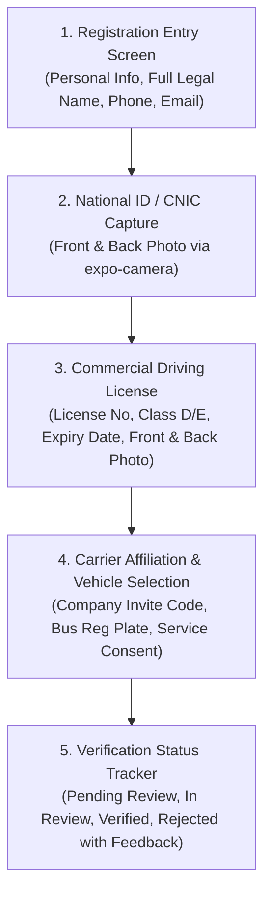
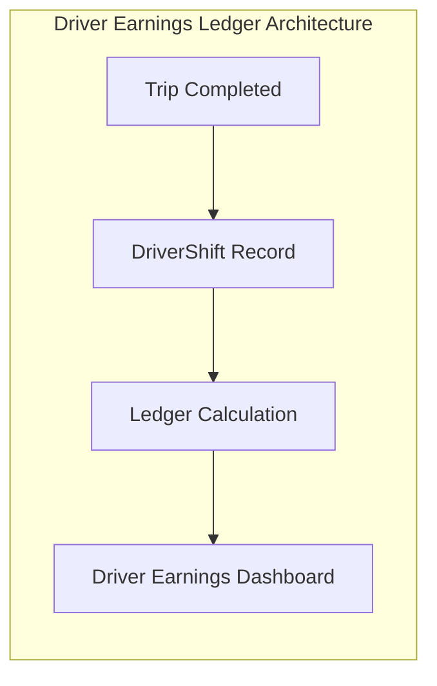

# 10 — Safarpay Blueprint & Enterprise Features Gap Audit

## 1. Executive Summary

This document performs an exhaustive feature-by-feature and architectural audit comparing the **Moja Bus Driver System** against the enterprise **Safarpay Platform Blueprint** (`app-references/safarpay/client/`, `app-references/safarpay/services/`, and the 88 detailed feature specifications in `app-references/safarpay/client/context/feature-specs/`).

Safarpay represents a battle-tested, high-throughput commercial mobility platform with deep support for multi-step driver onboarding, real-time dispatching, audio-visual urgent alerts, floating active-trip runtimes, and carrier-grade financial accounting.

---

## 2. Safarpay Feature Matrix vs. Moja Bus Current Implementation

| Safarpay Feature Specification | Safarpay Implementation (`client/lib` & `services`) | Moja Bus Current State | Gap Severity | Strategic Remediation Plan |
| :--- | :--- | :--- | :--- | :--- |
| **026–029: Driver Self-Registration Wizard** | Multi-step mobile flow: Demographics $\rightarrow$ National ID / CNIC $\rightarrow$ Driver License $\rightarrow$ Vehicle Selection $\rightarrow$ Review Submission $\rightarrow$ Verification Status Tracker. | Driver can only be added manually by operator via Web ERP modal (`AddDriverModal`). Driver mobile app has no registration wizard. | 🟠 **HIGH GAP** | Port the 5-step registration wizard to `apps/driver-app/app/(auth)/register/*` with document camera capture. |
| **044: Driver Mode Switch** | Instant toggle between Passenger Mode and Driver Mode (with role check and active trip guard). | Driver App is currently a standalone app, but lacks dual-mode toggle between Intercity Timetable Run vs Urban Contractor Loop. | 🟡 **MEDIUM GAP** | Implement mode switch engine in `apps/driver-app/app/(tabs)/trips.tsx` with dedicated UI layouts. |
| **050–052: Vehicle Taxonomy & Carrier Consent** | Vehicle classification (Bus, Minibus, Coach), seating layout, carrier affiliation contract, and data-sharing consent. | Schema supports `Bus` and `DriverCompanyAffiliation`, but mobile app lacks interactive vehicle picker and carrier consent signature. | 🟡 **MEDIUM GAP** | Add vehicle selection & company code pairing screen in driver profile. |
| **055: Driver Earnings & Shift Ledger** | Real-time earnings card, daily/weekly breakdown, completed trip commissions, tips, and payout withdrawal history. | Basic shift timer exists in schema (`DriverShift`), but Driver App profile only shows mock static numbers. | 🟠 **HIGH GAP** | Create `apps/driver-app/app/(tabs)/earnings.tsx` wired to `trpc.drivers.getMyEarnings`. |
| **056 & 075: Real-time Dispatch & Urgent Ride Alerts** | Full-screen modal, custom high-priority audio chime (`audioplayers`), progressive countdown ring, and persistent wake-lock on Android. | Dispatches appear only in static list; no audio chime, wake-lock, or urgent dispatch popup. | 🟠 **HIGH GAP** | Integrate `@novu/react-native` push alerts + `expo-av` custom dispatch sound and full-screen dispatch notification modal. |
| **066, 078, 081: Foreground Active Ride Runtime & Overlay** | Persistent floating overlay on device lock screen / over other apps with turn-by-turn navigation HUD and quick actions. | Basic `live.tsx` screen exists inside app, but lacks system overlay and live Mapbox turn-by-turn routing. | 🟠 **HIGH GAP** | Integrate `@rnmapbox/maps` with dynamic turn-by-turn directions, speed HUD, and Android foreground service notification. |
| **060: In-Trip Communication (Chat & Calls)** | Masked VoIP / Twilio calling and real-time chat between driver and passengers. | Driver manifest shows phone numbers directly without in-app masking or broadcast messaging. | 🟡 **MEDIUM GAP** | Add in-app passenger broadcast announcement feature via Novu SMS/Push. |
| **085: Map Camera & Controls** | Mapbox Follow-User camera mode, smooth heading rotation, dynamic bounding box framing, and quick recenter button. | Simulated CSS grid; no true vector map engine. | 🔴 **CRITICAL GAP** | Integrate `@rnmapbox/maps` MapboxGL engine with follow-user camera and dynamic polyline framing. |

---

## 3. Deep Dive: 5-Step Driver Registration Wizard (Safarpay Specs 026–029)

In Safarpay, prospective commercial drivers complete an autonomous mobile registration flow. To match this standard, `apps/driver-app` must introduce the following screen hierarchy under `apps/driver-app/app/(auth)/register/`:

### Screen Flow Details:
1. **Entry & Demographics (`register/index.tsx`)**:
   - Captures legal name, date of birth, residential address, emergency contact, and profile selfie.
2. **National Identity Document (`register/national-id.tsx`)**:
   - High-contrast camera frame with live edge-detection guidance.
   - Captures front and back of government ID with automatic compression via `expo-image-manipulator`.
3. **Commercial Driver License (`register/license.tsx`)**:
   - License Number, Category Class (`B`, `C`, `D`, `E`), Issue Date, Expiration Date.
   - Front and Back photo capture with validation checking that expiry date is in the future.
4. **Carrier Affiliation & Vehicle Allocation (`register/carrier.tsx`)**:
   - Enter Operator Company Code (e.g. `UTB-CI-01`, `SOTRA-EXP`).
   - Select primary bus registration plate or request unassigned contractor pool.
   - Digital agreement to carrier safety policies and GPS telemetry streaming consent.
5. **Verification Status Tracker (`register/status.tsx`)**:
   - Live polling / push notification receiver displaying compliance state:
     - 🟡 `PENDING_SUBMISSION`
     - 🔵 `UNDER_COMPLIANCE_REVIEW` (estimated 24–48 hours)
     - 🟢 `VERIFIED & CLEARED FOR DISPATCH` $\rightarrow$ Unlocks `(tabs)/trips`
     - 🔴 `REJECTED` (with exact compliance officer rejection reason and one-tap re-upload button).

---

## 4. Deep Dive: Urgent Dispatch Alerts & Audio-Visual Runtime (Safarpay Spec 075)

When a dispatcher assigns an urgent trip or changes schedule timing on the ERP dispatch board:
1. **Push & Socket Delivery**:
   - Novu triggers high-priority FCM / APNs payload to the driver's device.
   - WebSocket gateway broadcasts `driver:{id}:dispatch` event.
2. **Audio-Visual Urgency Engine**:
   - Uses `expo-av` or `react-native-sound` to play a distinct commercial two-tone chime at maximum notification volume.
   - Triggers heavy haptic pulse pattern (`Haptics.NotificationFeedbackType.Warning`).
   - Android: Launches high-priority Heads-Up Notification with full-screen intent.
3. **Acceptance / Confirmation UI**:
   - Renders a 30-second circular countdown timer with route preview, origin terminal, departure time, and bus plate.
   - Tapping **Accept Run** acknowledges the dispatch and automatically transitions the driver to `ON_DUTY` / `ON_TRIP`.

---

## 5. Deep Dive: Driver Shift & Earnings Ledger (Safarpay Spec 055)

Commercial drivers require complete transparency into their shift hours, distance logged, and earnings:

### UI Components for `apps/driver-app/app/(tabs)/earnings.tsx`:
1. **Hero Balance Card**:
   - Today's Earnings, Week-to-Date Earnings, Total Logged Shift Hours.
2. **Shift Statistics**:
   - Trips Completed Today vs Target.
   - Total Kilometers Logged on Road.
   - On-Time Punctuality Score (%).
3. **Trip-by-Trip Statement**:
   - Itemized list of completed runs showing departure/arrival timestamps, passenger manifest count, and verified passenger rating.
4. **Payout History**:
   - Direct integration with Moja Wallet for driver disbursements (Wave, Orange Money, MTN MoMo).
