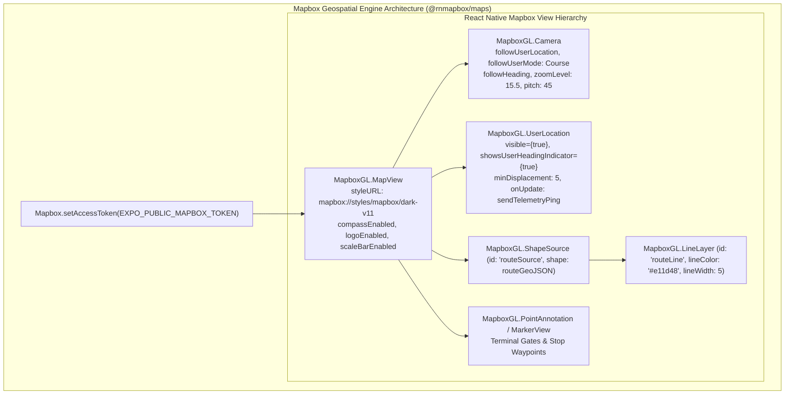

# 11 — Mapbox Geospatial & Navigation Architecture Audit (`@rnmapbox/maps`)

## 1. Overview & Technical Motivation

In commercial fleet telematics, static raster maps or simulated CSS grid canvases fail to meet enterprise requirements for turn-by-turn navigation, dynamic route re-centering, off-route detection, and smooth coordinate interpolation.

To achieve full parity with the **Safarpay map engine** (`mapbox_maps_flutter`), the Moja Bus ecosystem across both `apps/driver-app` and `apps/traveler-app` utilizes **`@rnmapbox/maps`** (the official, high-performance Mapbox Maps SDK for React Native and Expo).



---

## 2. Configuration & Manifest Setup (`app.json`)

To configure `@rnmapbox/maps` under Expo 57 managed workflow, the following plugin configuration must be added to `apps/driver-app/app.json` and `apps/traveler-app/app.json`:

```json
{
  "expo": {
    "plugins": [
      [
        "@rnmapbox/maps",
        {
          "RNMapboxMapsDownloadToken": "sk.eyJ1IjoibW9qYS1idXNzIi... (Secret Downloads Token)",
          "RNMapboxMapsVersion": "11.18.0"
        }
      ]
    ]
  }
}
```

### Environment Token Strategy:
- **Public Map Rendering Token (`EXPO_PUBLIC_MAPBOX_TOKEN`)**: Used at runtime by client apps for fetching vector tiles, style sheets, and glyphs (`pk.eyJ1...`).
- **Private Downloads Token (`RNMapboxMapsDownloadToken`)**: Configured in `.npmrc` or CI environment variables for pulling Mapbox Android SDK and iOS XCFramework binaries during native build.

---

## 3. Core Mapbox Components & Patterns

### A. Dedicated Driver Navigation Canvas (`DriverNavigationMap.tsx`)
In `apps/driver-app/features/map/components/driver-navigation-map.tsx`:

```tsx
import React, { useRef, useEffect } from "react";
import { View, StyleSheet } from "react-native";
import MapboxGL from "@rnmapbox/maps";

MapboxGL.setAccessToken(process.env.EXPO_PUBLIC_MAPBOX_TOKEN || "");

interface DriverNavigationMapProps {
  currentLocation?: { latitude: number; longitude: number; heading?: number; speed?: number };
  routeGeoJson?: GeoJSON.FeatureCollection<GeoJSON.LineString>;
  stops?: Array<{ id: string; name: string; latitude: number; longitude: number; order: number }>;
  isNavigating?: boolean;
}

export function DriverNavigationMap({
  currentLocation,
  routeGeoJson,
  stops = [],
  isNavigating = false,
}: DriverNavigationMapProps) {
  const cameraRef = useRef<MapboxGL.Camera>(null);

  useEffect(() => {
    if (isNavigating && currentLocation && cameraRef.current) {
      cameraRef.current.setCamera({
        centerCoordinate: [currentLocation.longitude, currentLocation.latitude],
        zoomLevel: 16,
        pitch: 50,
        heading: currentLocation.heading || 0,
        animationDuration: 1000,
        animationMode: "flyTo",
      });
    }
  }, [currentLocation, isNavigating]);

  return (
    <View style={styles.container}>
      <MapboxGL.MapView
        style={styles.map}
        styleURL="mapbox://styles/mapbox/dark-v11"
        logoEnabled={false}
        attributionEnabled={false}
        compassEnabled={true}
        compassPosition={{ top: 16, right: 16 }}
      >
        <MapboxGL.Camera
          ref={cameraRef}
          defaultSettings={{
            centerCoordinate: currentLocation
              ? [currentLocation.longitude, currentLocation.latitude]
              : [-4.0083, 5.3599], // Abidjan default
            zoomLevel: 13,
          }}
        />

        {/* Route Polyline Layer */}
        {routeGeoJson && (
          <MapboxGL.ShapeSource id="routeSource" shape={routeGeoJson}>
            <MapboxGL.LineLayer
              id="routeLineOutline"
              style={{
                lineColor: "#9f1239",
                lineWidth: 7,
                lineCap: "round",
                lineJoin: "round",
              }}
            />
            <MapboxGL.LineLayer
              id="routeLine"
              style={{
                lineColor: "#e11d48",
                lineWidth: 5,
                lineCap: "round",
                lineJoin: "round",
              }}
            />
          </MapboxGL.ShapeSource>
        )}

        {/* Stop Waypoint Markers */}
        {stops.map((stop) => (
          <MapboxGL.PointAnnotation
            key={stop.id}
            id={`stop-${stop.id}`}
            coordinate={[stop.longitude, stop.latitude]}
          >
            <View style={styles.stopMarker}>
              <View style={styles.stopMarkerInner} />
            </View>
          </MapboxGL.PointAnnotation>
        ))}

        {/* Real-time Moving Bus Puck */}
        {currentLocation && (
          <MapboxGL.PointAnnotation
            id="busPuck"
            coordinate={[currentLocation.longitude, currentLocation.latitude]}
          >
            <View style={styles.busMarkerContainer}>
              <View
                style={[
                  styles.busMarkerPuck,
                  { transform: [{ rotate: `${currentLocation.heading || 0}deg` }] },
                ]}
              >
                {/* Arrow Pointer */}
                <View style={styles.puckArrow} />
              </View>
            </View>
          </MapboxGL.PointAnnotation>
        )}
      </MapboxGL.MapView>
    </View>
  );
}

const styles = StyleSheet.create({
  container: { flex: 1, backgroundColor: "#09090b" },
  map: { flex: 1 },
  stopMarker: {
    width: 20,
    height: 20,
    borderRadius: 10,
    backgroundColor: "rgba(16, 185, 129, 0.2)",
    borderWidth: 2,
    borderColor: "#10b981",
    alignItems: "center",
    justifyContent: "center",
  },
  stopMarkerInner: {
    width: 8,
    height: 8,
    borderRadius: 4,
    backgroundColor: "#10b981",
  },
  busMarkerContainer: {
    width: 44,
    height: 44,
    alignItems: "center",
    justifyContent: "center",
  },
  busMarkerPuck: {
    width: 36,
    height: 36,
    borderRadius: 18,
    backgroundColor: "#e11d48",
    borderWidth: 3,
    borderColor: "#ffffff",
    alignItems: "center",
    justifyContent: "center",
    shadowColor: "#e11d48",
    shadowOffset: { width: 0, height: 4 },
    shadowOpacity: 0.5,
    shadowRadius: 8,
    elevation: 8,
  },
  puckArrow: {
    width: 0,
    height: 0,
    borderLeftWidth: 5,
    borderRightWidth: 5,
    borderBottomWidth: 10,
    borderStyle: "solid",
    borderLeftColor: "transparent",
    borderRightColor: "transparent",
    borderBottomColor: "#ffffff",
    marginTop: -4,
  },
});
```

---

## 4. Mapbox Directions & Turn-by-Turn Routing Engine

To display dynamic arrival times and route corridors:
1. **Mapbox Directions API Integration**:
   - Query `https://api.mapbox.com/directions/v5/mapbox/driving/${originLng},${originLat};${destLng},${destLat}?geometries=geojson&steps=true&access_token=${TOKEN}`.
   - Extract `routes[0].geometry` (GeoJSON LineString) for the polyline layer.
   - Extract `routes[0].duration` (seconds) and `routes[0].distance` (meters) for HUD ETA updates.
2. **Offline Tile Cache**:
   - For long-distance intercity routes with intermittent cellular connectivity (e.g. northern Côte d'Ivoire), pre-cache route tile packs using `MapboxGL.offlineManager.createPack(...)`.
3. **Off-Route Geofencing**:
   - If the vehicle's perpendicular distance from the corridor polyline exceeds **500 meters**, trigger an automated "Off-Route Alert" event to dispatchers.

---

## 5. Traveler App Live Bus Tracking Screen Integration

In `apps/traveler-app/app/tracking/[tripId].tsx`:
- Replaces the placeholder radial canvas with a lightweight `MapboxGL.MapView`.
- Subscribes to the WebSocket telemetry channel `trip:${tripId}:telemetry`.
- Binds camera bounds using `cameraRef.current.fitBounds([destLng, destLat], [busLng, busLat], 60, 1000)`.
- Renders origin terminal, intermediate waypoint gates, destination terminal, and the live moving bus marker.
