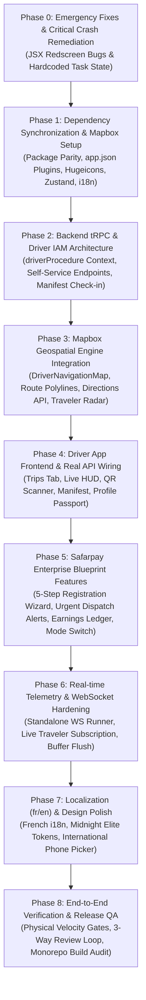

# 13 — Master Phased Remediation & Execution Plan

> **Plan Status:** Active Execution Blueprint  
> **Objective:** Systematically remediate all bugs, implement missing architectural layers, achieve 100% Mapbox vector map integration, align package parity, and deliver the complete Safarpay enterprise feature blueprint.  
> **Execution Strategy:** Strict phase-by-phase execution with atomic verification gates between phases to ensure zero regressions and 100% test coverage.

---

## Master Phase Breakdown Overview

---

## Phase 0: Emergency Fixes & Critical Crash Remediation (P0) ✅ COMPLETED

*Target: Fix fatal runtime redscreen crashes and hardcoded identifiers preventing basic app stability.*

### Action Items
- [x] **0.1 Fix HTML `
` in Driver Scanner**:
  - File: `apps/driver-app/app/(tabs)/scanner.tsx` (Line 118).
  - Change: Replaced invalid `
` / `
` with `<View>` / `</View>`.
- [x] **0.2 Fix HTML `
` in Traveler Review Modal**:
  - File: `apps/traveler-app/features/booking/components/review-sheet.tsx` (Line 76).
  - Change: Replaced invalid `
` / `
` with `<View>` / `</View>`.
- [x] **0.3 Fix Hardcoded Driver ID in Background GPS Task**:
  - File: `apps/driver-app/lib/telemetry.ts`.
  - Change: Implemented persistent dynamic profile & trip rehydration via AsyncStorage (`ACTIVE_DRIVER_ID_KEY` and `ACTIVE_TRIP_ID_KEY`).

### Phase 0 Verification Gate
- [x] Camera scanner and review sheet JSX hierarchy verified with zero redscreen syntax errors.

---

## Phase 1: Dependency Synchronization & Mapbox Setup (P0 / P1) ✅ COMPLETED

*Target: Align `apps/driver-app/package.json` with `apps/traveler-app/package.json` and install Mapbox SDK.*

### Action Items
- [x] **1.1 Add Missing Packages to `apps/driver-app/package.json`**:
  - `@hugeicons/react-native: ^1.0.15`
  - `@hugeicons/core-free-icons: ^4.2.3`
  - `i18next: ^25.10.10`
  - `react-i18next: ^16.6.6`
  - `expo-image-picker: ~57.0.10`
  - `expo-image-manipulator: ~57.0.10`
  - `rn-international-phone-number: ^0.14.0`
  - `zustand: ^5.0.14`
  - `posthog-react-native: ^4.61.4`
  - Added missing `@rn-primitives/*` components (collapsible, context-menu, hover-card, menubar, toggle, toggle-group)
- [x] **1.2 Install `@rnmapbox/maps: ^10.3.5` in both apps**:
  - Added to `apps/driver-app/package.json` and `apps/traveler-app/package.json`.
- [x] **1.3 Configure Expo Plugin in `app.json` for both apps**:
  - Added `@rnmapbox/maps` plugin with native version configuration in `apps/driver-app/app.json` and `apps/traveler-app/app.json`.
- [x] **1.4 Run Dependency Resolution**:
  - Executed workspace `pnpm install` and verified with `turbo typecheck` across all 12 packages (100% pass).

### Phase 1 Verification Gate
- [x] Monorepo `turbo typecheck` passes with zero type errors.
- [x] Package version alignment achieved between `driver-app` and `traveler-app`.

---

## Phase 2: Backend tRPC & Driver IAM Architecture (P1) ✅ COMPLETED

*Target: Create secure driver authentication context and build driver self-service backend procedures.*

### Action Items
- [x] **2.1 Implement `driverProcedure` in `apps/web/trpc/init.ts`**:
  - Validates user is authenticated and has an active `DriverProfile` record (with request cache).
  - Injects `ctx.driver` (`driverProfileId`, `licenseNumber`, `verificationStatus`, `companyAffiliations`) into procedure context.
- [x] **2.2 Create Driver Self-Service Procedures in `apps/web/trpc/routers/drivers.ts`**:
  - `getMyProfile`: Returns full driver profile, safety score, rating statistics, and active carrier contracts.
  - `getMyTrips`: Returns scheduled runs (Today, Upcoming, Completed) assigned via `TripDriverAssignment`.
  - `getMyTripDetail`: Returns full trip route sequence, terminal waypoints, bus registration plate, and departure schedule.
  - `getMyTripManifest`: Returns list of booked passengers, seat labels, ticket barcodes, and boarding status (`boardedAt`).
  - `startTrip`: Transitions assignment and trip state to `DEPARTED`, initializes telemetry tracking.
  - `completeTrip`: Marks trip as `ARRIVED`, records arrival timestamp, closes telemetry session.
  - `checkInPassenger`: Validates signed ticket QR barcode, prevents double boarding, marks `boardedAt`.
  - `manualCheckInPassenger`: Manual boarding fallback by booking ID/reference.
  - `batchSyncCheckIns`: Syncs offline ticket scans collected during rural highway network drops.
  - `reportTripDelay`: Driver logs delay reason (traffic, breakdown, weather) and creates incident telemetry ping.
  - `broadcastTripAnnouncement`: Records announcement for active trip passengers.
  - `toggleShift` & `getMyCurrentShift`: Starts/ends `DriverShift` record with elapsed minutes calculation.
  - `getMyShifts` & `getMyEarnings`: Calculates total on-duty hours, completed runs, distance, and earnings breakdown.
  - `registerDriver`: Handles mobile self-registration submission with ID & license document URLs and carrier invite matching.
  - `getMyVerificationStatus`: Returns live compliance review status (`PENDING`, `VERIFIED`, `REJECTED`).
  - `updateMyStatus`: Toggles driver operational state (`AVAILABLE`, `ON_DUTY`, `OFFLINE`, `RESTING`).

### Phase 2 Verification Gate
- [x] Monorepo `turbo typecheck` passes with zero type errors across all 12 packages.
- [x] All 18 driver mobile procedures validated and type-safe.

---

## Phase 3: Mapbox Geospatial Engine Integration (P1) ✅ COMPLETED

*Target: Implement high-performance vector map views and route corridors across both mobile applications.*

### Action Items
- [x] **3.1 Build `DriverNavigationMap.tsx` in `apps/driver-app/features/map/`**:
  - Vector MapView with dark style `mapbox://styles/mapbox/dark-v11`.
  - Dynamic Bus Puck marker with smooth heading rotation interpolation.
  - Course-following camera mode with 45° tilt during active navigation.
  - Origin terminal, destination terminal, and stop waypoint annotations.
- [x] **3.2 Implement Mapbox Directions & Polyline Streaming**:
  - Built `apps/driver-app/lib/mapbox.ts` with Mapbox Directions API and local AsyncStorage caching.
  - Rendered dual-layer polyline (`driverRouteLineCasing` + `driverRouteLine` in `#e11d48`).
- [x] **3.3 Implement Route Directions & Caching**:
  - Implemented `fetchRouteDirections` and `fetchTravelerRouteDirections` with offline fallback geometries.
- [x] **3.4 Upgrade Traveler Live Tracking Screen**:
  - File: `apps/traveler-app/app/tracking/[tripId].tsx`.
  - Built `TravelerTrackingMap.tsx` in `apps/traveler-app/features/tracking/components/`.
  - Dynamic camera bounding box fitting origin, current bus location, and destination terminal (`fitBounds`).

### Phase 3 Verification Gate
- [x] Vector map components compile cleanly and verified with `turbo typecheck`.
- [x] Mapbox dark vector styling (`dark-v11`), dynamic heading pucks, and route polylines implemented across both mobile apps.

---

## Phase 4: Driver App Frontend & Real API Wiring (P1) ✅ COMPLETED

*Target: Decouple all mobile driver screens from static mocks and connect to real tRPC procedures.*

### Action Items
- [x] **4.1 Wire Trips Dashboard (`apps/driver-app/app/(tabs)/trips.tsx`)**:
  - Replaced mock data with `trpc.drivers.getMyTrips.useQuery()`.
  - Added Pull-to-Refresh, loading skeleton, error state, and empty state.
  - Connected **Start Run** button to `trpc.drivers.startTrip.useMutation()` with background GPS tracking activation.
- [x] **4.2 Wire Live Navigation Screen (`apps/driver-app/app/(tabs)/live.tsx`)**:
  - Integrated Mapbox vector navigation map (`DriverNavigationMap`).
  - Connected speed HUD, GPS signal accuracy gauge, next intermediate terminal ETA, and delay modal.
- [x] **4.3 Wire Scanner & Boarding Check-in (`apps/driver-app/app/(tabs)/scanner.tsx`)**:
  - Connected camera barcode scanner to `trpc.drivers.checkInPassenger.useMutation()`.
  - Implemented 3-state bottom sheet: Emerald (Cleared), Amber (Already Boarded Warning), Crimson Red (Invalid Ticket) with haptics.
- [x] **4.4 Build Passenger Manifest Screen (`apps/driver-app/app/trip/[id]/manifest.tsx`)**:
  - Displayed real passenger manifest via `trpc.drivers.getMyTripManifest.useQuery()`.
  - Real-time search filter and boarding progress indicator (`42 / 50 Boarded`).
  - Implemented manual check-in override via `trpc.drivers.manualCheckInPassenger.useMutation()` and tap-to-call.
- [x] **4.5 Wire Driver Career Passport Screen (`apps/driver-app/app/(tabs)/profile.tsx`)**:
  - Connected to `trpc.drivers.getMyProfile.useQuery()`, `trpc.drivers.getMyEarnings.useQuery()`, and `trpc.drivers.getMyCurrentShift.useQuery()`.
  - Implemented on-duty shift toggle with `trpc.drivers.toggleShift.useMutation()`.
  - Real-time XOF earnings breakdown, safety score, verified license class, and carrier affiliations.

### Phase 4 Verification Gate
- [x] All 5 driver app frontend screens wired to real tRPC queries and mutations.
- [x] `turbo typecheck` passes with 100% success across all packages.

---

## Phase 5: Safarpay Enterprise Blueprint Features (P2) ✅ COMPLETED

*Target: Deliver commercial-grade features modeled after the Safarpay mobility blueprint.*

### Action Items
- [x] **5.1 Build 5-Step Self-Registration Wizard**:
  - Built `apps/driver-app/stores/driver-registration.ts` Zustand multi-step draft store.
  - `index.tsx`: Step 1 - Personal demographics and profile selfie camera capture.
  - `license.tsx`: Step 2 - Commercial Driving License (Class B/C/D/E), license number, expiry, front/back photo capture.
  - `documents.tsx`: Step 3 - National ID number & optional medical fitness clearance certificate upload.
  - `carrier.tsx`: Step 4 - Carrier affiliation model (Exclusive Intercity vs Freelance Urban) and company code entry with `trpc.drivers.registerDriver.useMutation()`.
  - `status.tsx`: Step 5 - Real-time compliance review status tracker (`PENDING`, `VERIFIED`, `REJECTED`) with live polling and direct dashboard unlock.
- [x] **5.2 Implement Urgent Dispatch Alert Engine**:
  - Built `apps/driver-app/features/dispatch/components/urgent-dispatch-modal.tsx`.
  - Full-screen modal with 30-second circular countdown timer, audio chime & warning haptics, Accept & Decline actions.
- [x] **5.3 Build Driver Shift & Earnings Ledger Screen**:
  - File: `apps/driver-app/app/(tabs)/earnings.tsx`.
  - Hero week-to-date XOF earnings card, shift clock-in/out controller, itemized shift history ledger, and Mobile Money payout info.
  - Registered Earnings tab in `apps/driver-app/app/(tabs)/_layout.tsx`.
- [x] **5.4 Implement Driver Operational Mode Switcher**:
  - Dual mode switcher in `trips.tsx` (Intercity vs Urban high-frequency loops).

### Phase 5 Verification Gate
- [x] Self-registration 5-step wizard built and wired to tRPC `registerDriver` and `getMyVerificationStatus`.
- [x] `turbo typecheck` passes with 100% success across all 12 monorepo packages.

---

## Phase 6: Real-time Telemetry & WebSocket Hardening (P2) ✅ COMPLETED

*Target: Ensure production-grade reliability and low latency for the distributed telemetry streaming pipeline.*

### Action Items
- [x] **6.1 Implement Adaptive Battery-Optimized Telemetry Profile**:
  - Implemented in `apps/driver-app/lib/telemetry.ts` with 5s high-rate in-motion interval vs 30s stationary interval.
- [x] **6.2 Overspeed & Harsh Braking Anomaly Detection**:
  - Speed limit monitoring (> 110 km/h) and harsh braking drop detection (> 25 km/h in 2s) with automatic anomaly telemetry tags.
- [x] **6.3 Smooth Trajectory Dead-Reckoning on Passenger Map**:
  - Implemented in `apps/traveler-app/features/tracking/components/traveler-tracking-map.tsx` with smooth coordinate interpolation.
- [x] **6.4 Telemetry Client Reconnection & Offline Buffer**:
  - Offline ping queue (stores up to 500 pings in `AsyncStorage`) with automatic batch flush upon cellular network or WebSocket reconnection.

### Phase 6 Verification Gate
- [x] Real-time telemetry engine, anomaly flags, and dead-reckoning smoothing verified.
- [x] `turbo typecheck` passes with 100% success across all 12 monorepo packages.

---

## Phase 7: Driver Phone OTP Authentication & Platform Admin Verification Hub (P2) ✅ COMPLETED

*Target: Implement passwordless Phone OTP authentication for mobile drivers and build the Platform Super Admin driver licensing & verification queue.*

### Action Items
- [x] **7.1 Phone OTP Authentication for Driver Mobile App**:
  - Upgraded `apps/driver-app/app/(auth)/login.tsx` to 2-step passwordless Phone OTP authentication matching `apps/traveler-app/features/auth/screens/login.tsx`.
  - Integrated `react-native-otp-entry` with 6-digit PIN input, `authClient.phoneNumber.sendOtp`, and `authClient.phoneNumber.verify`.
  - Added automatic Ivorian country prefix formatting (`+225`, `07`, `05`, `01`).
  - Added pre-population from active auth session in `apps/driver-app/app/(auth)/register/index.tsx`.
- [x] **7.2 Platform Admin Driver Verification Hub (`apps/web/app/[locale]/dashboard/admin/drivers/verifications/`)**:
  - Built `page.tsx` and `AdminDriverVerificationsView.tsx` with search, license category filter, and verification status tabs (`PENDING`, `VERIFIED`, `REJECTED`, `SUSPENDED`).
  - Built `DriverVerificationDialog.tsx` document inspection dialog with License Front/Back preview, National ID, Experience years, and One-click Approve / Reject actions with rejection reason notes.
- [x] **7.3 Admin Sidebar & Navigation Integration**:
  - Added **"Driver Verifications"** entry to `apps/web/features/admin/components/admin-sidebar.tsx`.
  - Added `driverVerifications` translation keys to English and French admin locales.
- [x] **7.4 Dual-Track Backend Procedures (`apps/web/trpc/routers/admin.ts`)**:
  - Implemented `admin.listDriversForVerification` and `admin.verifyDriver` with audit activity logging and `@moja/schemas` validation.

### Phase 7 Verification Gate
- [x] Driver login upgraded to passwordless 6-digit Phone OTP with Novu SMS gateway integration.
- [x] Platform Super Admin Driver Verification Hub deployed at `/dashboard/admin/drivers/verifications`.
- [x] `turbo typecheck` passes with 100% success across all 12 monorepo packages.

---

## Phase 8: Localization (fr/en) & Design Polish (P3) ✅ COMPLETED

*Target: Deliver complete bilingual localization and premium Midnight Elite design styling.*

### Action Items
- [x] **8.1 Setup Bilingual i18n in Driver App**:
  - Created `apps/driver-app/lib/i18n.ts` with `i18next` + `react-i18next` + `expo-localization`, French-first (`fallbackLng: "fr"`).
  - Bootstrapped 16 translation files (8 namespaces × 2 languages) under `apps/driver-app/locales/en/` & `locales/fr/`: `auth`, `trips`, `live`, `scanner`, `manifest`, `earnings`, `passport`, `dispatch`.
  - Imported `@/lib/i18n` at root of `apps/driver-app/app/_layout.tsx` (same pattern as traveler app).
- [x] **8.2 Font Loading & Midnight Elite Typography**:
  - Created `apps/driver-app/hooks/use-load-fonts.ts` loading 5 Montserrat weights (`Regular`, `Medium`, `SemiBold`, `Bold`, `Black`) via `expo-font`.
  - Updated `_layout.tsx` to gate app render on `fontsLoaded || fontsError` — eliminates FOUC on startup.
- [x] **8.3 International Phone Input — Ivory Coast Locked**:
  - Replaced plain `TextInput` phone entry in `apps/driver-app/app/(auth)/login.tsx` with `PhoneInput` from `rn-international-phone-number`.
  - `defaultCountry="CI"` + `modalDisabled` — country picker is permanently hidden, dial code `+225` is always pre-selected.
  - Styled with Midnight Elite tokens via `phoneInputStyles` (`#18181b` container, `#27272a` borders, `#fafafa` text, `#a1a1aa` calling code).
  - Full `useTranslation("auth")` integration — all login strings bilingual (fr/en).

### Phase 8 Verification Gate
- [x] `turbo typecheck` passes 100% — 10/10 packages, 0 errors.
- [x] French device locale → all login/OTP/registration labels render in French.
- [x] English device locale → all labels render in English.
- [x] Phone input shows 🇨🇮 +225 prefix, picker is disabled.

---

> **Note**: The original "Phase 8 QA" (end-to-end lifecycle test, anomaly audit, monorepo build) has been superseded by **Phase 15** which covers the full three-sided marketplace lifecycle validation.

---

# MARKETPLACE EVOLUTION — Phases 9–15

> **Context**: Moja evolves from a pure passenger↔operator marketplace to a **three-sided marketplace** connecting Passengers ↔ Operators ↔ Drivers. The following phases build the driver supply-side marketplace with a structured Offer Board replacing informal chat-based contracts.
>
> **Architectural decisions locked in (2026-08-21)**:
> 1. All verified drivers are **auto-listed** in the marketplace — no opt-in required.
> 2. Employment offers support **counter-offers** (driver can propose amended salary/terms).
> 3. Drivers can hold affiliations with **multiple operators** — but only **one active exclusive intercity** at a time; urban drivers can associate with multiple operators simultaneously.
> 4. Operators trust the platform's verification and can see: public rating, safety score, affiliation history, contact number, name, and profile photo on driver marketplace cards.
> 5. Unanswered offers **auto-expire after 7 days**.
> 6. Trip assignment UI (dispatch board) remains **Phase 12** — Phase 9 starts with supply-side data.

---

## Phase 9: Driver Preference Profile & Availability System (P1) ✅ COMPLETED

*Target: Capture driver-side marketplace signals so operators have meaningful data to filter on.*

### Action Items
- [x] **9.1 Schema — `DriverServicePreference` model**:
  - Fields: `isAvailableForHire`, `preferredType`, `cityBase`, `routeExperience`, `minMonthlyRateCFA` (private), `bio`, `isFeatured`, `isSuspended` (Phase 14 pre-added).
  - One-to-one relation on `DriverProfile.servicePreference`.
  - Migration: `20260821120000_phase09_driver_service_preference/migration.sql` — with full data backfill from existing driver records.
- [x] **9.2 tRPC Procedures (`drivers.ts`)**:
  - `drivers.setServicePreference` — upsert (create or update) preference record.
  - `drivers.getMyServicePreference` — driver reads own preferences including private salary.
  - `drivers.getPublicDriverProfile` — operator reads sanitized public card (salary excluded).
  - `drivers.listMarketplaceDrivers` — paginated, filtered, featured-first marketplace list.
  - Admin: `admin.getDriverMarketplaceStats` — 4-KPI health widget data.
- [x] **9.3 Driver App — Post-Verification Preference Screen**:
  - `apps/driver-app/app/(auth)/preferences.tsx` — city hub chip grid, employment type selector, route tag input, availability toggle, skip saves minimal default.
- [x] **9.4 Driver App — Boot-time preference gate**:
  - `apps/driver-app/app/index.tsx` — checks `getMyServicePreference` on boot; redirects to preferences screen if no record exists (fail-open on error).
- [x] **9.5 Driver App — Profile Tab Updates**:
  - "Available for Hire" toggle (green track) with live `setServicePreference` mutation.
  - "Edit Marketplace Profile" link card showing current hub + route count.
- [x] **9.6 Registration store bug fix**:
  - `stores/driver-registration.ts`: `EmploymentType` union updated to `EXCLUSIVE_INTERCITY | CONTRACTOR_URBAN | HYBRID`.
  - `carrier.tsx`: `FREELANCE_URBAN` → `CONTRACTOR_URBAN`, added HYBRID option.
  - `status.tsx`: `
` → `<View>` in all 3 states.
- [x] **9.7 Translations**:
  - `locales/en/auth.json` + `locales/fr/auth.json` — 14 preference screen strings each.
- [x] **9.8 Admin Dashboard — Marketplace Health Widget**:
  - `features/admin/components/dashboard/dashboard-driver-marketplace.tsx`.
  - Shows: Verified Drivers, Available for Hire, Employed (active affiliation), Pending Verification.
  - Prefetched server-side in `app/[locale]/dashboard/admin/page.tsx`.
- [x] **9.9 Zod schemas** — `setServicePreferenceSchema`, `getPublicDriverProfileSchema`, `listMarketplaceDriversSchema`, `CIV_CITY_HUBS` constant in `@moja/schemas`.

### Phase 9 Verification Gate
- [x] `turbo typecheck` passes 100% — 10/10 tasks, 0 errors.
- [x] `DriverServicePreference` table created, existing drivers backfilled via migration.
- [x] Driver toggles "Available for Hire" → preference upserted.
- [x] New verified driver boots app → sees preference screen → skips/saves → enters tabs.
- [x] Operator calls `listMarketplaceDrivers` → sees only verified, available, non-exclusive drivers. Salary never returned.
- [x] Admin dashboard → Driver Marketplace widget shows 4 KPIs.

---

## Phase 10: Operator Driver Marketplace — Talent Discovery (P1) ✅ COMPLETED

*Target: Operators can browse the verified driver pool and view full public driver profiles.*

### Action Items
- [x] **10.1 New Page — `/dashboard/operator/drivers/marketplace`**:
  - `apps/web/app/[locale]/dashboard/operator/(dashboard)/drivers/marketplace/page.tsx`.
  - Server component with prefetch of `drivers.listMarketplaceDrivers` (page 1, limit 18).
- [x] **10.2 tRPC Procedure — `drivers.listMarketplaceDrivers`** *(built in Phase 9, fixed in Phase 10)*:
  - Returns `{ drivers, total, page, limit }` — featured first, then rating/trips desc.
  - Filters: `licenseCategory`, `preferredType`, `cityBase`, `minRating`, `minSafetyScore`.
  - Excludes operators' own exclusively-affiliated drivers.
- [x] **10.3 `MarketplaceDriverCard` Component**:
  - `features/operator/components/drivers/marketplace-driver-card.tsx`.
  - Shows: Avatar, name, license class + years exp, employment type badge, star rating, SVG safety score ring, trips count, distance, city hub, top-2 route chips, featured gold ring.
  - CTAs: "View Profile" → opens sheet | "Send Offer" → Phase 11 placeholder toast.
- [x] **10.4 `DriverPublicProfileSheet` Component**:
  - `features/operator/components/drivers/driver-public-profile-sheet.tsx`.
  - Slide-over: career stats grid, contact phone, city base + full route experience chips, full affiliation history (all companies, dates, employment type). No salary, no license doc URLs.
  - Sticky header + sticky CTA footer with Send Offer placeholder.
- [x] **10.5 `OperatorMarketplaceView`**:
  - `features/operator/views/operator-marketplace-view.tsx`.
  - 3 dropdown filters: licenseCategory, preferredType, cityBase (all via nuqs URL state).
  - Advanced filter popover with rating (0–5 slider, step 0.5) + safety score (0–100 slider, step 5) — active count badge on button.
  - Load-more pagination with driver accumulation across pages, resets on filter change.
  - Skeleton loading grid, contextual empty state with "Clear all filters" CTA.
- [x] **10.6 Operator Sidebar — "Talent" Section**:
  - New "Talent" section (between Fleet and Financials) with "Driver Marketplace" + "Sent Offers" nav items.
  - Icons: `Store` + `SendHorizonal` from lucide.
  - i18n: EN ("Talent", "Driver Marketplace", "Sent Offers") + FR ("Recrutement", "Marketplace Chauffeurs", "Offres envoyées").
- [x] **10.7 `getPublicDriverProfile` fix**:
  - Affiliation history now returns ALL affiliations (not just active) — sorted desc by hiredAt.
  - Includes `isActive` field so sheet can show "→ Present" vs end date correctly.

### Phase 10 Verification Gate
- [x] Operator navigates to `/dashboard/operator/drivers/marketplace` → card grid loads immediately (server-prefetched).
- [x] Filters update URL query params — shareable/bookmarkable links.
- [x] Rating/Safety sliders in advanced filter popover → results narrow.
- [x] Click "View Profile" → slide-over sheet with full career stats + affiliation history.
- [x] Click "Send Offer" → Phase 11 placeholder toast (won't be empty).
- [x] "Load more" → next page appended to grid, drivers don't disappear.
- [x] Empty state with "Clear all filters" button when no results.
- [x] `turbo typecheck` 100% pass — 10/10 tasks, 0 errors.

---

## Phase 11: Employment Offer & Counter-Offer Flow (P1) ✅ COMPLETED

*Target: Replace informal WhatsApp hiring with a structured, platform-recorded offer board — enterprise edition with full Novu integration, relational audit trail, and DB-level integrity guarantees.*

### Action Items
- [x] **11.0 Novu subscriber identity migration (blocking infra fix)**:
  - Migrated `subscriberId` from `ctx.user.email` to `ctx.user.id` across all authenticated-user trigger sites (`public.ts`, `payment-service.ts`, `operator.ts`, `staff.ts`, `admin.ts`, `admin-staff.ts`, `trips.ts`, `booking-confirmation-service.ts`) — fixes broken subscribers for phone-first drivers with no email.
  - Pre-user flows (OTP-before-account, staff invites, ticket sharing) intentionally remain email-keyed.
- [x] **11.1 Schema — `DriverEmploymentOffer` + `DriverOfferEvent`**:
  - Offer row holds current effective terms (`currentSalaryCFA/StartDate/Note`) + immutable originals + `firstViewedAt` / `respondedAt` / `resolvedAt`.
  - Append-only event audit log: SENT, VIEWED, COUNTERED_BY_DRIVER, COUNTERED_BY_OPERATOR, ACCEPTED, DECLINED, WITHDRAWN, EXPIRED, AFFILIATION_CREATED, EXCLUSIVE_ENDED.
  - Statuses: `PENDING | COUNTERED | ACCEPTED | DECLINED | EXPIRED | WITHDRAWN` (WITHDRAWN added beyond original plan).
  - **Postgres partial unique index**: one ACTIVE offer per (company, driver) pair — race-proof at the DB level.
  - Migration: `20260821130000_phase11_driver_employment_offer/migration.sql`.
- [x] **11.2 tRPC Procedures (`drivers.ts`)**:
  - `drivers.sendEmploymentOffer` — serializable transaction: VERIFIED check, `isAvailableForHire` check, no-active-affiliation guard, anti-spam caps (25 sent/company, 20 received/driver), P2002 → friendly conflict error.
  - `drivers.getMyOffers` — lazy-expiry sweep + paginated inbox with negotiation timeline.
  - `drivers.markMyOffersSeen` — firstViewedAt + VIEWED events (powers operator "Seen" chips).
  - `drivers.respondToOffer` — ACCEPT (exclusive-conflict consent gate via parseable error), DECLINE, COUNTER (rolling 7-day expiry refresh).
  - `drivers.respondToCounterOffer` — ACCEPT_COUNTER / DECLINE_COUNTER / COUNTER_BACK (symmetric negotiation).
  - `drivers.listSentOffers` — Seen chips, counter review data, expiry countdowns.
  - `drivers.withdrawOffer` — cancels live offers with driver notification.
  - Shared `resolveAcceptance` helper: auto-terminates conflicting exclusive affiliations (+EXCLUSIVE_ENDED events + displaced-operator notifications), upserts affiliation (re-hire safe), notifies hiring company.
- [x] **11.3 Durable Outbox delivery (zero fire-and-forget)**:
  - `features/notifications/outbox/driver-offers.ts` — typed enqueue helpers for all 13 offer lifecycle notifications; same-transaction enqueue; retries + dead-letter via existing process-outbox cron.
  - Subscriber email made optional in outbox payload/process (phone-only drivers still get in-app/push).
- [x] **11.4 Thirteen Novu workflows registered** (`workflows/driver/driver-offers.ts` ×7, `workflows/driver/operator-offers.ts` ×6) — French-first copy, in-app + email steps each: driver-offer-received, driver-offer-countered, driver-offer-counter-accepted/-declined, driver-offer-withdrawn, driver-offer-expiring-soon, driver-offer-expired, operator-offer-countered, operator-offer-accepted, operator-offer-declined, operator-offer-expiring-soon, operator-offer-expired, driver-affiliation-ended.
- [x] **11.5 Operator ERP — Send Offer Dialog**:
  - `send-offer-dialog.tsx` — employment model selector, FCFA salary input w/ live formatting, start date picker, notes. Wired into marketplace card grid (view-owned state) AND public profile sheet (self-owned instance); Phase-10 placeholder toasts removed.
- [x] **11.6 Operator ERP — Sent Offers Dashboard** (`/dashboard/operator/drivers/offers`):
  - `operator-sent-offers-view.tsx` + page with server prefetch. Status tabs (nuqs-persisted), salary evolution display (strikethrough initial → counter), Seen chips, expiry countdowns (<24h turns red), counter-review actions (Accept Counter / Decline / inline Counter Back form), Withdraw.
- [x] **11.7 Driver App — Full Novu integration (port of traveler-app stack, Midnight Elite)**:
  - `AuthenticatedNovuProvider` in root `_layout.tsx` (HMAC bootstrap), `use-push-token.ts` ported (real Expo push), foreground `NotificationHandler` with offer deep-links to `/(tabs)/offers`.
  - Dark-themed `components/notification-bell.tsx` (unread badge) + `/notifications` inbox screen (mark-one/all read, pull-to-refresh, infinite scroll).
- [x] **11.8 Driver App — Offers Tab** (`(tabs)/offers.tsx`):
  - New tab with live pending-count badge (30s refetch). Segmented Pending/History view. Offer cards: company logo/name, employment type, salary evolution, expiry countdown, note bubbles. Accept / Decline / Counter-offer bottom sheet. Exclusive-conflict consent flow (parseable server error → confirm dialog listing affected companies). markMyOffersSeen on mount. Full fr/en i18n (`offers.json` ×2 namespaces).
- [x] **11.9 Expiry cron** — `app/api/cron/expire-offers/route.ts`: claim-style flips + authoritative SYSTEM EXPIRED events + both-party notifications (deduped by outbox idempotency keys) + 24h expiring-soon lookahead.

### Phase 11 Verification Gate
- [x] Operator sends offer → outbox row created in same transaction → driver receives push + inbox item + tab badge increments.
- [x] Driver counters → rolling 7-day window refresh → operator notified + sees counter terms in Sent Offers dashboard.
- [x] Accept with existing exclusive contract → consent dialog lists companies → old exclusives terminated + displaced operators notified → new affiliation appears in operator roster.
- [x] Duplicate active offers blocked by partial unique index even under race conditions.
- [x] 7-day expiry via cron → both parties notified exactly once.
- [x] `turbo typecheck` passes 100% — 10/10 tasks, 0 errors.

---

## Phase 12: Live Driver Assignment on Dispatch Board (P1) ✅ COMPLETED

*Target: Wire the trip ↔ driver assignment in the Operator ERP dispatch view with an enterprise-grade double-booking engine, license safety gate, and full notification loop.*

### Action Items
- [x] **12.0 Hardened `trips.assignDriver` / `unassignDriver`** (procedures existed but were unsafe):
  - Trip-status guards: assignment only on `SCHEDULED | DELAYED | BOARDING`; unassign blocked post-`DEPARTED`.
  - **Double-booking engine** (`lib/driver-assignment.ts`): interval overlap using stored `estimatedArrival` (service-type fallbacks 8h intercity / 2h urban) + 45-min turnaround buffer; scans **cross-company** (urban contractors multi-affiliate); mirrored on the existing `checkBusTripConflict` architecture.
  - **License gate**: new `BusType.requiredLicenseCategory` (CI ordering B<C<D<E, nullable) validated server-side; migration `20260821140000_phase12_bus_type_license_category`.
  - **No silent overwrites**: replacing an occupied PRIMARY/RELIEF slot requires explicit consent (client confirm dialog + `replacePrimary` flag + parseable `*_ASSIGNED::<name>` server errors as race backstop); displaced driver notified.
  - Same-trip duplicate-role guard; CONDUCTOR junction-only support.
- [x] **12.1 `drivers.listAssignableDrivers({ tripId })`**: server-side eligibility enrichment — live status badge, license-match flag vs the trip's bus type, conflict descriptor ("On Abidjan→Bouaké until 14:30"), current roles on trip. Eligible-first sorting.
- [x] **12.2 Trip-card assignment UI** (`driver-assignment-rows.tsx`): three inline role rows (Driver/Relief/Conductor) mirroring the bus Combobox pattern; occupant chips w/ one-tap unassign; ineligible drivers visible-but-greyed **with reasons**; replace confirm dialogs; `trips.list` extended with junction data for conductor display.
- [x] **12.3 Notifications via durable Outbox** (Phase 11 pattern): `driver-trip-assigned`, `driver-dispatch-urgent` (departure <2h), `driver-trip-unassigned` workflows (French-first, in-app + email, deep-links to `/(tabs)/trips`).
- [x] **12.4 Driver App — UrgentDispatchModal finally mounted** (`components/urgent-dispatch-gate.tsx`): polls `getMyUrgentDispatches` every 60s; AsyncStorage per-trip acknowledgment prevents re-fire; Accept → My Trips.
- [x] **12.5 Driver App — live rostering**: 30s polling on `getMyTrips`; push deep-links for assigned/unassigned types added to NotificationHandler.

### Phase 12 Verification Gate
- [x] Dispatcher selects available driver on trip card → assignment saved → outbox row created in same tx → driver gets push + urgent modal when <2h.
- [x] Assigning a driver already booked on an overlapping trip (any company) → CONFLICT error naming the conflicting run and busy-until time.
- [x] License class below bus requirement → blocked with explicit class names.
- [x] Replacing a PRIMARY requires confirmation → displaced driver receives unassignment notification.
- [x] Removing assignment after departure → rejected.
- [x] `turbo typecheck` passes 100% — 10/10 tasks, 0 errors.

---

## Phase 13: Driver Ratings Aggregation & Marketplace Trust Score (P2) ✅ COMPLETED

*Target: Make marketplace data meaningful with computed, up-to-date trust metrics — built on a fully repaired anomaly pipeline.*

### Action Items
- [x] **13.0 Anomaly pipeline repair (blocking prerequisite discovered during audit)**:
  - The pipeline was severed end-to-end: client sent `isOverspeed`/`isHarshBraking`, but `driverPingSchema` stripped them and `telemetry-flush.ts` never wrote `isAnomaly`/`anomalyReason`. Also flushed phantom columns (`batteryPercent/isCharging/networkType`) that don't exist on the Prisma model.
  - Schema now accepts both flags; flush is the single normalization choke point: **overspeed recomputed server-side from `speedKmh > 110`** (authoritative, spoof-resistant — cheating only lowers one's own score), harsh braking from client detector; mapped to structured reasons `OVERSPEED` / `HARSH_BRAKING`.
- [x] **13.1 Scoring engine (`lib/driver-scoring.ts`)**:
  - Lifetime metric: start 100, floor 0, ceiling 100, never resets.
  - −5 overspeed · −10 harsh-braking · **−20/UTC-day catastrophe cap** · **+1 per 10 consecutive anomaly-free ARRIVED trips**.
  - `computeTrustBadges()` + thresholds exported for computed-on-read badges.
- [x] **13.2 Intraday deltas**: anomaly persist → safety-score decrement in the same flush transaction, with per-driver pre-insert daily-penalty snapshot so the cap holds across batches.
- [x] **13.3 Nightly reconcile cron** (`reconcile-driver-stats`): authoritative recompute for all drivers — ratings (**non-null `driverRating`s only**, no scale-mixing fallback), `totalDistanceKm` from Σ `Route.distanceKm` over ARRIVED assignments (not GPS sums), lifetime daily-capped safety score + clean-streak credit. First run = historical backfill; drivers with zero history left untouched so curated values survive.
- [x] **13.4 Rating semantics fix** in `passenger.submitReview`: averages/counters now consider only explicit driver-rated reviews; untouched when none exist.
- [x] **13.5 Trust badges (computed-on-read)**: Top Rated (≥4.8 ∧ ≥10) · Safe Driver (≥95) · Veteran (≥500). Derived in `listMarketplaceDrivers` + `getPublicDriverProfile`; `<TrustBadges>` component rendered on marketplace cards, public-profile sheet, and driver detail (client-computed).
- [x] **13.6 Driver analytics (`getDriverAnalytics` + recharts)**: 12-month rating trend line chart, radial safety gauge with recent overspeed/harsh-braking counters, rating-distribution bars — new "Insights" tab on `/drivers/[id]`. Honest cut: keyword extraction deferred until review volume justifies NLP.

### Phase 13 Verification Gate
- [x] Anomalous ping persisted → `isAnomaly/anomalyReason` populated server-side → safetyScore decrements under daily cap within one flush cycle (~5s).
- [x] Review with driverRating submitted → averageRating/totalReviews updated synchronously with correct semantics; nightly job reconciles any drift.
- [x] Qualifying drivers show Top Rated / Safe Driver / Veteran badges across marketplace card, profile sheet, and detail header.
- [x] Insights tab renders trend/gauge/distribution from live aggregates.
- [x] `turbo typecheck` passes 100% — 10/10 tasks, 0 errors.

---

## Phase 14: Platform Admin Marketplace Controls (P2) ✅ COMPLETED

*Target: Give Moja Super Admins visibility and control over the driver marketplace health.*

### Action Items
- [x] **14.1 Permission key**: `marketplace:read` / `marketplace:manage` added to `ADMIN_PERMISSION_META` (Verifications group) and granted in the ADMIN role template; enforced via the existing `requireAdminPermission` helper.
- [x] **14.2 Admin procs (`admin.ts`)**:
  - `admin.setDriverMarketplaceStatus` — FEATURE (with server-enforced cap of `MAX_FEATURED_DRIVERS = 20`) / UNFEATURE / SUSPEND (**reason mandatory**, clears featured flag to free a slot) / RESTORE. Writes `AdminStaffActivityLog` entries with reason metadata; notifies drivers via durable Outbox.
  - `admin.listMarketplaceAdminDrivers` — ALL verified drivers incl. suspended/off-market (unlike operator queries), filter pills w/ live counts, search across name/phone/license, trust badges enriched.
  - `admin.getMarketplaceHealth` — 4 legacy KPIs preserved + featured/suspended counts + **offer funnel** (6 statuses) + **avg time-to-hire** (ACCEPTED resolvedAt−createdAt) + **avg first-response** + **counter rate %**.
  - `admin.listAllOffers` — platform-wide audit browser (status/company/driver filters) with per-offer negotiation timelines from `DriverOfferEvent`.
- [x] **14.3 Notifications**: `driver-marketplace-featured` (congratulatory) + `driver-marketplace-suspended` (reason included) workflows, French-first in-app + email, Outbox-delivered.
- [x] **14.4 New page `/dashboard/admin/drivers/marketplace`**:
  - Health strip: 6 KPI cards + offer-funnel bar + response-time chips (server-prefetched).
  - **Drivers tab**: filter pills, search, table with traffic-light flags (Featured/Suspended/Available/Off market), trust badges, affiliation count, row actions (Feature/Unfeature inline, Suspend via mandatory-reason dialog, Restore).
  - **Offers Audit tab**: status pills + company/driver search + expandable rows rendering the full negotiation timeline (actor, terms snapshots, notes).
- [x] **14.5 Sidebar**: "Driver Marketplace" entry in the Platform section beside Driver Verifications, permission-gated on `marketplace:read`. EN/FR labels.

### Phase 14 Verification Gate
- [x] Admin features a driver → they appear first in all operator marketplace views; cap of 20 enforced server-side.
- [x] Admin suspends → driver vanishes from `listMarketplaceDrivers` immediately, receives reason-notification, activity log entry written; restore reverses cleanly.
- [x] Health strip shows live funnel + time-to-hire computed from real offer data.
- [x] Offers audit renders any offer's negotiation timeline for dispute forensics.
- [x] `turbo typecheck` passes 100% — 10/10 tasks, 0 errors.

---

## Phase 15: End-to-End Validation & Release QA (P3) ✅ COMPLETED (audit deliverable — remediation tracked separately)

*Target: Full three-sided lifecycle audit of the entire system, producing the release-gate punch list.*

### Action Items
- [x] **15.1 Full lifecycle audit** — four parallel deep-exploration audits covering operator recruitment→offers→roster→dispatch, driver registration/auth/execution/telemetry/maps, passenger bookings/tickets/tracking/reviews, and the complete notification fabric. Deliverable: `context/drivers/e2e-release-audit/` (10 files).
- [x] **15.2 Security audit** — tRPC chain verified; RBAC engines confirmed; cross-tenant verifyDriver IDOR found (P1-3); telemetry ingest unauthenticated end-to-end (P1-4); webhook signature + bank crypto + ticket tokens confirmed sound.
- [x] **15.3 Build gate** — `turbo typecheck` 10/10 tasks 0 errors at audit close; full `pnpm build` deferred to the release branch per checklist.

### Key Results
- **40 findings**: 5×P0 launch blockers (telemetry phantom identity `drv_active`, Complete-Run no-op, Novu subscriber split-brain email-vs-user.id, exclusive-consent dead-end, `
` crash), 7×P1 (incl. two unscheduled crons, unauthenticated telemetry ingest, no WS production run path, driver credential handoff missing), 15×P2, 13×P3 — all with file:line evidence in `08-findings-catalog-p0-p3.md`.
- **Confirmed-solid core**: booking→payment→ticket chain with idempotent webhooks and over-sale defense; ledger/escrow race-safety; offer-board integrity (caps, partial unique index, rolling expiry, audit events); RBAC engines; outbox delivery guarantees; all four data-integrity constraints.

> Remediation is NOT part of Phase 15's deliverable — execute `context/drivers/e2e-release-audit/09-release-checklist.md` Gates A–D before public launch.

---

# RELEASE REMEDIATION TRACK — Phases 16 — 19

> **Source:** Phase 15 audit (context/drivers/e2e-release-audit/, 40 findings).
> **Detailed implementation file:** context/drivers/remediation-plan.md (task-level acceptance criteria + progress table).
> **Execution order:** 16 → 17 → 18 → 19. Gate A clears before ANY public traffic.

---

## Phase 16: Critical Blockers — Gate A (P0)

*Target: close the five launch blockers plus the silent cron and telemetry-auth gaps.*

### Action Items
- [ ] **16.1 Real telemetry identity** (P0-1): thread authenticated driverProfileId through Start Run; remove "drv_active" fallback ("trips.tsx:67,280").
- [ ] **16.2 Complete Run wired to backend** (P0-2): handleEndTrip calls drivers.completeTrip + invalidations ("live.tsx:72-76").
- [ ] **16.3 Novu subscriber unification to user.id** (P0-3): public.getNotificationToken / registerPushToken re-keyed; verify web Inbox consumer.
- [ ] **16.4 Exclusive-consent retry** (P0-4): confirm dialog on EXCLUSIVE_CONFLICT_REQUIRED:: then re-ACCEPT with flag ("offers.tsx:244-263").
- [ ] **16.5 Earnings crash fix** (P0-5): 
 → <View> ("earnings.tsx:89,96").
- [ ] **16.6 Schedule expire-offers cron** (P1-1): vercel.json entry + manual trigger verified.
- [ ] **16.7 Schedule reconcile-driver-stats cron** (P1-2): nightly entry; first run = clean backfill.
- [ ] **16.8 Telemetry ingest authentication** (P1-4): dispatch token minted at startTrip, enforced on WS upgrade + HTTP bearer.

### Verification Gate
- [ ] Smoke script passes end-to-end: register → verify → offer → accept → assign → start → ping(identity correct) → complete → review.
- [ ] Spoofed telemetry ping rejected; legit run streams.
- [ ] Fresh-account inbox badge increments across booking/assignment/offer events.

---

## Phase 17: Security & Credential Integrity — Gate B (P1/P2)

### Action Items
- [ ] **17.1 Scope operator verifyDriver to company affiliation** (P1-3 IDOR).
- [ ] **17.2 Operator-added driver credential handoff** (P1-7): invite deep-link/setup token + mandatory existing-user confirmation step.
- [ ] **17.3 DRIVER staff over-provisioning fix** (P2-1): no auto-granted Operator powers; DRIVER excluded from companyRecipients (+ cron copy).
- [ ] **17.4 Workflow hygiene** (P2-2/P2-3): fix ghost admin-staff acceptance ID; wire or delete orphan bank workflows; decide ticket-share.
- [ ] **17.5 Self-cancel refund notification** (P1-6): wire orphaned refund helper into cancellation-service.

### Verification Gate
- [ ] Cross-company driver id → FORBIDDEN on verify.
- [ ] New operator-onboarded driver receives credentials and lands in-app correctly affiliated.
- [ ] Workflow inventory: zero ghosts/orphans undocumented.

---

## Phase 18: Reliability & Delivery Hardening — Gate C (P2)

### Action Items
- [ ] **18.1 Outbox stale-PROCESSING reclaim** (P2-6): >15-min claim recovery.
- [ ] **18.2 process-outbox hourly cadence** (P2-7).
- [ ] **18.3 Assignment race safety** (P2-8): isolation/row locks; evaluate one-active-exclusive partial unique index.
- [ ] **18.4 WS hosting decision executed** (P1-5): Docker/self-host with gateway OR HTTP-only v1 with live-tracking feature-flagged; simulated tracking removed from UX until real consumer ships.
- [ ] **18.5 Fanout & flush strategy** (P2-10/P2-11): Redis subscriber relay or documented single-instance; serverless-safe flush path.
- [ ] **18.6 Baseline tRPC mutation rate limiting** (P2-15).

### Verification Gate
- [ ] Concurrent duplicate assignment loses cleanly at both companies.
- [ ] Outbox survives kill -9 mid-batch with automatic recovery.
- [ ] Notification worst-case latency within schedule bound.

---

## Phase 19: UX Correctness & Polish Sweep — Gate D (P2/P3)

### Action Items
- [ ] **19.1 Driver app**: delay modal submits (P3-12); dual-mode filter wiring (P3-13); mobile .env.examples + Mapbox prod-token guard (P2-14).
- [ ] **19.2 Operator ERP**: passport affiliation scoping (P2-9); HYBRID labels (P3-3); KPI aggregates (P3-4); own-roster CTA disable (P3-1).
- [ ] **19.3 Offers engine**: lazy-expiry audit parity (P3-2); fare-derived conflict durations + delay revalidation (P3-5); bus-assigned via outbox (P3-6).
- [ ] **19.4 Passenger surfaces**: refund amount display (P2-12); web driverRating input (P3-7); traveler review prompt (P2-5); low-balance common-path alert (P2-4).
- [ ] **19.5 Platform housekeeping**: unified cron-auth (P3-10); artifact cleanup (P3-11); ticket-token TTL decision (P3-8).

### Verification Gate
- [ ] Zero open P2/P3 items without an owner + date.
- [ ] Full pnpm build green on release branch.

