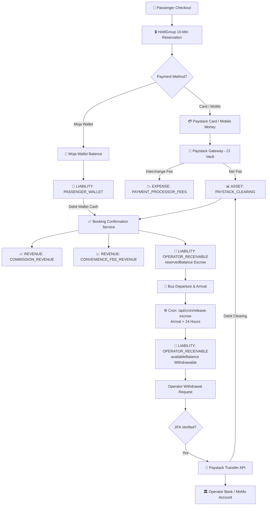

# Chapter 7: Complete System Flowcharts & Risk Analysis

## 1. End-to-End Money Lifecycle Diagram

The following comprehensive Mermaid diagram traces the entire journey of money through the Moja Bus platform, from passenger checkout to operator withdrawal:



---

## 2. Cancellation & Refund State Machine

```mermaid
stateDiagram-v2
    [*] --> CONFIRMED: Booking Paid
    
    CONFIRMED --> CANCELLED: Passenger / Operator Cancels
    
    state CANCELLED {
        [*] --> CheckChannel
        
        state CheckChannel {
            WALLET_Refund: Channel = WALLET
            CASH_Refund: Channel = CASH
        }
        
        WALLET_Refund --> ImmediateCredit: Debit Operator Net + Platform Comm<br/>Credit PASSENGER_WALLET
        ImmediateCredit --> COMPLETED: Refund Instantly Available
        
        CASH_Refund --> CounterObligation: Debit Operator Net<br/>Credit OFFLINE_REFUND_PAYABLE
        CounterObligation --> PENDING_FULFILMENT: Passenger Collects Cash at Depot
        PENDING_FULFILMENT --> COMPLETED: Operator Marks Fulfilled
    }
    
    CONFIRMED --> REBOOKED: Operator Rebooking
    REBOOKED --> CONFIRMED: Linked to Target Trip
```

---

## 3. Failure Mode & Risk Mitigation Matrix

| Failure Mode / Threat | Severity | Technical Vulnerability | Implemented Mitigation in Codebase |
|---|---|---|---|
| **Seat Overselling Race Condition** | High | Concurrent passengers selecting the same seat simultaneously. | **Row Locking**: `createHold` and `BookingConfirmationService` serialize transactions with `SELECT ... FOR UPDATE` on the trip and seat segment indices. |
| **Orphaned Payments on Expired Holds** | High | Passenger takes >10 minutes on Mobile Money USSD prompt; hold expires before webhook arrives. | **`rescueOrphanedPayment`**: If payment arrives on an expired hold, 100% of captured fiat is automatically credited to the passenger's `PASSENGER_WALLET`. |
| **Duplicate Webhook Delivery** | Medium | Paystack sends multiple `charge.success` or `transfer.success` webhooks. | **Idempotent Webhook Log**: Webhooks recorded in `WebhookEvent` with unique idempotency keys. Database update returns duplicate without mutating ledger. |
| **Double Payout on Fast Clicks** | High | Operator submits multiple withdrawal requests rapidly. | **Client Nonce + Row Lock**: `requestWithdrawal` acquires an exclusive lock on `OPERATOR_RECEIVABLE` and accepts a unique idempotency nonce. |
| **Phantom Fees on Failed Payouts** | Medium | Paystack transfer fails, but processing fee remains posted on platform books. | **`PAYOUT_FEE_REVERSAL`**: Webhook handler reverses both the main transfer journal and the `PAYMENT_PROCESSOR_FEE` transaction. |
| **Operator Insolvency During Refund** | Medium | Passenger cancels, but operator has already withdrawn all available funds. | **`allowNegativeBalance: true`**: `OPERATOR_RECEIVABLE` permits negative balances, ensuring traveler refunds are never blocked. |
| **Referral Reward Farming** | Medium | Bad actors creating fake accounts to harvest referral credit lots. | **Anti-Abuse Engine**: Device fingerprinting (`deviceHash`), self-referral blocks, and a **48-hour post-trip qualification delay**. |
| **Escrow Release Concurrency Clash** | Medium | Multiple cron instances or manual clearing running concurrently. | **PostgreSQL Advisory Lock**: `pg_advisory_xact_lock` hashed by `companyId` serializes escrow releases per operator. |

---

## 4. Key Architectural Conclusions & Recommendations

1. **Robust Core**: The double-entry accounting engine (`@moja/db/src/services/AccountingEngine.ts`) provides bank-grade mathematical consistency, strict zero-sum journals, and PostgreSQL row locking.
2. **Unified Treasury**: The single Paystack account abstraction simplifies regulatory compliance across the WAEMU region while keeping full accounting visibility over platform margins, escrow obligations, and user balances.
3. **Moja Wallet Optimization**: The $0\text{ XOF}$ convenience fee incentive for Moja Wallet checkouts effectively drives pre-funded deposits, reducing Paystack payment interchange costs and enhancing passenger checkout conversion.
