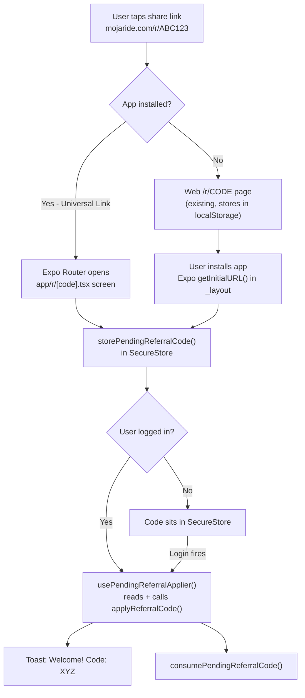

# Traveler App — Discount, Referral & Promo Credit Feature Completion

## Goal

Close the feature gaps between the web app and the React Native traveler app across four systems:

1. **Referral deep-link capture & auto-apply** — tapping a `/r/CODE` link currently does nothing useful in the app
2. **Zero-cash (isZeroCash) checkout flow** — when promo credits fully cover a fare, the payment selector should disappear
3. **Granular coupon rejection messages** — 10+ server error codes mapped to specific user-facing strings instead of one generic message
4. **Minor UX polish** — wallet top-up CTA link, convenience-fee-waiver nudge

---

## Background: How Enterprise Mobile Apps Handle Referrals

For context, here's the industry-standard approach that big apps (Uber, Airbnb, Duolingo) use — and what we'll implement a clean version of:

```
Phase 1 — Pre-click (Web)
  User A shares a link: https://mojaride.com/r/ABC123
  (already exists via the web /r/[code] route)

Phase 2 — Click & Deep Link
  User B clicks the link on their phone.

  IF app is installed → Universal Link / Custom Scheme opens app
    directly to /r/[code] in-app screen.

  IF app is NOT installed → web /r/CODE page loads
    (web already stores code in localStorage for web users)
    After install, expo-linking initialURL carries the scheme URL.

Phase 3 — Store & Apply
  App receives the code via Expo Router screen or getInitialURL()
  Stores it in SecureStore (persists across crashes/relaunches)
  After user logs in → usePendingReferralApplier hook fires
  Calls applyReferralCode() automatically
  Shows Toast with optional welcome coupon code

Phase 4 — Reward
  Already implemented server-side (referral-service.ts) ✅
```

**Enterprise note**: Uber/Airbnb use Branch.io or Adjust for *deferred* deep links (capturing the referral even when the app was installed fresh after clicking). That requires a paid SDK. For now, we use Expo's built-in linking (which handles the app-already-installed case reliably), and defer Branch.io to a future sprint when referral conversion data justifies it.

---

## Architecture



---

## User Review Required

> [!IMPORTANT]
> **Universal Links need web-server files**: To make `https://mojaride.com/r/CODE` open the app directly, we need:
> - iOS: `apple-app-site-association` at `https://mojaride.com/.well-known/apple-app-site-association`
> - Android: `assetlinks.json` at `https://mojaride.com/.well-known/assetlinks.json`
> - `app.json` update: `"associatedDomains": ["applinks:mojaride.com"]`
>
> The in-app Expo Route (`app/r/[code].tsx`) and custom scheme (`traveler-app://r/CODE`) work immediately without these files. Universal Links are a follow-up. **Do you want to include the web-server-side config in this plan?**

> [!IMPORTANT]
> **Zero-cash CTA copy**: When credits cover 100% of the fare, should the button say "Confirm Free Booking (0 XOF)" (same as web) or something different? Plan defaults to web wording.

---

## Open Questions

> [!NOTE]
> **Deferred deep link**: If a user clicks the share link but doesn't have the app installed, after installing fresh the referral code is lost (no Branch.io). Is this acceptable for now? **Recommended**: Yes, accept for now. Add Branch.io in a later sprint.

---

## Proposed Changes

---

### Milestone 1 — Referral Deep Link Capture & Auto-Apply

#### [NEW] `apps/traveler-app/lib/pending-referral.ts`

SecureStore wrapper — mirrors the web's `pending-referral.ts` but uses `expo-secure-store`.

```typescript
import * as SecureStore from 'expo-secure-store';

const KEY = 'moja:pending-referral:v1';

export async function storePendingReferralCode(code: string): Promise<void> {
  try {
    await SecureStore.setItemAsync(KEY, code.trim().toUpperCase());
  } catch { /* ignore */ }
}

export async function peekPendingReferralCode(): Promise<string | null> {
  try {
    return await SecureStore.getItemAsync(KEY);
  } catch {
    return null;
  }
}

export async function consumePendingReferralCode(): Promise<void> {
  try {
    await SecureStore.deleteItemAsync(KEY);
  } catch { /* ignore */ }
}
```

---

#### [NEW] `apps/traveler-app/app/r/[code].tsx`

Expo Router screen that handles `traveler-app://r/ABC123` and Universal Links.

```typescript
import { useEffect } from 'react';
import { View, ActivityIndicator } from 'react-native';
import { useLocalSearchParams, router } from 'expo-router';
import { authClient } from '@/lib/auth-client';
import { storePendingReferralCode } from '@/lib/pending-referral';

export default function ReferralLandingScreen() {
  const { code } = useLocalSearchParams<{ code: string }>();
  const { data: session } = authClient.useSession();

  useEffect(() => {
    if (!code) { router.replace('/'); return; }
    void (async () => {
      await storePendingReferralCode(code);
      // Logged-in → go home (applier will fire via useEffect)
      // Guest     → go to register so they create an account
      router.replace(session?.user ? '/(tabs)' : '/(auth)/register');
    })();
  }, [code, session?.user]);

  return (
    <View style={{ flex: 1, alignItems: 'center', justifyContent: 'center' }}>
      <ActivityIndicator size="large" color="#ee237c" />
    </View>
  );
}
```

---

#### [NEW] `apps/traveler-app/hooks/use-pending-referral-applier.ts`

Hook mounted once in `_layout.tsx`. Watches for a logged-in session, reads SecureStore, applies the code, then clears it.

```typescript
import { useEffect, useRef } from 'react';
import { useMutation, useQueryClient } from '@tanstack/react-query';
import Toast from 'react-native-toast-message';
import { useTranslation } from 'react-i18next';
import { authClient } from '@/lib/auth-client';
import { useTRPC } from '@/lib/trpc';
import {
  peekPendingReferralCode,
  consumePendingReferralCode,
} from '@/lib/pending-referral';

export function usePendingReferralApplier() {
  const { data: session } = authClient.useSession();
  const trpc = useTRPC();
  const queryClient = useQueryClient();
  const attempted = useRef(false);
  const { t } = useTranslation('referrals');

  const applyMutation = useMutation(
    trpc.discounts.applyReferralCode.mutationOptions({
      onSuccess: async (result) => {
        if (result.welcomeCouponCode) {
          Toast.show({
            type: 'success',
            text1: t('applySuccess'),
            text2: t('applySuccessWelcome', { code: result.welcomeCouponCode }),
            visibilityTime: 5000,
          });
        } else {
          Toast.show({ type: 'success', text1: t('applySuccess') });
        }
        await Promise.all([
          queryClient.invalidateQueries(trpc.discounts.myReferral.pathFilter()),
          queryClient.invalidateQueries(trpc.discounts.listMyInvitees.pathFilter()),
        ]);
      },
      onError: async (err) => {
        const msg = err.message ?? '';
        const definitive =
          msg.includes('Self-referral') || msg.includes('inactive') ||
          msg.includes('Invalid') || msg.includes('not found');
        if (definitive) await consumePendingReferralCode();
        if (!msg.includes('already attributed') && !msg.includes('Self-referral')) {
          Toast.show({ type: 'error', text1: msg || t('applyFailed') });
        }
      },
    }),
  );

  useEffect(() => {
    if (!session?.user?.id || attempted.current) return;
    attempted.current = true;
    void (async () => {
      const code = await peekPendingReferralCode();
      if (!code) return;
      const { getDeviceHash } = await import('@/lib/device-hash');
      const deviceHash = await getDeviceHash();
      applyMutation.mutate(
        { code, ...(deviceHash ? { deviceHash } : {}) },
        { onSuccess: async () => { await consumePendingReferralCode(); } },
      );
    })();
  }, [session?.user?.id]);
}
```

---

#### [MODIFY] `apps/traveler-app/app/_layout.tsx`

Three additions:
1. `PendingReferralApplier` null-component mounted inside `AuthenticatedNovuProvider`
2. `getInitialURL()` call in `RootLayout` to capture initial deep-link code on first launch

```diff
+import * as Linking from 'expo-linking';
+import { usePendingReferralApplier } from '@/hooks/use-pending-referral-applier';
+import { storePendingReferralCode } from '@/lib/pending-referral';

+function PendingReferralApplier() {
+  usePendingReferralApplier();
+  return null;
+}

 // Inside AuthenticatedNovuProvider JSX:
   <PushTokenRegistrar />
   <NotificationHandler />
+  <PendingReferralApplier />
   {children}

 // In RootLayout, before the return:
+  useEffect(() => {
+    void (async () => {
+      const url = await Linking.getInitialURL();
+      if (!url) return;
+      const parsed = Linking.parse(url);
+      const parts = parsed.path?.split('/').filter(Boolean) ?? [];
+      if (parts[0] === 'r' && parts[1]) {
+        await storePendingReferralCode(parts[1]);
+      }
+    })();
+  }, []);
```

---

#### [MODIFY] `apps/traveler-app/locales/en/referrals.json` & `fr/referrals.json`

Add (if not already present):
```json
{
  "applySuccess": "Invite code applied!",
  "applySuccessWelcome": "Your welcome code: {{code}}",
  "applyFailed": "Could not apply invite code"
}
```

---

### Milestone 2 — isZeroCash Checkout Flow

#### [MODIFY] `apps/traveler-app/features/search/components/passenger-form-sheet.tsx`

**1. Compute `isZeroCash` after pricing:**
```typescript
const isZeroCash = totalAmountXOF === 0 && pricingQuery.data !== undefined;
const effectivePaymentMethod = isZeroCash ? 'WALLET' : paymentMethod;
```

**2. Replace Payment Method section conditionally:**
```tsx
{isZeroCash ? (
  <View className="bg-emerald-50 rounded-2xl border border-emerald-200 p-4 shadow-xs mb-4">
    <View className="flex-row items-center gap-2 mb-2">
      {/* Sparkles icon from @hugeicons/core-free-icons */}
      <Text className="text-sm font-black text-emerald-900">
        {t('booking:freeCoverTitle')}
      </Text>
    </View>
    <Text className="text-xs text-emerald-700 leading-relaxed">
      {t('booking:freeCoverBody')}
    </Text>
  </View>
) : (
  // existing payment selector JSX unchanged
)}
```

**3. CTA button label:**
```tsx
{isPending
  ? t('search:holdingSeats')
  : isZeroCash
    ? t('booking:confirmFreeBooking')
    : `${t('booking:confirmPayment')} (${formatPriceXOF(totalAmountXOF)})`}
```

**4. Pass `effectivePaymentMethod` to `createHold` and wallet check:**
```typescript
// Replace both uses of `paymentMethod` in handleConfirmAndPay with effectivePaymentMethod
if (effectivePaymentMethod === 'WALLET') { ... }
```

**New i18n keys (`locales/en/booking.json`):**
```json
{
  "freeCoverTitle": "100% Covered by Promo Credits",
  "freeCoverBody": "Your promotional balance fully covers this fare. No card or mobile money required.",
  "confirmFreeBooking": "Confirm Free Booking (0 XOF)"
}
```

---

### Milestone 3 — Granular Coupon Rejection Messages

#### [NEW] `apps/traveler-app/features/search/lib/discount-errors.ts`

```typescript
type TFn = (key: any) => string;

const MAP: Record<string, string> = {
  'discounts.errors.invalidCode':     'booking:errInvalidCode',
  'discounts.errors.codeExpired':     'booking:errCodeExpired',
  'discounts.errors.codePersonal':    'booking:errCodePersonal',
  'discounts.errors.codeExhausted':   'booking:errCodeExhausted',
  'discounts.errors.campaignMissing': 'booking:errCampaignMissing',
  'discounts.errors.zeroDiscount':    'booking:errZeroDiscount',
  'discounts.errors.inactive':        'booking:errInactive',
  'discounts.errors.wrongOperator':   'booking:errWrongOperator',
  'discounts.errors.noOptIn':         'booking:errNoOptIn',
  'discounts.errors.routeScope':      'booking:errRouteScope',
  'discounts.errors.scheduleScope':   'booking:errScheduleScope',
  'discounts.errors.tripScope':       'booking:errTripScope',
  'discounts.errors.budget':          'booking:errBudget',
};

export function resolveDiscountRejectionMessage(
  messageKey: string | undefined | null,
  t: TFn,
): string {
  if (!messageKey) return t('booking:applyFailed');
  return MAP[messageKey] ? t(MAP[messageKey]!) : t('booking:applyFailed');
}
```

#### [MODIFY] `passenger-form-sheet.tsx` — replace generic error display:

```diff
-  {pricingQuery.data?.discountOk === false && appliedCode ? (
-    <Text className="text-xs text-red-600 mb-2">
-      {t('booking:applyFailed')}
-    </Text>
-  ) : null}

+  {pricingQuery.data?.discountOk === false && appliedCode ? (
+    <Text className="text-xs text-red-600 mb-2">
+      {resolveDiscountRejectionMessage(
+        pricingQuery.data?.discountRejection?.messageKey,
+        t,
+      )}
+    </Text>
+  ) : null}
```

**New i18n keys (`locales/en/booking.json`):**
```json
{
  "errInvalidCode":     "This code doesn't exist or has been deactivated.",
  "errCodeExpired":     "This promo code has expired.",
  "errCodePersonal":    "This code is for a specific account.",
  "errCodeExhausted":   "This code has reached its usage limit.",
  "errCampaignMissing": "The campaign linked to this code is no longer active.",
  "errZeroDiscount":    "This code doesn't apply to your selected fare.",
  "errInactive":        "This promo code is currently inactive.",
  "errWrongOperator":   "This code is only valid for a specific bus operator.",
  "errNoOptIn":         "The operator hasn't opted into this promotion.",
  "errRouteScope":      "This code only applies to specific routes.",
  "errScheduleScope":   "This code isn't valid for this schedule.",
  "errTripScope":       "This code isn't valid for this trip.",
  "errBudget":          "This promotion's budget has been exhausted."
}
```

---

### Milestone 4 — UX Polish

#### [MODIFY] `passenger-form-sheet.tsx` — wallet top-up CTA

Replace the plain `Alert` on insufficient wallet with a two-button alert that offers navigation to `/wallet`:

```typescript
Alert.alert(
  t('booking:insufficientFunds'),
  t('booking:insufficientWallet'),
  [
    { text: t('booking:cancel'), style: 'cancel' },
    {
      text: t('booking:topUpWallet'),
      onPress: () => { onClose(); router.push('/wallet'); },
    },
  ],
);
```

Add inline shortfall hint below the wallet option:
```tsx
{paymentMethod === 'WALLET' && walletBalance < totalAmountXOF && !isZeroCash ? (
  <Text className="text-xs text-amber-600 mt-1">
    {t('booking:walletShortfall', {
      short: formatPriceXOF(totalAmountXOF - walletBalance),
    })}
  </Text>
) : null}
```

#### Fee-waiver nudge (when PAYSTACK selected but wallet could cover):
```tsx
{paymentMethod === 'PAYSTACK' && walletBalance >= totalAmountXOF && !isZeroCash ? (
  <View className="bg-slate-50 rounded-xl p-3 mt-2">
    <Text className="text-xs text-slate-500 text-center">
      {t('booking:walletFeeWaiverNudge')}
    </Text>
  </View>
) : null}
```

**New i18n keys:**
```json
{
  "topUpWallet": "Top Up Wallet",
  "walletShortfall": "{{short}} short — tap to top up",
  "walletFeeWaiverNudge": "💡 Switch to Moja Wallet to waive the convenience fee entirely"
}
```

---

## File Change Summary

| File | Action | Milestone |
|------|--------|-----------|
| `lib/pending-referral.ts` | **NEW** | 1 |
| `app/r/[code].tsx` | **NEW** | 1 |
| `hooks/use-pending-referral-applier.ts` | **NEW** | 1 |
| `app/_layout.tsx` | MODIFY | 1 |
| `app.json` | MODIFY (iOS associatedDomains) | 1 |
| `features/search/lib/discount-errors.ts` | **NEW** | 3 |
| `features/search/components/passenger-form-sheet.tsx` | MODIFY | 2, 3, 4 |
| `locales/en/referrals.json` | MODIFY | 1 |
| `locales/fr/referrals.json` | MODIFY | 1 |
| `locales/en/booking.json` | MODIFY | 2, 3, 4 |
| `locales/fr/booking.json` | MODIFY | 2, 3, 4 |

**Total: 3 new files, 8 modified files · ~3 hours of dev work**

---

## Effort Estimates

| Milestone | Est. Time | Risk |
|---|---|---|
| 1 — Referral deep link + auto-apply | 1.5 hr | Low |
| 2 — isZeroCash checkout flow | 45 min | Medium |
| 3 — Granular error messages | 30 min | Low |
| 4 — UX polish | 20 min | None |
| **Total** | **~3 hours** | |

---

## Verification Plan

### Manual Steps

**M1 — Deep link:**
```bash
# iOS simulator
npx uri-scheme open "traveler-app://r/TESTCODE" --ios
```
1. App opens → brief spinner → redirects to home/register
2. Log in → Toast appears with code applied message
3. Open Referrals screen → confirms mutation fired

**M2 — isZeroCash:**
1. Seed a `CreditLot` in DB with `remainingXOF` ≥ route price
2. Search that route → open passenger form
3. Verify: payment selector is **gone**, replaced by emerald "Covered" banner
4. CTA reads "Confirm Free Booking (0 XOF)"
5. Confirm → booking completes without Paystack WebView

**M3 — Granular errors:**
1. Enter a fake code → "This code doesn't exist…"
2. Enter a code scoped to a different route → "This code only applies to specific routes."

**M4 — Polish:**
1. Select Wallet with insufficient funds → Alert has "Top Up Wallet" button → navigates to `/wallet`
2. Select Paystack with sufficient wallet balance → nudge tip appears

### Type Check
```bash
cd apps/traveler-app
npx tsc --noEmit
```
