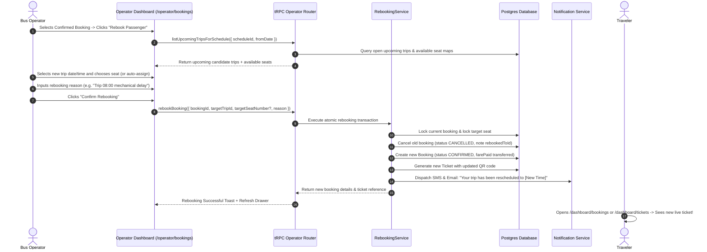

# Operator Rebooking System Design

## 1. User Journey & Interaction Model



---

## 2. Technical Implementation Specifications

### A. New tRPC Endpoints in `apps/web/trpc/routers/operator.ts`

```typescript
// 1. List candidate upcoming trips for the same schedule/route
listUpcomingScheduleTrips: operatorCompanyProcedure
  .input(z.object({
    scheduleId: z.string(),
    limit: z.number().min(1).max(50).default(20),
  }))
  .query(async ({ ctx, input }) => {
    // Queries future trips for this schedule with available seat counts
  }),

// 2. Execute atomic rebooking
rebookBooking: operatorCompanyProcedure
  .input(z.object({
    bookingReference: z.string(),
    targetTripId: z.string(),
    seatNumber: z.number().int().positive().optional(),
    reason: z.string().min(3),
  }))
  .mutation(async ({ ctx, input }) => {
    return rebookingService.rebookPassenger({
      prisma: ctx.prisma,
      companyId: ctx.companyId,
      staffId: ctx.user.id,
      ...input,
    });
  }),
```

---

## 3. UI Redesign: `BookingDetailDrawer`

In [`booking-detail-drawer.tsx`](file:///C:/dev/moja-buss/apps/web/features/operator/components/bookings/booking-detail-drawer.tsx):
1. **Primary Actions:**
   - **"Rebook Passenger"** (Primary blue button)
   - **"Cancel Booking"** (Secondary outline/destructive button)
2. **Rebooking Modal Flow:**
   - Shows current trip info (Origin $\rightarrow$ Destination, Departure Time, Seat).
   - Dropdown list of upcoming departures for the same schedule (showing date, departure time, and available seat count).
   - Seat selection picker (or auto-assign next available seat).
   - Reason input.
   - Action: **"Confirm Rebooking & Notify Passenger"**.
3. **Cancel Modal Flow:**
   - Simplified to two refund methods: **Wallet Refund** (for registered users) and **Cash Refund** (for guests/cash at counter). The "Voucher" tab is removed.
